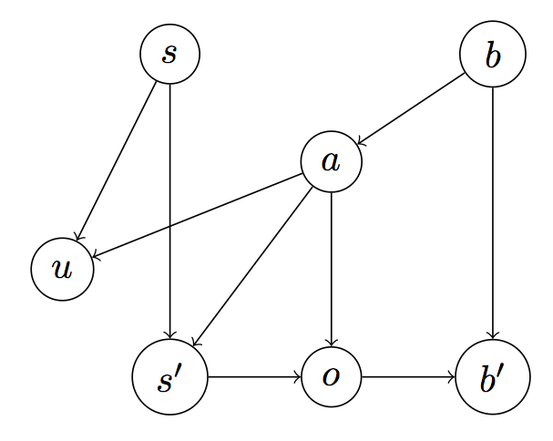

#### Adapted by Joshua K Hartshorne from "[Modeling agents with probabilistic programs](http://agentmodels.org)" by Owain Evans, Andreas Stuhlmüller, John Salvatier, and Daniel Filan.

## Introduction

We [previously looked at](/chapters/04.1-agents-as-programs.html) agent models for solving simple, one-shot decision problems. In this chapter, we turn to *sequential* problems, where an agent's choice of action *now* depends on the actions they will choose in the future. 

A common example is planning a route. Suppose that Bob is hungry. He knows his local options are a chain selling Donuts, a Vegetarian Salad Bar and a Noodle Shop. In prior chapters, we might have modeled how Bob chooses between the three food options. However, this not all Bob has to do: simply deciding to eat donuts does not by itself provide Bob with any donuts. Among other things, he still has to find his way to the donut shop.

For our models of route-planning, we will use a simple "grid-world" representation like the following. Experiment with the code below to ensure you understand how it works. 

~~~~
var ___ = ' '; 
var DN = { name: 'Donut N' };
var DS = { name: 'Donut S' };
var V = { name: 'Veg' };
var N = { name: 'Noodle' };

var grid = [
  ['#', '#', '#', '#',  V , '#'],
  ['#', '#', '#', ___, ___, ___],
  ['#', '#', DN , ___, '#', ___],
  ['#', '#', '#', ___, '#', ___],
  ['#', '#', '#', ___, ___, ___],
  ['#', '#', '#', ___, '#',  N ],
  [___, ___, ___, ___, '#', '#'],
  [DS , '#', '#', ___, '#', '#']
];

var mdp = makeGridWorldMDP({ grid, start: [3, 1] });

viz.gridworld(mdp.world, { trajectory : [mdp.startState] });
~~~~

Bob's location is indicated by the blue dot. At any given moment, he can either stay where he is or move into an adjacent street square or restaurant. He cannot move into a wall (marked by gray squares). Given Bob's current location, he can move one square to the North, West, or South. None of these movements will, by themselves, provide Bob with a donut. So Bob's problem is not to figure out which action will provide him with what he wants *now*, but rather to choose an action that leads to an action that leads to an action ... that leads to his donut. 

## Markov Decision Processes
### Definition

To help Bob out, we will use a Markod Decision Process (MDP): a tuple $$ \left\langle S,A(s),T(s,a),U(s,a) \right\rangle$$, including the *states*, the *actions* available in each state, the *transition function* that maps state-action pairs to successor states, and the *utility* or *reward* function. In our example, the states $$S$$ are Bob's locations on the grid. At each state, Bob selects an action $$a \in \{ \text{up}, \text{down}, \text{left}, \text{right} \} $$, which moves Bob around the grid (according to transition function $$T$$). c transitions and stochastic utilities.

As with the one-shot decisions we discussed earlier, the agent will choose actions that *maximize expected utility*. This depends on the total utility of the *sequence* of states that the agent visits. Formally, let $$EU_{s}[a]$$ be the expected (total) utility of action $$a$$ in state $$s$$. The agent's choice is a softmax function of this expected utility:

$$
C(a; s) \propto e^{\alpha EU_{s}[a]}
$$

The expected utility depends on both immediate utility (the value of the square Bob moves to) and, recursively, on future expected utility (the value of the *next* square Bob would move to):

<a id="recursion">**Expected Utility Recursion**</a>:

$$
EU_{s}[a] = U(s, a) + \mathbb{E}_{s', a'}(EU_{s'}[a'])
$$

 
with the next state $$s' \sim T(s,a)$$ and $$a' \sim C(s')$$. The decision problem ends either when a *terminal* state is reached (in our case, when Bob arrives at a donut store) or when the time-horizon is reached (Bob runs out of time). While a time-horizon is not strictly necessary, it can be useful: it prevents Bob of considering unreasonably long paths to the donut store. 

The intuition to keep in mind for solving MDPs is that the expected utility propagates backwards from future states to the current action. If a high utility state can be reached by a sequence of actions starting from action $$a$$, then action $$a$$ will typically have high expected utility. Intuitively, an action that gets you significantly closer to your goal is a good action to take. 

### Implementation

Let's start with a slightly simpler grid-world -- technically a "line-world" -- in which Bob can only move left or right:

- **States**: Points on the integer line (e.g 0, 1, 2, 3).

- **Actions/transitions**: Actions "left", "right" and "stay" move the agent deterministically along the line in either direction.

- **Utility**: The utility is $$1$$ for the state corresponding to donut shop and is $$0$$ otherwise. 

The following code implements this MDP and outputs Bob's first move given that he can make a maximum of 5 moves. 

~~~~
var ___ = ' '; 
var D = { name: 'Donut' };

var grid = [
  ['___', '___', '___', '___',  D]
];

var mdp = makeGridWorldMDP({ grid, start: [0, 0] });

var transition = function(state, action) {
  return state + action;
};

var utility = function(state) {
  if (state === 4) {
    return 1;
  } else {
    return 0;
  }
};

var makeAgent = function() { 
  
  var act = function(state, timeLeft) {
    return Infer({ model() {
      var action = uniformDraw([-1, 0, 1]);
      var eu = expectedUtility(state, action, timeLeft);
      factor(100 * eu);
      return action;
    }});
  };

  var expectedUtility = function(state, action, timeLeft){
    var u = utility(state, action);
    var newTimeLeft = timeLeft - 1;
    if (newTimeLeft === 0){
      return u; 
    } else {
      return u + expectation(Infer({ model() {
        var nextState = transition(state, action); 
        var nextAction = sample(act(nextState, newTimeLeft));
        return expectedUtility(nextState, nextAction, newTimeLeft);
      }}));
    }
  };

  return { act };
}

var act = makeAgent().act;

var startState = 0;
var totalTime = 5;

// Agent's move '-1' means 'left', '0' means 'stay', '1' means 'right'
viz.gridworld(mdp.world, { trajectory : [mdp.startState] });
print("Agent's action: " + sample(act(startState, totalTime)));
~~~~

To simulate the Bob's entire trajectory, we add a third function `simulate`, which updates and stores the world state in response to the agent's actions: 

~~~~
///fold: MDP
var ___ = ' '; 
var D = { name: 'Donut' };

var grid = [
  ['___', '___', '___', '___',  D]
];

var mdp = makeGridWorldMDP({ grid, start: [0, 0] });

var transition = function(state, action) {
  return state + action;
};

var utility = function(state) {
  if (state === 4) {
    return 1;
  } else {
    return 0;
  }
};

var makeAgent = function() { 
  var act = function(state, timeLeft) {
    return Infer({ model() {
      var action = uniformDraw([-1, 0, 1]);
      var eu = expectedUtility(state, action, timeLeft);
      factor(100 * eu);
      return action;
    }});
  };

  var expectedUtility = function(state, action, timeLeft) {
    var u = utility(state, action);
    var newTimeLeft = timeLeft - 1;
    if (newTimeLeft === 0) {
      return u; 
    } else {
      return u + expectation(Infer({ model() {
        var nextState = transition(state, action); 
        var nextAction = sample(act(nextState, newTimeLeft));
        return expectedUtility(nextState, nextAction, newTimeLeft);
      }}));
    }
  };

  return { act };
}

var act = makeAgent().act;
///
var simulate = function(state, timeLeft){
  if (timeLeft === 0){
    return [];
  } else {
    var action = sample(act(state, timeLeft));
    var nextState = transition(state, action); 
    return [state].concat(simulate(nextState, timeLeft - 1))
  }
};

var startState = 0;
var totalTime = 5;
viz.gridworld(mdp.world, { trajectory : [mdp.startState] });
print("Agent's trajectory: " + simulate(startState, totalTime));
~~~~

Interestingly, the `expectedUtility` and `simulate` functions are similar. The `expectedUtilty` function includes the agent's own (*subjective*) simulation of the future distribution on states. In the case of an MDP and optimal agent, the agent's simulation is identical to the world simulator. In more realistic models of human decision-making, the agent's internal simulations may not perfectly match the world.

### Interlude: Increasing efficiency with memoization

We already mentioned the mutual recursion between `act` and `expectedUtility`. The root is the starting state (`startState === 0`) and this branches into three successor states (`-1`, `0`, `1`). Each of these branches into three successor state [respectively: (`-2`, `-1`, `0`), (`-1`, `0`, `1`), (`0`, `1`, `2`)], and so on. This leads to an exponential blow-up in the runtime of a single action (which depends on how long into the future the agent plans). Here, we use some code to measure runtime as a function of number of timesteps allowed:

~~~~
///fold: transition, utility and makeAgent functions as above
var ___ = ' '; 
var D = { name: 'Donut' };

var grid = [
  ['___', '___', '___', '___',  D]
];

var mdp = makeGridWorldMDP({ grid, start: [0, 0] });

var transition = function(state, action) {
  return state + action;
};

var utility = function(state) {
  if (state === 4) {
    return 1;
  } else {
    return 0;
  }
};

var makeAgent = function() { 
  var act = function(state, timeLeft) {
    return Infer({ model() {
      var action = uniformDraw([-1, 0, 1]);
      var eu = expectedUtility(state, action, timeLeft);
      factor(100 * eu);
      return action;
    }});
  };

  var expectedUtility = function(state, action, timeLeft) {
    var u = utility(state, action);
    var newTimeLeft = timeLeft - 1;
    if (newTimeLeft === 0) {
      return u; 
    } else {
      return u + expectation(Infer({ model() {
        var nextState = transition(state, action); 
        var nextAction = sample(act(nextState, newTimeLeft));
        return expectedUtility(nextState, nextAction, newTimeLeft);
      }}));
    }
  };

  return { act };
}

var act = makeAgent().act;

var simulate = function(state, timeLeft){
  if (timeLeft === 0){
    return [];
  } else {
    var action = sample(act(state, timeLeft));
    var nextState = transition(state, action); 
    return [state].concat(simulate(nextState, timeLeft - 1))
  }
};

///

var startState = 0;

var getRuntime = function(totalTime) {
  return timeit(function() {
    return act(startState, totalTime);
  }).runtimeInMilliseconds.toPrecision(4);
};

var numSteps = [4, 5, 6, 7, 8];
var runtimes = map(getRuntime, numSteps);

print('Runtime in ms for for a given number of steps: \n')
print(_.zipObject(numSteps, runtimes));
viz.bar(numSteps, runtimes);
~~~~

Planning more than a few steps into the future is prohibitively costly!

However, most of this computation is unnecessary. After two time steps, the agent could be at the following locations: `-2`, `-1`, `0`, `1`, `2`. However, there are actually two different sets of actions that result in the agent being at `-1` or `1` and three sets of actions that result at `0` (Why?). This means that the code above will ultimately compute `agent(-1, totalTime-2)` and `agent(1, totalTime-2)` twice each and `agent(0, totalTime-2)` three times. This is redundant.

We can address this with memoization, storing the result of a `agent(0, totalTime-2)` the first time we run it and simply reusing that result. In previous chapters, we used the function `mem()` for memoization. However, memoization is more complex in the context of recursion. For this, we'll use `dp.cache()` from the [WebPPL dynamic programming library](https://github.com/stuhlmueller/webppl-dp) to memoize the `act` and `expectedUtility` functions (Why memoize these functions and not `agent()`?): 

~~~~
///fold: transition, utility and makeAgent functions as above, but...
// ...with `act` and `expectedUtility` wrapped in `dp.cache`
var transition = function(state, action) {
  return state + action;
};

var utility = function(state) {
  if (state === 4) {
    return 1;
  } else {
    return 0;
  }
};

var makeAgent = function() { 
  var act = dp.cache(function(state, timeLeft) {
    return Infer({ model() {
      var action = uniformDraw([-1, 0, 1]);
      var eu = expectedUtility(state, action, timeLeft);
      factor(100 * eu);
      return action;
    }});
  });

  var expectedUtility = dp.cache(function(state, action, timeLeft) {
    var u = utility(state, action);
    var newTimeLeft = timeLeft - 1;
    if (newTimeLeft === 0) {
      return u; 
    } else {
      return u + expectation(Infer({ model() {
        var nextState = transition(state, action); 
        var nextAction = sample(act(nextState, newTimeLeft));
        return expectedUtility(nextState, nextAction, newTimeLeft);
      }}));
    }
  });

  return { act };
}

var act = makeAgent().act;

var simulate = function(state, timeLeft){
  if (timeLeft === 0){
    return [];
  } else {
    var action = sample(act(state, timeLeft));
    var nextState = transition(state, action); 
    return [state].concat(simulate(nextState, timeLeft - 1))
  }
};
///

var startState = 0;

var getRuntime = function(totalTime) {
  return timeit(function() {
    return act(startState, totalTime);
  }).runtimeInMilliseconds.toPrecision(4);
};

var numSteps = [4, 5, 6, 7, 8];
var runtimes = map(getRuntime, numSteps);

print('WITH MEMOIZATION \n');
print('Runtime in ms for for a given number of steps: \n')
print(_.zipObject(numSteps, runtimes));
viz.bar(numSteps, runtimes)
~~~~

This use of memoization results in a runtime that is polynomial in the number of states and the total time. (Question: Could we also memoize `simulate`? Why or why not?)

### Choosing restaurants in Gridworld

Below, we provide code for Bob's restaurant choice. We'll assume that Bob's favorite restaurant is the vegetarian cafe. The [webppl-agents library](https://github.com/agentmodels/webppl-agents) comes with a handy function, `viz.gridworld()`, which we will use to animate our agent's trajectory. 

The agent model above that includes memoization allows us to solve Bob's "Restaurant Choice" problem efficiently. One additional bit of inefficiency we should address is that our model continues to infer what Bob will do after he gets to his preferred restaurant, which a little pointless, since presumably he stays there and gets lunch. States in the [webppl-agents library](https://github.com/agentmodels/webppl-agents) GridworldMDP object have a property `terminateAfterAction`. For labeled states like our restaurants, this property is automatically turned to `true`. We make use of this in our code to have the simulation automatically stop once a restaurant is reached. 

~~~~
///fold: Restaurant constants, tableToUtilityFunction

var ___ = ' '; 
var DN = { name : 'Donut N' };
var DS = { name : 'Donut S' };
var V = { name : 'Veg' };
var N = { name : 'Noodle' };

var tableToUtilityFunction = function(table, feature) {
  return function(state, action) {
    var stateFeatureName = feature(state).name;
    return stateFeatureName ? table[stateFeatureName] : table.timeCost;
  };
};
///

// Construct world

var grid = [
  ['#', '#', '#', '#',  V , '#'],
  ['#', '#', '#', ___, ___, ___],
  ['#', '#', DN , ___, '#', ___],
  ['#', '#', '#', ___, '#', ___],
  ['#', '#', '#', ___, ___, ___],
  ['#', '#', '#', ___, '#',  N ],
  [___, ___, ___, ___, '#', '#'],
  [DS , '#', '#', ___, '#', '#']
];

var mdp = makeGridWorldMDP({
  grid,
  start: [3, 1],
  totalTime: 9
});

var world = mdp.world;
var transition = world.transition;
var stateToActions = world.stateToActions;

// Construct utility function

var utilityTable = {
  'Donut S': 1, 
  'Donut N': 1, 
  'Veg': 3,
  'Noodle': 2, 
  'timeCost': -0.1
};

var utility = tableToUtilityFunction(utilityTable, world.feature);

// Construct agent

var makeAgent = function() {
  
  var act = dp.cache(function(state) {
    return Infer({ model() {
      var action = uniformDraw(stateToActions(state));
      var eu = expectedUtility(state, action);
      factor(100 * eu);
      return action;
    }});
  });

  var expectedUtility = dp.cache(function(state, action){
    var u = utility(state, action);
    if (state.terminateAfterAction){
      return u; 
    } else {
      return u + expectation(Infer({ model() {
        var nextState = transition(state, action);
        var nextAction = sample(act(nextState));
        return expectedUtility(nextState, nextAction);
      }}));
    }
  });
  
  return { act };
};

var act = makeAgent().act;

// Generate and draw a trajectory

var simulate = function(state) {
  var action = sample(act(state));
  var nextState = transition(state, action);
  var out = [state, action];
  if (state.terminateAfterAction) {
    return [out];
  } else {
    return [out].concat(simulate(nextState));
  }
};

var trajectory = simulate(mdp.startState);

viz.gridworld(world, { trajectory: map(first, trajectory) });
~~~~

## Stochastic MDPs

In our MDP above, we assumed that utilities were fixed and guaranteed. Sadly, the world does not work that way. In this section, we'll consider probabilistic outcomes. We begin by introducing a new gridworld MDP:

> **Hiking Problem**:
>Suppose that Alice is hiking. There are two peaks nearby, denoted "West" and "East". The peaks provide different views and Alice must choose between them. South of Alice's starting position is a steep hill. Falling down the hill would result in painful (but non-fatal) injury and end the hike early.

We represent Alice's hiking problem with a Gridworld similar to Bob's Restaurant Choice example. The peaks are terminal states, providing different utilities. The steep hill is represented by a row of terminal state, each with identical negative utility. Each timestep before Alice reaches a terminal state incurs a "time cost", which is negative to represent the fact that Alice prefers a shorter hike. <!-- TODO might be good to indicate on plot that the steep hills are bad -->

<!-- draw_hike -->
~~~~
var H = { name: 'Hill' };
var W = { name: 'West' };
var E = { name: 'East' };
var ___ = ' ';

var grid = [
  [___, ___, ___, ___, ___],
  [___, '#', ___, ___, ___],
  [___, '#',  W , '#',  E ],
  [___, ___, ___, ___, ___],
  [ H ,  H ,  H ,  H ,  H ]
];

var start = [0, 1];

var mdp = makeGridWorldMDP({ grid, start });

viz.gridworld(mdp.world, { trajectory: [mdp.startState] });
~~~~

For convenience, the `webppl-agents` library comes with a function `makeMDPAgent()` that provides a wrapper around the functions `act`, `expectedUtility`. We'll use this in the future to save some typing. The code for the function is shown below:

~~~~
var makeMDPAgent = function(params, world) {
  var stateToActions = world.stateToActions;
  var transition = world.transition;
  var utility = params.utility;
  var alpha = params.alpha;

  var act = dp.cache(
    function(state) {
      return Infer({ model() {
        var action = uniformDraw(stateToActions(state));
        var eu = expectedUtility(state, action);
        factor(alpha * eu);
        return action;
      }});
    });

  var expectedUtility = dp.cache(
    function(state, action){
      var u = utility(state, action);
      if (state.terminateAfterAction){
        return u;
      } else {
        return u + expectation(Infer({ model() {
          var nextState = transition(state, action);
          var nextAction = sample(act(nextState));
          return expectedUtility(nextState, nextAction);
        }}));
      }
    });

  return { params, expectedUtility, act };
};
~~~~

In our restaurant choice model, the only noise comes from Bob's softmax decision. That is, he has some (very small) probability of heading off towards a non-preferred restaurant. For our hiking example, we'll consider the possibility that even when Alice makes the right decision, it doesn't always work out for her.

Imagine that the weather is very wet and windy. As a result, Alice will sometimes intend to go one way but actually go another way (because she slips in the mud). In this case, the shorter route to the peaks might be too risky for Alice. To model bad weather, we assume that at every timestep, there is a constant independent probability `transitionNoiseProbability` of the agent moving orthogonally to their intended direction. The independence assumption is unrealistic (if a location is slippery at one timestep it is more likely slippery the next), but it is simple and satisfies the Markov assumption for MDPs.

Setting `transitionNoiseProbability=0.1`, we'll see that Alice now takes the long way around, minimizing her risk of falling down the hill.

~~~~
///fold: makeHikeMDP
var makeHikeMDP = function(options) {
  var H = { name: 'Hill' };
  var W = { name: 'West' };
  var E = { name: 'East' };
  var ___ = ' ';
  var grid = [
    [___, ___, ___, ___, ___],
    [___, '#', ___, ___, ___],
    [___, '#',  W , '#',  E ],
    [___, ___, ___, ___, ___],
    [ H ,  H ,  H ,  H ,  H ]
  ];
  return makeGridWorldMDP(_.assign({ grid }, options));
};
///

// Set up world

var mdp = makeHikeMDP({
  start: [0, 1],
  totalTime: 13,
  transitionNoiseProbability: 0.1  // <- NEW
});

// Create parameterized agent

var makeUtilityFunction = mdp.makeUtilityFunction;
var utility = makeUtilityFunction({
  East: 10,
  West: 1,
  Hill: -10,
  timeCost: -.1
});
var agent = makeMDPAgent({ utility, alpha: 100 }, mdp.world);

// Generate a single trajectory, draw

var trajectory = simulateMDP(mdp.startState, mdp.world, agent, 'states');
viz.gridworld(mdp.world, { trajectory });

// Generate 100 trajectories, plot distribution on lengths

var trajectoryDist = Infer({
  model() {
    var trajectory = simulateMDP(mdp.startState, mdp.world, agent);
    return { trajectoryLength: trajectory.length }
  },
  method: 'forward',
  samples: 100
});

viz(trajectoryDist);
~~~~

### Noisy transitions vs. Noisy agents

It's important to distinguish noise in the transition function from the softmax noise in the agent's selection of actions. Noise (or "stochasticity") in the transition function is a representation of randomness in the world. This is easiest to think about in games of chance[^noise]. In a game of chance (e.g. slot machines or poker) rational agents will take into account the randomness in the game. By contrast, softmax noise is a property of an agent. For example, we can vary the behavior of otherwise identical agents by varying their parameter $$\alpha$$.

Unlike transition noise, softmax noise has little influence on the agent's planning for the Hiking Problem. Since it's so bad to fall down the hill, the softmax agent will rarely do so even if they take the short route. The softmax agent is like a person who takes inefficient routes when stakes are low but "pulls themself together" when stakes are high.

[^noise]: An agent's world model might treat a complex set of deterministic rules as random. In this sense, agents will vary in whether they represent an MDP as stochastic or not. We won't consider that case in this tutorial.

### Stochastic transitions: plans and policies

We return to the case of a stochastic environment with very low softmax action noise. In a stochastic environment, the agent sometimes finds themself in a state they did not intend to reach. The functions `agent` and `expectedUtility` (inside `makeMDPAgent`) implicitly compute the expected utility of actions for every possible future state, including states that the agent will try to avoid. In the MDP literature, this function from states and remaining time to actions is called a *policy*. (For infinite-horizon MDPs, policies are functions from states to actions.) Since policies take into account every possible contingency, they are quite different from the everyday notion of a plan.

The expected values were already being computed implicitly; we now use `getExpectedUtilitiesMDP()` to access them and `viz.gridworld()` to display them. The displayed numbers in each grid cell are the expected utilities of moving in the corresponding directions. For example, we can read off how close the agent was to taking the short route as opposed to the long route. (Note that if the difference in expected utility between two actions is small then a noisy agent will take each of them with nearly equal probability).

~~~~
///fold: makeBigHikeMDP, getExpectedUtilitiesMDP
var makeBigHikeMDP = function(options) {
  var H = { name: 'Hill' };
  var W = { name: 'West' };
  var E = { name: 'East' };
  var ___ = ' ';
  var grid = [
    [___, ___, ___, ___, ___, ___],
    [___, ___, ___, ___, ___, ___],
    [___, ___, '#', ___, ___, ___],
    [___, ___, '#',  W , '#',  E ],
    [___, ___, ___, ___, ___, ___],
    [ H ,  H ,  H ,  H ,  H ,  H ]
  ];
  return makeGridWorldMDP(_.assign({ grid }, options));
};

// trajectory must consist only of states. This can be done by calling
// *simulate* with an additional final argument 'states'.
var getExpectedUtilitiesMDP = function(stateTrajectory, world, agent) {
  var eu = agent.expectedUtility;
  var actions = world.actions;
  var getAllExpectedUtilities = function(state) {
    var actionUtilities = map(
      function(action){ return eu(state, action); },
      actions);
    return [state, actionUtilities];
  };
  return map(getAllExpectedUtilities, stateTrajectory);
};
///

// Long route is better, agent takes long route

var mdp = makeBigHikeMDP({
  start: [1, 1],
  totalTime: 12,
  transitionNoiseProbability: 0.03
});

// below we use mdp.makeUtilityFunction, which is a convenience function from the webppl-agent library.
// it takes a table of utilities and returns a utility function 

var utility = mdp.makeUtilityFunction({
  East: 10,
  West: 7,
  Hill : -40,
  timeCost: -0.4
});
var agent = makeMDPAgent({ utility, alpha: 100 }, mdp.world);

var trajectory = simulateMDP(mdp.startState, mdp.world, agent, 'states');
var actionExpectedUtilities = getExpectedUtilitiesMDP(trajectory, mdp.world, agent);

viz.gridworld(mdp.world, { trajectory, actionExpectedUtilities });
~~~~

## Partially Observable Markov Decision Processes

In an MDP the agent observes the full state of the environment at each timestep. In Gridworld, for instance, the agents always knows their precise position and are uncertain only about their future position. Yet in real-world problems, the agent often does not observe the full state every timestep. For example, suppose you are sailing at night without any navigation instruments. You might be very uncertain about your precise position and you only learn about it indirectly, by waiting to observe certain landmarks in the distance. For environments where the state is only observed partially or with uncertainty, we use Partially Observed Markov Decision Processes (POMDPs). 

In a POMDP, the agent knows the transition function of the environment. This distinguishes POMDPs from [Reinforcement Learning](https://agentmodels.org/chapters/3d-reinforcement-learning.html) problems. However, the agent starts out with uncertainty the precise state of the environment. However, at each timestep, they *observe* information about the environment. The information depends on the true state and their previous action. Based on this observation, they update a probability distribution on the current state and then choose an action. The action causes a state transition just like in an MDP but the agent only receives indirect evidence about the new state.

As an example, consider the <a href="/chapters/3a-mdp.html#restaurant_choice">Restaurant Choice Problem</a>. Suppose Bob doesn't know whether the Noodle Shop is open. Previously, the agent's state consisted of Bob's location on the grid as well as the remaining time. In the POMDP case, the state also represents whether or not the Noodle Shop is open, which determines whether Bob can enter the Noodle Shop. When Bob gets close enough to the Noodle Shop, he will observe whether or not it's open and act accordingly. Bob should probably consider ahead of time what his contingency plan is, and perhaps plan his route to the Noodle Shop accordingly.

### Formal model

We first define the class of decision probems (POMDPs) and then define an agent model for optimally solving these problems. Our definitions are based on @kaelbling1998planning. A Partially Observable Markov Decision Process (POMDP) is a tuple $$ \left\langle S,A(s),T(s,a),U(s,a),\Omega,O \right\rangle$$, where:

- $$S$$ (state space), $$A$$ (action space), $$T$$ (transition function), $$U$$ (utility or reward function) form an MDP as defined above, with $$U$$ assumed to be deterministic[^utility]. 

- $$\Omega$$ is the finite space of observations the agent can receive.

- $$O$$ is a function  $$ O\colon S \times A \to \Delta \Omega $$. This is the *observation function*, which maps an action $$a$$ and the state $$s'$$ resulting from taking $$a$$ to an observation $$o \in \Omega$$ drawn from $$O(s',a)$$.

[^utility]: In the RL literature, the utility or reward function is often allowed to be *stochastic*. Our agent models assume that the agent's utility function is deterministic. To represent environments with stochastic "rewards", we treat the reward as a stochastic part of the environment (i.e. the world state). So in a Bandit problem, instead of the agent receiving a (stochastic) reward $$R$$, they transition to a state to which they assign a fixed utility $$R$$. (Why do we avoid stochastic utilities? One focus of this tutorial is inferring an agent's preferences. The preferences are fixed over time and non-stochastic. We want to identify the agent's utility function with their preferences). 

So at each timestep, the agent transitions from state $$s$$ to state $$s' \sim T(s,a)$$ (where $$s$$ and $$s'$$ are generally unknown to the agent) having performed action $$a$$. On entering $$s'$$ the agent receives an observation $$o \sim O(s',a)$$ and a utility $$U(s,a)$$. 

To characterize the behavior of an expected-utility maximizing agent, we need to formalize the belief-updating process. Let $$b$$, the current belief function, be a probability distribution over the agent's current state. Then the agent's succesor belief function $$b'$$ over their next state is the result of a Bayesian update on the observation $$o \sim O(s',a)$$ where $$a$$ is the agent's action in $$s$$. That is:

$$
b'(s') \propto O(s',a,o)\sum_{s \in S}{T(s,a,s')b(s)}
$$

Intuitively, the probability that $$s'$$ is the new state depends on the marginal probability of transitioning to $$s'$$ (given $$b$$) and the probability of the observation $$o$$ occurring in $$s'$$. The relation between the variables in a POMDP is summarized in Figure 1 (below).

>**Figure 1:** The dependency structure between variables in a POMDP.

The ordering of events in Figure 1 is as follows:

>(1). The agent chooses an action $$a$$ based on belief distribution $$b$$ over their current state (which is actually $$s$$).

>(2). The agent gets utility $$u = U(s,a)$$ when leaving state $$s$$ having taken $$a$$.

>(3). The agent transitions to state $$s' \sim T(s,a)$$, where it gets observation $$o \sim O(s',a)$$ and updates its belief to $$b'$$ by updating $$b$$ on the observation $$o$$.

As with an MDP, the expected utility of an action $$a$$ in a state $$s$$ recursively in terms of the expected utility of the resulting pair of state $$s'$$ and action $$a'$$. However, there are two added complications. First, the agent does not actually know what the states are. Instead, the agent will need to integrate over their belief distribution -- that is, consider each possible state in proportion to how likely the agent believes that state is. Moreover, after each action, the agent makes an observation and updates his/her beliefs about the world. Thus, the agent's action $$a'$$ will depend on updated belief $$b'(s')$$. Again, we will need to integrate out possible future beliefs based on possible future observations. Thus, the expected utility of action $$a$$ given belief $$b$$ is given by:

<!-- Thus, the expected utility given belief `b` is calculated recursively, analogously to the *value function*, $$V_{b}$$ in @kaelbling1998planning:

$$
EU_{b}[s,a] = U(s,a) + \mathbb{E}_{s',o,a'}(EU_{b'}[s',a'_{b'}])
$$

where:

- we have $$s' \sim T(s,a)$$ and $$o \sim O(s',a)$$

- $$b'$$ is the updated belief function $$b$$ on observation $$o$$, as defined <a href="#belief">above</a>

- $$a'_{b'}$$ is the softmax action the agent takes given belief $$b'$$

The agent cannot use this definition to directly compute the best action, since the agent doesn't know the state. Instead the agent takes an expectation over their belief distribution, picking the action $$a$$ that maximizes the following:

$$
EU[b,a] = \mathbb{E}_{s \sim b}(EU_{b}[s,a])
$$

We can also represent the expected utility of action $$a$$ given belief $$b$$ in terms of a recursion on the successor belief state. We call this the **Expected Utility of Belief Recursion**, which is closely related to the Bellman Equations for POMDPs: --> 

$$
EU[b,a] = \mathbb{E}_{s \sim b}( U(s,a) + \mathbb{E}_{s',o,a'}(EU[b',a']) )
$$

<!-- where $$s'$$, $$o$$, $$a'$$ and $$b'$$ are distributed as in the Expected Utility of State Recursion.

Unfortunately, finding the optimal policy for POMDPs is intractable. Even in the special case where observations are deterministic and the horizon is finite, determining whether the optimal policy has expected utility greater than some constant is PSPACE-complete refp:papadimitriou1987complexity. -->

Below, we translate these formulas into WebPPL code. The variables `nextState`, `nextObservation`, `nextBelief`, and `nextAction` correspond to $$s'$$,  $$o$$, $$b'$$ and $$a'$$ respectively, and we use the Expected Utility of Belief Recursion.

<!-- pomdp_agent -->
~~~~

var updateBelief = function(belief, observation, action){
    return Infer({ model() {
      var state = sample(belief);
      var predictedNextState = transition(state, action);
      var predictedObservation = observe(predictedNextState);
      condition(_.isEqual(predictedObservation, observation));
      return predictedNextState;
    }});
};

var act = function(belief) {
  return Infer({ model() {
    var action = uniformDraw(actions);
    var eu = expectedUtility(belief, action);
    factor(alpha * eu);
    return action;
  }});
};

var expectedUtility = function(belief, action) {
  return expectation(
    Infer({ model() {
      var state = sample(belief);
      var u = utility(state, action);
      if (state.terminateAfterAction) {
        return u;
      } else {
        var nextState = transition(state, action);
        var nextObservation = observe(nextState);
        var nextBelief = updateBelief(belief, nextObservation, action);
        var nextAction = sample(act(nextBelief));
        return u + expectedUtility(nextBelief, nextAction);
      }
    }}));
};

// To simulate the agent, we need to transition
// the state, sample an observation, then
// compute agent's action (after agent has updated belief).

// *startState* is agent's actual startState (unknown to agent)
// *priorBelief* is agent's initial belief function

var simulate = function(startState, priorBelief) {

  var sampleSequence = function(state, priorBelief, action) {
    var observation = observe(state);
    var belief = updateBelief(priorBelief, observation, action);
    var action = sample(act(belief));
    var output = [ [state, action] ];

    if (state.terminateAfterAction){
      return output;
    } else {
      var nextState = transition(state, action);
      return output.concat(sampleSequence(nextState, belief, action));
    }
  };
  return sampleSequence(startState, priorBelief, 'noAction');
};
~~~~

### Gridworld with observations

A person looking for a place to eat will not be *fully* informed about all local restaurants. This section extends the Restaurant Choice problem to represent an agent with uncertainty about which restaurants are open. The agent *observes* whether a restaurant is open by moving to one of the grid locations adjacent to the restaurant. If the restaurant is open, the agent can enter and receive utility. 

In this POMDP version of Restaurant Choice, a rational agent can exhibit behavior that never occurs in the MDP version: for instance, going to Noodle, seeing that it is closed, and then taking the loop around the Veg. This route that doesn't make sense if Noodle is known to be closed (see second codebox). 

The POMDP version of Restaurant Choice is built from the MDP version. States now have the form:

>`{manifestState: { ... }, latentState: { ... }}`

The `manifestState` contains the features of the world that the agent always observes directly (and so always knows). This includes the remaining time and the agent's location in the grid. The `latentState` contains features that are only observable in certain states. In our examples, `latentState` specifies whether each restaurant is open or closed. The transition function for the POMDP is the same as the MDP except that if a restaurant is closed the agent cannot transition to it.

The next two codeboxes use the same POMDP, where all restaurants are open but for Noodle. The first agent prefers the Donut Store and believes (falsely) that Donut South is likely closed. The second agent prefers Noodle and believes (falsely) that Noodle is likely open.

<!-- agent_thinks_donut_south_closed -->
~~~~
///fold:
var getPriorBelief = function(startManifestState, latentStateSampler){
  return Infer({ model() {
    return {
      manifestState: startManifestState, 
      latentState: latentStateSampler()};
  }});
};

var ___ = ' '; 
var DN = { name : 'Donut N' };
var DS = { name : 'Donut S' };
var V = { name : 'Veg' };
var N = { name : 'Noodle' };

var grid = [
  ['#', '#', '#', '#',  V , '#'],
  ['#', '#', '#', ___, ___, ___],  
  ['#', '#', DN , ___, '#', ___],
  ['#', '#', '#', ___, '#', ___],
  ['#', '#', '#', ___, ___, ___],
  ['#', '#', '#', ___, '#',  N ],
  [___, ___, ___, ___, '#', '#'],
  [DS , '#', '#', ___, '#', '#']
];

var pomdp = makeGridWorldPOMDP({
  grid,
  noReverse: true,
  maxTimeAtRestaurant: 2,
  start: [3, 1],
  totalTime: 11
});
///

var utilityTable = {
  'Donut N': 5,
  'Donut S': 5,
  'Veg': 1,
  'Noodle': 1,
  'timeCost': -0.1
};
var utility = function(state, action) {
  var feature = pomdp.feature;
  var name = feature(state.manifestState).name;
  if (name) {
    return utilityTable[name];
  } else {
    return utilityTable.timeCost;
  }
};

var latent = {
  'Donut N': true,
  'Donut S': true,
  'Veg': true,
  'Noodle': false
};
var alternativeLatent = extend(latent, {
  'Donut S': false,
  'Noodle': true
});

var startState = {
  manifestState: { 
    loc: [3, 1],
    terminateAfterAction: false,
    timeLeft: 11
  },
  latentState: latent
};

var latentStateSampler = function() {
  return categorical([0.8, 0.2], [alternativeLatent, latent]);
};

var priorBelief = getPriorBelief(startState.manifestState, latentStateSampler);
var agent = makePOMDPAgent({ utility, priorBelief, alpha: 100 }, pomdp);
var trajectory = simulatePOMDP(startState, pomdp, agent, 'states');
var manifestStates = _.map(trajectory, _.property('manifestState'));

viz.gridworld(pomdp.MDPWorld, { trajectory: manifestStates });
~~~~

Here is the agent that prefers Noodle and falsely belives that it is open:

<!-- agent_thinks_noodle_open -->
~~~~
///fold: Same world, prior, start state, and latent state as previous codebox
var getPriorBelief = function(startManifestState, latentStateSampler){
  return Infer({ model() {
    return {
      manifestState: startManifestState, 
      latentState: latentStateSampler()
    };
  }});
};

var ___ = ' '; 
var DN = { name : 'Donut N' };
var DS = { name : 'Donut S' };
var V = { name : 'Veg' };
var N = { name : 'Noodle' };

var grid = [
  ['#', '#', '#', '#',  V , '#'],
  ['#', '#', '#', ___, ___, ___],  
  ['#', '#', DN , ___, '#', ___],
  ['#', '#', '#', ___, '#', ___],
  ['#', '#', '#', ___, ___, ___],
  ['#', '#', '#', ___, '#',  N ],
  [___, ___, ___, ___, '#', '#'],
  [DS , '#', '#', ___, '#', '#']
];

var pomdp = makeGridWorldPOMDP({
  grid,
  noReverse: true,
  maxTimeAtRestaurant: 2,
  start: [3, 1],
  totalTime: 11
});

var latent = {
  'Donut N': true,
  'Donut S': true,
  'Veg': true,
  'Noodle': false
};
var alternativeLatent = extend(latent, {
  'Donut S': false,
  'Noodle': true
});

var startState = {
  manifestState: { 
    loc: [3, 1],
    terminateAfterAction: false,
    timeLeft: 11
  },
  latentState: latent
};

var latentSampler = function() {
  return categorical([0.8, 0.2], [alternativeLatent, latent]);
};

var priorBelief = getPriorBelief(startState.manifestState, latentSampler);
///

var utilityTable = {
  'Donut N': 1,
  'Donut S': 1,
  'Veg': 3,
  'Noodle': 5,
  'timeCost': -0.1
};
var utility = function(state, action) {
  var feature = pomdp.feature;
  var name = feature(state.manifestState).name;
  if (name) {
    return utilityTable[name];
  } else {
    return utilityTable.timeCost;
  }
};
var agent = makePOMDPAgent({ utility, priorBelief, alpha: 100 }, pomdp);
var trajectory = simulatePOMDP(startState, pomdp, agent, 'states');
var manifestStates = _.map(trajectory, _.property('manifestState'));

viz.gridworld(pomdp.MDPWorld, { trajectory: manifestStates });
~~~~

 

Test your knowledge: [Exercises]({{site.baseurl}}/exercises/05.1-sequential-decisions.html)

Reading & Discussion: [Readings]({{site.baseurl}}/readings/05.1-sequential-decisions.html)

Next chapter: [Models for sequences of observations]({{site.baseurl}}/chapters/06-inference-about-inference.html)

### Footnotes
