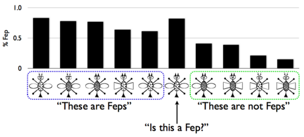

<!--
  * **revise learning as induction section:**

    * **infinite hypothesis spaces. poverty of stimulus arguments, inductive bias.**

    * **add number game?**

    * **more on LoT / RR style models**

    * **conjugate vs length prior**
-->
The line between "reasoning" and "learning" is unclear in cognition.
Just as reasoning can be seen as a form of conditional inference, so can learning: discovering persistent facts about the world (for example, causal processes or causal properties of objects).
By saying that we are learning "persistent" facts we are indicating that there is something to infer which we expect to be relevant to many observations over time.
Thus, we will formulate learning as inference in a model that (1) has a fixed latent value of interest, the *hypothesis*, and (2) has a sequence of observations, the *data points*. This will be a special class of [models for sequences of observations]({{site.baseurl}}/chapters/05-observing-sequences.html)---roughly those that fit the pattern of [Bayes rule](03-conditioning.html#bayes-rule):

<!--note that this pattern is exactly the mapData pattern....-->

~~~~ norun
Infer({...}, function() {
  var hypothesis = sample(prior)
  var obsFn = function(datum){...uses hypothesis...}
  mapData({data: observedData}, obsFn)
  return hypothesis
});
~~~~

The `prior` samples a hypothesis from the *hypothesis space*.
This distribution expresses our prior knowledge about how the process we observe is likely to work, before we have observed any data.
The function `obsFn` captures the relation between the `hypothesis` and a single `datum`, and will usually contain an `observe` statement.
Here we have used the special operator [`mapData`](http://webppl.readthedocs.io/en/master/functions/arrays.html?highlight=mapData) whose meaning is the same as `map`. We use `mapData` both to remind ourselves that we are expressing the special pattern of observing a sequence of observations, and because some inference algorithms can use this hint to do better learning.

When thinking about learning as inference, there are several key questions. First, what can be inferred about the hypothesis given a certain subset of the observed data? For example, in most cases, you cannot learn much about the weight of an object based on its color. However, if there is a correlation between weight and color -- as is the case in many children's toys -- observing color does allow you to learn about weight. 

Second, what is the relationship between the amount of input (how much data we've observed) and the knowledge gained? In psychology, this relationship is often characterized with a *learning curve*, representing a belief as a function of amount of data. 
In general, getting more data allows us to update our beliefs. But some data, in some models, has a much bigger effect. 
In addition, while knowledge often changes gradually as data is acucmulated, it sometimes jumps in non-linear ways; these are usually the most psychologically interesting predictions.

<!--
  NDG: i didn't really lie this discussion...
The code below generates three simple learning curves. In the first, there is a linear relationship between amount of input and amount of knowledge. 

The second shows an exponential relationship: each additional bit of data results in more knowledge than the last one. This learning curve is common when learning an integrated set of facts (like a theory): learning additional parts of the theory help you understand the parts you've already learned better. 

The third learning curve depicts decreasing returns: each additional bit of data provides less and less new knowledge. This is sadly quite common. For instance, in memorizing unrelated facts (like the capitals of countries), new information can interfere with already-acquired knowledge, making it harder to learn the new information and causing you to forget what you have already learned. Other examples involve repetition in the input: after moving to a new city, you are likely to meet fewer and fewer new people each day. Thus, each additional day results in less additional knowledge. 

~~~~js
var fn_increase = function(){
  var x = uniform(0,1)
  var y = x*x
  return {input:x,knowledge:y}
}

var fn_decrease = function(){
  var x = uniform(0,1)
  var y = x*x
  return {input:x,knowledge:y}
}

var fn_linear = function(){
  var x = uniform(0,1)
  return {input:x,knowledge:x}
}

print("")
print("Three kinds of learning curves")
print("Equivalent returns on input regardless of amount of knowledge:")
viz(repeat(100, fn_linear))

print("Increasing returns on input as knowledge grows:")
viz(repeat(100, fn_increase))

print("Decreasing returns on input as knowledge grows:")
viz(repeat(100, fn_decrease))
~~~~

-->

# Example: Learning About Coins

As a simple illustration of learning, imagine that a friend pulls a coin out of her pocket and offers it to you to flip.  You flip it five times and observe a set of all heads:

`[H, H, H, H, H]`.

Does this seem at all surprising?  To most people, flipping five heads in a row is a minor coincidence but nothing to get excited about.  But suppose you flip it five more times and continue to observe only heads.  Now the data set looks like this:

`[H, H, H, H, H, H, H, H, H, H]`

Most people would find this a highly suspicious coincidence and begin to suspect that perhaps their friend has rigged this coin in some way -- maybe it's a weighted coin that always comes up heads no matter how you flip it.  This inference could be stronger or weaker, of course, depending on what you believe about your friend or how she seems to act; did she offer a large bet that you would flip more heads than tails?  Now you continue to flip five more times and again observe nothing but heads -- so the data set now consists of 15 heads in a row:

`[H, H, H, H, H, H, H, H, H, H, H, H, H, H, H]`

Regardless of your prior beliefs, it is almost impossible to resist the inference that the coin is a trick coin.

This "learning curve" reflects a highly systematic and rational process of conditional inference.
<!--
Here's how to describe it using a probabilistic program<ref>following on Griffiths and Tenenbaum, "From mere coincidences to meaningful discoveries", Cognition, 2007, who present a more in-depth rational analysis and empirical study of people's sense of coincidence</ref>.  Recall how earlier we used stochastic functions with no inputs, or *thunks*, to describe coins of different weights.  Each such function now represents a hypothesis about the process generating our observations.  In the program below, the function `coin` represents these hypotheses.  The higher-order function `make-coin` takes one input, `weight`, and returns a `coin` thunk with that weight embedded in its definition.
-->
For simplicity let's consider only two hypotheses, two possible definitions of `coin`, representing a fair coin and a trick coin that produces heads 95% of the time. A priori, how likely is any coin offered up by a friend to be a trick coin?  Of course there is no objective or universal answer to that question, but for the sake of illustration let's assume that the *prior probability* of seeing a trick coin is 1 in a 1000, versus 999 in 1000 for a fair coin.  These probabilities determine the weight passed to `makeCoin`.  Now to inference:

~~~~
var observedData = ['h', 'h', 'h', 'h', 'h']
var fairPrior = 0.999
var makeCoin = function(weight) {
  return function() {
    return flip(weight) ? 'h' : 't'
  }
}

var fairnessPosterior = Infer({method: 'enumerate'}, function() {
  var fair = flip(fairPrior)
  var coin = makeCoin(fair ? 0.5 : 0.95)
  var obsFn = function(datum){condition(datum == coin())}
  mapData({data: observedData}, obsFn)
  return {fair: fair}
})

viz(fairnessPosterior)
~~~~

Try varying the number of flips and the number of heads observed.  You should be able to reproduce the intuitive learning curve described above.  Observing 5 heads in a row is not enough to suggest a trick coin, although it does raise the hint of this possibility: its chances are now a few percent, approximately 30 times the baseline chance of 1 in a 1000.  After observing 10 heads in a row, the odds of trick coin and fair coin are now roughly comparable, although fair coin is still a little more likely.  After seeing 15 or more heads in a row without any tails, the odds are now strongly in favor of the trick coin.

Study how this learning curve depends on the choice of `fairPrior`.   There is certainly a dependence.  If we set `fairPrior` to be 0.5, equal for the two alternative hypotheses, just 5 heads in a row are sufficient to favor the trick coin by a large margin.  If `fairPrior` is 99 in 100, 10 heads in a row are sufficient.  We have to increase `fairPrior` quite a lot, however, before 15 heads in a row is no longer sufficient evidence for a trick coin: even at `fairPrior` = 0.9999, 15 heads without a single tail still weighs in favor of the trick coin.  This is because the evidence in favor of a trick coin accumulates exponentially as the data set increases in size; each successive `h` flip increases the evidence by nearly a factor of 2.

Learning is always about the shift from one state of knowledge to another.  The speed of that shift provides a way to diagnose the strength of a learner's initial beliefs.   Here, the fact that somewhere between 10 and 15 heads in a row is sufficient to convince most people that the coin is a trick coin suggests that for most people, the a priori probability of encountering a trick coin in this situation is somewhere between 1 in a 100 and 1 in 10,000---a reasonable range.  Of course, if you begin with the suspicion that any friend who offers you a coin to flip is liable to have a trick coin in his pocket, then just seeing five heads in a row should already make you very suspicious---as we can see by setting `fairPrior` to a value such as 0.9.

## Learning trajectories

When studying learning as conditional inference, that is when considering an *ideal learner model*, we are particularly interested in the dynamics of how inferred hypotheses change as a function of amount of data (often thought of as time the learner spends acquiring data). We can map out the *trajectory* of learning by plotting a summary of the posterior distribution over hypotheses as a function of the amount of observed data. Here we plot the expectation that the coin is fair in the above example:

~~~~
///fold:
var makeCoin = function(weight) {
  return function() {
    return flip(weight) ? 'h' : 't'
  }
};
///

var fairnessPosterior = function(observedData) {
  return Infer({method: 'enumerate'}, function() {
    var fair = flip(0.999)
    var coin = makeCoin(fair ? 0.5 : 0.95)
    var obsFn = function(datum){condition(datum == coin())}
    mapData({data: observedData}, obsFn)
    return {fair: fair}
  })
}

var trueWeight = .9;
var trueCoin = makeCoin(trueWeight);
var fullDataSet = repeat(100, trueCoin);
var observedDataSizes = [1,3,6,10,20,30,50,70,100];
var estimates = map(function(N) {
  return expectation(fairnessPosterior(fullDataSet.slice(0,N)), function(x){return x.fair})
}, observedDataSizes);
viz.line(observedDataSizes, estimates);
~~~~

Notice that different runs of this program can give quite different trajectories, but always end up in the same place in the long run. This is because the data set used for learning is different on each run. This is a feature, not a bug: real learners have idiosyncratic experience, even if they are al drawn from the same distribution. Of course, we are often interested in the average behavior of an ideal learner: we could average this plot over many randomly chosen data sets, simulating many different learners.  

# Learning a Continuous Parameter

The previous example represents perhaps the simplest imaginable case of learning.  Typical learning problems in human cognition or AI are more complex in many ways.  For one, learners are almost always confronted with more than two hypotheses about the causal structure that might underlie their observations.  Indeed, hypothesis spaces for learning are often infinite.  Countably infinite hypothesis spaces are encountered in models of learning for domains traditionally considered to depend on "discrete" or "symbolic" knowledge; hypothesis spaces of grammars in language acquisition are a canonical example.  Hypothesis spaces for learning in domains traditionally considered more "continuous", such as perception or motor control, are typically uncountable and parametrized by one or more continuous dimensions.  In causal learning, both discrete and continuous hypothesis spaces typically arise.  (In statistics, making conditional inferences over continuous hypothesis spaces given data is often called *parameter estimation*.)

We can explore a basic case of learning with continuous hypothesis spaces by slightly enriching our coin flipping example.  Suppose that our hypothesis generator `makeCoin`, instead of simply flipping a coin to determine which of two coin weights to use, can choose *any* coin weight between 0 and 1.
The following program computes conditional inferences about the weight of a coin drawn from a *prior distribution* described by the `Uniform` function, conditioned on a set of observed flips.

~~~~
///fold:
var makeCoin = function(weight) {
  return function() {
    return flip(weight) ? 'h' : 't';
  }
};
///
var observedData = ['h', 'h', 'h', 'h', 'h']

var weightPosterior = Infer({method: 'rejection', samples: 1000}, function() {
  var coinWeight = sample(Uniform({a: 0, b: 1}))
  var coin = makeCoin(coinWeight)
  var obsFn = function(datum){condition(datum == coin())}
  mapData({data: observedData}, obsFn)
  return coinWeight
})

viz(weightPosterior)
~~~~

<!--
Because the output of inference is a set of conditional samples, and each sample is drawn from the uncountable interval $$[0,1]$$, we cannot expect that any of these samples will correspond exactly to the true coin weight or the single most likely value.
By binning the samples, however, we can get a meaningful estimate of how likely the coin weight is to fall in any subinterval of $[0,1]$.  We call the distribution of samples produced by conditional inference on data the *conditional distribution*, or sometimes the *posterior distribution*, to contrast with the prior distribution expressing our a priori beliefs.   The code above illustrates both prior and conditional distributions, each with a histogram of 1000 samples.
-->
Experiment with different data sets, varying both the number of flips and the relative proportion of heads and tails.  How does the shape of the conditional distribution change?  The location of its peak reflects a reasonable "best guess" about the underlying coin weight.  It will be roughly equal to the proportion of heads observed, reflecting the fact that our prior knowledge is basically uninformative; a priori, any value of `coinWeight` is equally likely.  The spread of the conditional distribution reflects a notion of confidence in our beliefs about the coin weight.  The distribution becomes more sharply peaked as we observe more data, because each flip, as an independent sample of the process we are learning about, provides additional evidence the process's unknown parameters.

 We can again look at the learning trajectory in this example:

~~~~
///fold:
var makeCoin = function(weight) {
  return function() {
    return flip(weight) ? 'h' : 't';
  }
};
///

var weightPosterior = function(observedData){
  return Infer({method: 'MCMC', samples: 1000}, function() {
    var coinWeight = sample(Uniform({a: 0, b: 1}))
    var coinDist = Bernoulli({p: coinWeight})
    var obsFn = function(datum){observe(coinDist, datum=='h')}
    mapData({data: observedData}, obsFn)
    return coinWeight
  })
}

var fullDataSet = repeat(100, function(){return 'h'});
var observedDataSizes = [0,1,2,4,8,16,25,30,50,70,100];
var estimates = map(function(N) {
  return expectation(weightPosterior(fullDataSet.slice(0,N)))
}, observedDataSizes);
viz.line(observedDataSizes, estimates);
~~~~

(Note that we have made two changes for algorithmic efficiency: we have re-written `obsFn` to use `observe` instead of `condition`, and we have switched to method `MCMC`. Think about why this helps!)
You can explore what is learned by plotting different kinds of statistics by passing a function to the `expectation`. For example, the absolute difference between the true mean and the estimated mean, or a confidence measure like the standard error of the mean.

# A Structured Hypothesis Space

It is easy to see that the previous WebPPL program doesn't really capture our intuitions about coins, or at least not in the most familiar everyday scenarios.  Imagine that you have just received a quarter in change from a store -- or even better, taken it from a nicely wrapped-up roll of quarters that you have just picked up from a bank.  Your prior expectation at this point is that the coin is almost surely fair.  If you flip it 10 times and get 7 heads out of 10, you'll think nothing of it; that could easily happen with a fair coin and there is no reason to suspect the weight of this particular coin is anything other than 0.5.  But running the above query with uniform prior beliefs on the coin weight, you'll guess the weight in this case is around 0.7. Our hypothesis generating function needs to be able to draw `coinWeight` not from a uniform distribution, but from some other function that can encode various expectations about how likely the coin is to be fair, skewed towards heads or tails, and so on. 

One option is the Beta distribution. The Beta distribution takes parameters `a` and `b`, which can be thought of as the number of *prior* observations of `h` and `t`, respectively.

~~~~
///fold:
var makeCoin = function(weight) {
  return function() {
    return flip(weight) ? 'h' : 't';
  }
};
///

var pseudoCounts = {a: 10, b: 10};

var weightPosterior = function(observedData){
  return Infer({method: 'MCMC', burn:1000, samples: 1000}, function() {
    var coinWeight = sample(Beta({a: pseudoCounts.a, b: pseudoCounts.b}))
    var coinDist = Bernoulli({p: coinWeight})
    var obsFn = function(datum){observe(coinDist, datum=='h')}
    mapData({data: observedData}, obsFn)
    return coinWeight
  })
}

var fullDataSet = repeat(100, function(){return 'h'});
var observedDataSizes = [0,1,2,4,6,8,10,20,30,40,50,70,100];
var estimates = map(function(N) {
  return expectation(weightPosterior(fullDataSet.slice(0,N)))
}, observedDataSizes);
viz.line(observedDataSizes, estimates);
~~~~

We are getting closer, in that learning is far more conservative. In fact, it is too conservative: after getting heads 100 times in a row, most humans will conclude the coin can *only* come up heads. The model, in contrast, still expects the coin to come up tails around 10% of the time. 

We can of course decrease our priors `a` and `b` to get faster learning, but then we will just go back to our earlier problem. The problem is that our Beta is putting much less prior probability on a coin with weight 1.0 than a coin with weight 0.9, whereas most humans probably have the opposite prior. While we can address this by using fractional values for `a` and `b`, this results in a model that strongly disfavors fair coins. What we really want is a prior that puts high probability on weights of 0.0, 0.5, and 1.0, with low probability on everything else.

The following model expects coins to come in one of four categories: fair, always heads, always tails, and 'bent' -- where a 'bent' coint can have any weight from 0 to 1:

~~~~js
///fold:
var makeCoin = function(weight) {
  return function() {
    return flip(weight) ? 'h' : 't';
  }
};
///

var priors = {fair:.999, allHeads:.0005, allTails:.00025, bent:.00025}
var drawWeight = function(priors){
  var type = sample(Categorical({vs: ['fair', 'allHeads', 'allTails', 'bent'], ps:[priors.fair, priors.allHeads, priors.allTails, priors.bent]}))
  return (type == 'fair') ? 0.5 : 
         (type == 'allHeads') ? 1.0 :
         (type == 'allTails') ? 0.0 :
         sample(Uniform({a:0, b:1}))
}

var weightPosterior = function(observedData){
  return Infer({method: 'MCMC', burn:2500, samples: 500, lag:100}, function() {
    var coinWeight = drawWeight(priors)
    var coinDist = Bernoulli({p: coinWeight})
    var obsFn = function(datum){observe(coinDist, datum=='h')}
    mapData({data: observedData}, obsFn)
    return coinWeight
  })
}

var fullDataSet = repeat(50, function(){return 'h'});
var observedDataSizes = [0,1,2,4,6,8,10,12,15,20,25,30,40,50];
var estimates = map(function(N) {
  return expectation(weightPosterior(fullDataSet.slice(0,N)))
}, observedDataSizes);
viz.line(observedDataSizes, estimates);
~~~~
 
This model stubbornly believes the coin is fair until around 10 successive heads have been observed. After that, it rapidly concludes that the coin can only come up heads. The shape of this learning trajectory is much closer to what we would expect for humans. 

Importantly, the model *can* infer an intermediate weight such as 0.85, albeit with some reluctance:

~~~~js
///fold:
var makeCoin = function(weight) {
  return function() {
    return flip(weight) ? 'h' : 't';
  }
};
///

var priors = {fair:.999, allHeads:.0005, allTails:.00025, bent:.00025}
var drawWeight = function(priors){
  var type = sample(Categorical({vs: ['fair', 'allHeads', 'allTails', 'bent'], ps:[priors.fair, priors.allHeads, priors.allTails, priors.bent]}))
  return (type == 'fair') ? 0.5 : 
         (type == 'allHeads') ? 1.0 :
         (type == 'allTails') ? 0.0 :
         sample(Uniform({a:0, b:1}))
}

var weightPosterior = function(observedData){
  return Infer({method: 'MCMC', burn:2500, samples: 500, lag:100}, function() {
    var coinWeight = drawWeight(priors)
    var coinDist = Bernoulli({p: coinWeight})
    var obsFn = function(datum){observe(coinDist, datum=='h')}
    mapData({data: observedData}, obsFn)
    return coinWeight
  })
}

var coin = makeCoin(.85)
var fullDataSet = repeat(200, function(){return coin()});
var observedDataSizes = [0,2,4,6,10,15,20,25,30,40,50,75,100,200];
var estimates = map(function(N) {
  return expectation(weightPosterior(fullDataSet.slice(0,N)))
}, observedDataSizes);
viz.line(observedDataSizes, estimates);
~~~~

Once again, it takes us a little while to begin to suspect the coin isn't fair. However, once we make that conclusion, we rapidly shift our beliefs about the coin's weight. Interestingly, the speed at which we reject the 'fair coin' hypothesis is related to how far the coin's actual weight is from 0.5 (Why?):

~~~~js
///fold:
var makeCoin = function(weight) {
  return function() {
    return flip(weight) ? 'h' : 't';
  }
};
///

var priors = {fair:.999, allHeads:.0005, allTails:.00025, bent:.00025}
var drawWeight = function(priors){
  var type = sample(Categorical({vs: ['fair', 'allHeads', 'allTails', 'bent'], ps:[priors.fair, priors.allHeads, priors.allTails, priors.bent]}))
  return (type == 'fair') ? 0.5 : 
         (type == 'allHeads') ? 1.0 :
         (type == 'allTails') ? 0.0 :
         sample(Uniform({a:0, b:1}))
}

var weightPosterior = function(observedData){
  return Infer({method: 'MCMC', burn:2500, samples: 500, lag:100}, function() {
    var coinWeight = drawWeight(priors)
    var coinDist = Bernoulli({p: coinWeight})
    var obsFn = function(datum){observe(coinDist, datum=='h')}
    mapData({data: observedData}, obsFn)
    return coinWeight
  })
}

var coin = makeCoin(.7)
var fullDataSet = repeat(200, function(){return coin()});
var observedDataSizes = [0,2,4,6,10,15,20,25,30,40,50,75,100,200];
var estimates = map(function(N) {
  return expectation(weightPosterior(fullDataSet.slice(0,N)))
}, observedDataSizes);
viz.line(observedDataSizes, estimates);
~~~~

This model is a simple example of a *hierarchical prior* which we explore in detail in a later chapter.

## Example: Estimating Causal Power

<!-- Not really the most compelling example. Maybe cut??
NDG: it's here to get ready for causal support later... we could explain better why this is interesting, eg connect more explicitly to cheng and RW? Perhaps model some of Cheng's actual data?-->

Modeling beliefs about coins makes for clear examples, but it's obviously not a very important cognitive problem. However, many important cognitive problems have a remarkably similar structure.

For instance, a common problem for cognition is *causal learning*: from observed evidence about the co-occurrence of events, attempt to infer the causal structure relating them. An especially simple case that has been studied by psychologists is *elemental causal induction*: causal learning when there are only two events, a potential cause C and a potential effect P. Cheng and colleagues @cheng1997covariation have suggested assuming that C and background effects can both cause E, with a noisy-or interaction. Causal learning then becomes an example of parameter learning,  where the parameter is the "causal power" of C to cause E:

~~~~
var observedData = [{C:true, E:true}, {C:true, E:true}, {C:false, E:false}, {C:true, E:true}]

var causalPowerPost = Infer({method: 'MCMC', samples: 10000}, function() {
  // Causal power of C to cause E
  var cp = uniform(0, 1)

  // Background probability of E
  var b = uniform(0, 1)

  var obsFn = function(datum) {
    // The noisy causal relation to get E given C
    var E = (datum.C && flip(cp)) || flip(b)
    condition( E == datum.E)
  }

  mapData({data: observedData}, obsFn)

  return {causal_power: cp}
});

viz(causalPowerPost);
~~~~

Experiment with this model: when does it conclude that a causal relation is likely (high `cp`)? Does this match your intuitions? What role does the background rate `b` play? What happens if you change the functional relationship in `obsFn`?

# Learning with a Language of Thought

An important worry about Bayesian models of learning is that the Hypothesis space must either be too simple (as in the models above), specified in a rather ad-hoc way, or both. There is a tension here: human representations of the world are enormously complex and so the space of possible representations must be correspondingly big, and yet we would like to understand the representational resources in simple and uniform terms. How can we construct very large (possibly infinite) hypothesis spaces, and priors over them? One possibility is to use a grammar to specify a *hypothesis language*: a small grammar can generate an infinite array of potential hypotheses. Because grammars are themselves generative processes, a prior is provided for free from this formulation.

## Example: Inferring an Arithmetic Expression

<!--
We generate an expression as a list, and then turn it into a value (in this case a procedure) by using `apply`---a function that invokes evaluation.

~~~~
var randomArithmeticExpression = function() {
  return (flip(.7) ?
          (flip() ? 'x' : randomInteger({n: 10})) :
	  (randomArithmeticExpression()
	  + categorical({vs: ['+', '-'], ps: [.5, .5]})
	  + randomArithmeticExpression()));
};

var funcFromExpression = function(expression) {
  return _top.eval('(function(x) { ' + expression + '})');
};

var expressionPosterior = Infer({method: 'enumerate', maxExecutions: 100}, function() {
  var fExpression = randomArithmeticExpression();
  var f = funcFromExpression(fExpression);
  condition(f(1) == 3);
  return fExpression;
});

viz.table(expressionPosterior);
~~~~
-->

Consider the following WebPPL program, which induces an arithmetic function from examples. This model can learn any function consisting of the integers 0 to 9 and the operations add, subtract, multiply, divide, and raise to a power. (The helper functions `prettify` and `runify`, above the fold, make the expression pretty to look at and a runnable function, respectively.)

~~~~
///fold:
// make expressions easier to look at
var prettify = function(e) {
  if (e == 'x' || _.isNumber(e)) {
    return e
  } else {
    var op = e[0]
    var arg1 = prettify(e[1])
    var prettyarg1 = (!_.isArray(e[1]) ? arg1 : '(' + arg1 + ')')
    var arg2 = prettify(e[2])
    var prettyarg2 = (!_.isArray(e[2]) ? arg2 : '(' + arg2 + ')')
    return prettyarg1 + ' ' + op + ' ' + prettyarg2
  }
}

// make expressions runnable
var runify = function(e) {
  if (e == 'x') {
    return function(z) { return z }
  } else if (_.isNumber(e)) {
    return function(z) { return e }
  } else {
    var op = (e[0] == '+') ? plus : 
             (e[0] == '-') ? minus :
             (e[0] == '*') ? multiply :
             (e[0] == '/') ? divide :
              power;
    var arg1Fn = runify(e[1])
    var arg2Fn = runify(e[2])
    return function(z) {
      return op(arg1Fn(z),arg2Fn(z))
    }
  }
}
///

var plus = function(a,b) {
  return a + b;
}

var multiply = function(a,b) {
  return Math.round(a * b,0);
}

var divide = function(a,b) {
  return Math.round(a/b,0);
}

var minus = function(a,b) {
  return a - b;
}

var power = function(a,b) {
  return Math.pow(a,b);
}

var randomConstantFunction = function() {
  return uniformDraw(_.range(10))
}

var randomCombination = function(f,g) {
  var op = uniformDraw(['+','-','*','/','^']);
  return [op, f, g];
}

// sample an arithmetic expression
var randomArithmeticExpression = function() {
  if (flip()) {
    return randomCombination(randomArithmeticExpression(), randomArithmeticExpression())
  } else {
    if (flip()) {
      return 'x'
    } else {
      return randomConstantFunction()
    }
  }
}

viz.table(Infer({method: 'enumerate', maxExecutions: 100}, function() {
  var e = randomArithmeticExpression();
  var s = prettify(e);
  var f = runify(e);
  condition(f(1) == 3);

  return {s: s};
}))
~~~~

The query asks for an arithmetic expression on variable `x` such that it evaluates to `3` when `x` is `1`. In this example there are many extensionally equivalent ways to satisfy the condition, for instance the expressions `3`, `1 + 2`, and `x + 2`, but because the more complex expressions require more choices to generate, they are chosen less often. What happens if we observe more data? For instance, try changing the condition in the above query to `f(1) == 3 && f(2) == 4`. This model learns from an infinite hypothesis space---all expressions made from 'x', '+', '-', and constant integers---but specifies both the hypothesis space and its prior using the simple generative process `randomArithmeticExpression`.

Notice that the model puts the most probability on a function that always returns `3` ($$f(x) = 3$$). This is the simplest hypothesis consistent with the data. Let's see what happens if we have more data:

~~~~
///fold:
// make expressions easier to look at
var prettify = function(e) {
  if (e == 'x' || _.isNumber(e)) {
    return e
  } else {
    var op = e[0]
    var arg1 = prettify(e[1])
    var prettyarg1 = (!_.isArray(e[1]) ? arg1 : '(' + arg1 + ')')
    var arg2 = prettify(e[2])
    var prettyarg2 = (!_.isArray(e[2]) ? arg2 : '(' + arg2 + ')')
    return prettyarg1 + ' ' + op + ' ' + prettyarg2
  }
}

var plus = function(a,b) {
  return a + b;
}

var multiply = function(a,b) {
  return Math.round(a * b,0);
}

var divide = function(a,b) {
  return Math.round(a/b,0);
}

var minus = function(a,b) {
  return a - b;
}

var power = function(a,b) {
  return Math.pow(a,b);
}

// make expressions runnable
var runify = function(e) {
  if (e == 'x') {
    return function(z) { return z }
  } else if (_.isNumber(e)) {
    return function(z) { return e }
  } else {
    var op = (e[0] == '+') ? plus : 
             (e[0] == '-') ? minus :
             (e[0] == '*') ? multiply :
             (e[0] == '/') ? divide :
              power;
    var arg1Fn = runify(e[1])
    var arg2Fn = runify(e[2])
    return function(z) {
      return op(arg1Fn(z),arg2Fn(z))
    }
  }
}

var randomConstantFunction = function() {
  return uniformDraw(_.range(10))
}

var randomCombination = function(f,g) {
  var op = uniformDraw(['+','-','*','/','^']);
  return [op, f, g];
}

// sample an arithmetic expression
var randomArithmeticExpression = function() {
  if (flip()) {
    return randomCombination(randomArithmeticExpression(), randomArithmeticExpression())
  } else {
    if (flip()) {
      return 'x'
    } else {
      return randomConstantFunction()
    }
  }
}
///

viz.table(Infer({method: 'enumerate', maxExecutions: 100}, function() {
  var e = randomArithmeticExpression();
  var s = prettify(e);
  var f = runify(e);
  condition(f(1) == 3);
  condition(f(2) == 6);

  return {s: s};
}))
~~~~

## Example: Rational Rules

How can we account for the productivity of human concepts (the fact that every child learns a remarkable number of different, complex concepts)? The "classical" theory of concepts formation accounted for this productivity by hypothesizing that concepts are represented compositionally, by logical combination of the features of objects (see for example Bruner, Goodnow, and Austin, 1951). That is, concepts could be thought of as rules for classifying objects (in or out of the concept) and concept learning was a process of deducing the correct rule.

While this theory was appealing for many reasons, it failed to account for a variety of categorization experiments. Here are the training examples, and one transfer example, from the classic experiment of Medin and Schaffer (1978). The bar graph above the stimuli shows the portion of human participants who said that bug was a "fep" in the test phase (the data comes from a replication by Nosofsky, Gluck, Palmeri, McKinley (1994); the bug stimuli are courtesy of Pat Shafto):

Notice three effects: there is a gradient of generalization (rather than all-or-nothing classification), some of the Feps are better (or more typical) than others (this is called "typicality"), and the transfer item is a ''better'' Fep than any of the Fep exemplars (this is called "prototype enhancement"). Effects like these were difficult to capture with classical rule-based models of category learning, which led to deterministic behavior. As a result of such difficulties, psychological models of category learning turned to more uncertain, prototype and exemplar based theories of concept representation. These models were able to predict behavioral data very well, but lacked  compositional conceptual structure.

Is it possible to get graded effects from rule-based concepts? Perhaps these effects are driven by uncertainty in *learning* rather than uncertainty in the representations themselves? To explore these questions Goodman, Tenenbaum, Feldman, and Griffiths (2008) introduced the Rational Rules model, which learns deterministic rules by probabilistic inference. This model has an infinite hypothesis space of rules (represented in propositional logic), which are generated compositionally. Here is a slightly simplified version of the model, applied to the above experiment:

~~~~
// first set up the training (cat A/B) and test objects:
var numFeatures = 4;

var makeObj = function(l) {return _.zipObject(['trait1', 'trait2', 'trait3', 'trait4'], l)}
var AObjects = map(makeObj, [[0,0,0,1], [0,1,0,1], [0,1,0,0], [0,0,1,0], [1,0,0,0]])
var BObjects = map(makeObj, [[0,0,1,1], [1,0,0,1], [1,1,1,0], [1,1,1,1]])
var TObjects = map(makeObj, [[0,1,1,0], [0,1,1,1], [0,0,0,0], [1,1,0,1], [1,0,1,0], [1,1,0,0], [1,0,1,1]])

//here are the human results from Nosofsky et al, for comparison:
var humanA = [.77, .78, .83, .64, .61]
var humanB = [.39, .41, .21, .15]
var humanT = [.56, .41, .82, .40, .32, .53, .20]

// two parameters: stopping probability of the grammar, and noise probability:
var tau = 0.3;
var noiseParam = Math.exp(-1.5)

// a generative process for disjunctive normal form propositional equations:
var traitPrior = Categorical({vs: ['trait1', 'trait2', 'trait3', 'trait4'],
                              ps: [.25, .25, .25, .25]});
var samplePred = function() {
  var trait = sample(traitPrior);
  var value = flip()
  return function(x) {return x[trait] == value};
}

var sampleConj = function() {
  if(flip(tau)) {
    var c = sampleConj();
    var p = samplePred();
    return function(x) {return c(x) && p(x)};
  } else {
    return samplePred();
  }
}

var getFormula = function() {
  if(flip(tau)) {
    var c = sampleConj();
    var f = getFormula();
    return function(x) {return c(x) || f(x)};
  } else {
    return sampleConj();
  }
}

var rulePosterior = Infer({method: 'MCMC', samples: 20000}, function() {
  // sample a classification formula
  var rule = getFormula();
  // condition on correctly (up to noise) accounting for A & B categories
  var obsFnA = function(datum){observe(Bernoulli({p: rule(datum) ? 0.999999999 : noiseParam}), true)}
  mapData({data:AObjects}, obsFnA)
  var obsFnB = function(datum){observe(Bernoulli({p: !rule(datum) ? 0.999999999 : noiseParam}), true)}
  mapData({data:BObjects}, obsFnB)
  // return posterior predictive
  var allObjs = TObjects.concat(AObjects).concat(BObjects);
  return _.zipObject(_.range(allObjs.length), map(rule, allObjs));
})

//build predictive distribution for each item
var predictives = map(function(item){return expectation(rulePosterior,function(x){x[item]})}, _.range(15))

var humanData = humanT.concat(humanA).concat(humanB)
viz.scatter(predictives, humanData)
~~~~
<!--note: this also works fine with enumerate.. switch?-->

Goodman, et al, have used to this model to capture a variety of classic categorization effects [@Goodman2008b]. Thus probabilistic induction of (deterministic) rules can capture many of the graded effects previously taken as evidence against rule-based models.

This style of compositional concept induction model, can be naturally extended to more complex hypothesis spaces. For examples, see:

* Compositionality in rational analysis: Grammar-based induction for concept learning. N. D. Goodman, J. B. Tenenbaum, T. L. Griffiths, and J. Feldman (2008). In M. Oaksford and N. Chater (Eds.). The probabilistic mind: Prospects for Bayesian cognitive science.

* A Bayesian Model of the Acquisition of Compositional Semantics. S. T. Piantadosi, N. D. Goodman, B. A. Ellis, and J. B. Tenenbaum (2008). Proceedings of the Thirtieth Annual Conference of the Cognitive Science Society.

* Piantadosi, S. T., & Jacobs, R. A. (2016). Four Problems Solved by the Probabilistic Language of Thought. Current Directions in Psychological Science, 25(1).

It has been used to model theory acquisition, learning natural numbers concepts, etc. Further, there is no reason that the concepts need to be deterministic; in WebPPL stochastic functions can be constructed compositionally and learned by induction:

* Learning Structured Generative Concepts. A. Stuhlmueller, J. B. Tenenbaum, and N. D. Goodman (2010). Proceedings of the Thirty-Second Annual Conference of the Cognitive Science Society.

Reading & Discussion: [Readings]({{site.baseurl}}/readings/08-learning-as-conditional-inference.html)

Test your knowledge: [Exercises]({{site.baseurl}}/exercises/08-learning-as-conditional-inference.html)

Next chapter: [Hierarchical models]({{site.baseurl}}/chapters/09-hierarchical-models.html)
