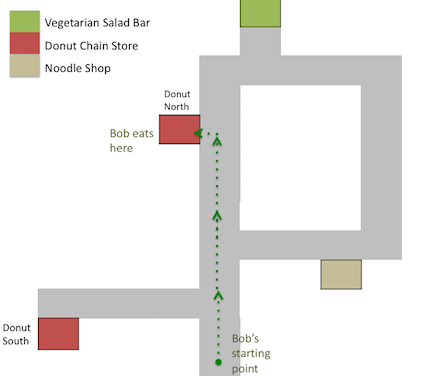

Adapted from "[Modeling agents with probabilistic programs](http://agentmodels.org)" by Owain Evans, Andreas Stuhlmüller, John Salvatier, and Daniel Filan, and "[Probabilistic language understanding](https://gscontras.github.io/probLang/)" by Gregory Scontras and Michael Henry Tessler.
Note: To be edited. Need permisions.

## Introduction

Imagine a dataset that records how individuals move through a city. The figure below shows what a datapoint from this set might look like. It depicts an individual, who we'll call Bob, moving along a street and then stopping at a restaurant. This restaurant is one of two nearby branches of a chain of Donut Stores. Two other nearby restaurants are also shown on the map.

Given Bob's movements alone, what can we infer about his preferences and beliefs? Since Bob spent a long time at the Donut Store, we infer that he bought something there. Since Bob could easily have walked to one of the other nearby eateries, we infer that Bob prefers donuts to noodles or salad.

Assuming Bob likes donuts, why didn't he choose the store closer to his starting point ("Donut South")? The cause might be Bob's *beliefs* and *knowledge* rather than his *preferences*. Perhaps Bob doesn't know about "Donut South" because it just opened. Or perhaps Bob knows about Donut South but chose Donut North because it is open later.

A different explanation is that Bob *intended* to go to the healthier "Vegetarian Salad Bar". However, the most efficient route to the Salad Bar takes him directly past Donut North, and once outside, he found donuts more tempting than salad.

<!--
We have described a variety of inferences about Bob which would explain his behavior. This tutorial develops models for inference that represent these different explanations and allow us to compute which explanations are most plausible. These models can also simulate an agent's behavior in novel scenarios: for example, predicting Bob's behavior if he looked for food in a different part of the city. 
-->

<!-- Remove because we don't do hierarchical case
Now, suppose that our dataset shows that a significant number of different individuals took exactly the same path as Bob. How would this change our conclusions about him? It could be that everyone is tempted away from healthy food in the way Bob potentially was. But this seems unlikely. Instead, it is now more plausible that Donut South is closed or that it is a new branch that few people know about. 

This kind of reasoning, where we make assumptions about the distributions of beliefs within populations, will be formalized and simulated in later chapters. We will also consider multi-agent behavior where coordination or competition become important. 
-->

### Making rational plans

Formal models of rational agents play an important role in economics refp:rubinstein2012lecture and in the cognitive sciences refp:chater2003rational as models of human or animal behavior. Core components of such models are *expected-utility maximization*, *Bayesian inference*, and *game-theoretic equilibria*. These ideas are also applied in engineering and in artificial intelligence refp:russell1995modern in order to compute optimal solutions to problems and to construct artificial systems that learn and reason optimally. 

<!--
This chapter implements utility-maximizing Bayesian agents as functional probabilistic programs. These programs provide a concise, intuitive translation of the mathematical specification of rational agents as code. The implemented agents explicitly simulate their own future choices via recursion. They update beliefs by exact or approximate Bayesian inference. They reason about other agents by simulating them (which includes simulating the simulations of others). 

The first section of the tutorial implements agent models for sequential decision problems in stochastic environments. We introduce a program that solves finite-horizon MDPs, then extend it to POMDPs. These agents behave *optimally*, making rational plans given their knowledge of the world. Human behavior, by contrast, is often *sub-optimal*, whether due to irrational behavior or constrained resources. The programs we use to implement optimal agents can, with slight modification, implement agents with biases (e.g. time inconsistency) and with resource bounds (e.g. bounded look-ahead and Monte Carlo sampling).

### Learning preferences from behavior

The example of Bob was not primarily about *simulating* a rational agent, but rather about the problem of *learning* (or *inferring*) an agent's preferences and beliefs from their choices. This problem is important to both economics and psychology. Predicting preferences from past choices is also a major area of applied machine learning; for example, consider the recommendation systems used by Netflix and Facebook.

One approach to this problem is to assume the agent is a rational utility-maximizer, to assume the environment is an MDP or POMDP, and to infer the utilities and beliefs and predict the observed behavior. This approach is called "structural estimation" in economics refp:aguirregabiria2010dynamic, "inverse planning" in cognitive science refp:ullman2009help, and "inverse reinforcement learning" (IRL) in machine learning and AI refp:ng2000algorithms. It has been applied to inferring the perceived rewards of education from observed work and education choices, preferences for health outcomes from smoking behavior, and the preferences of a nomadic group over areas of land (see cites in reft:evans2015learning). 
-->

Our goal is to implement agents that compute rational *policies*. Policies are *plans* for achieving good outcomes in environments where:

- The agent makes a *sequence* of *distinct* choices, rather than choosing once.

- The environment is *stochastic* (or "random").

- Some features of the environment are initially *unknown* to the agent. (So the agent may choose to gain information in order to improve future decisions.)

## One-shot decisions in a deterministic world

We begin with agents that solve the very simplest decision problems. These are trivial *one-shot* problems, where the agent selects a single action (not a sequence of actions). We use WebPPL to solve these problems in order to illustrate the core concepts that are necessary for the more complex problems in later chapters.

In a *one-shot decision problem* an agent makes a single choice between a set of *actions*, each of which has potentially distinct *consequences*. A rational agent chooses the action that is best in terms of his or her own preferences. Often, this depends not on the *action* itself being preferred, but only on its *consequences*. 

For example, suppose Tom is choosing between restaurants and all he cares about is eating pizza. There's an Italian restaurant and a French restaurant. Tom would choose the French restaurant if it offered pizza. Since it does *not* offer pizza, Tom will choose the Italian.

Tom selects an action $$a \in A$$ from the set of all actions. The actions in this case are {"eat at Italian restaurant", "eat at French restaurant"}. The consequences of an action are represented by a transition function $$T \colon S \times A \to S$$ from state-action pairs to states. In our example, the relevant *state* is whether or not Tom eats pizza. Tom's preferences are represented by a real-valued utility function $$U \colon S \to \mathbb{R}$$, which indicates the relative goodness of each state. 

Tom's *decision rule* is to take action $$a$$ that maximizes utility, i.e., the action

$$
{\arg \max}_{a \in A} U(T(s,a))
$$

In WebPPL, we can implement this utility-maximizing agent as a function `maxAgent` that takes a state $$s \in S$$ as input and returns an action. For Tom's choice between restaurants, we assume that the agent starts off in a state `"initialState"`, denoting whatever Tom does before going off to eat. The program directly translates the decision rule above using the higher-order function `argMax`.
<!-- TODO fix argmax -->

~~~~
///fold: argMax
var argMax = function(f, ar){
  return maxWith(f, ar)[0]
};
///
// Choose to eat at the Italian or French restaurants
var actions = ['italian', 'french'];

var transition = function(state, action) {
  if (action === 'italian') {
    return 'pizza';
  } else {
    return 'steak frites';
  }
};

var utility = function(state) {
  if (state === 'pizza') {
    return 10;
  } else {
    return 0;
  }
};

var maxAgent = function(state) {
  return argMax(
    function(action) {
      return utility(transition(state, action));
    },
    actions);
};

print('Choice in initial state: ' + maxAgent('initialState'));
~~~~

As you can see, Tom will always go to the Italian restaurant. (How would you modify the code to make him head to the French restaurant?)

There is an alternative way to compute the optimal action for this problem. The idea is to treat choosing an action as an *inference* problem. We sample random actions with `uniformDraw` and condition on the preferred outcome happening. Intuitively, we imagine observing the consequence we prefer (e.g. pizza) and then *infer* from this the action that caused this consequence. <!-- address evidential vs causal decision theory? -->

This idea is known as "planning as inference" refp:botvinick2012planning. It also resembles the idea of "backwards chaining" in logical inference and planning. The `inferenceAgent` solves the same problem as `maxAgent`, but uses planning as inference: 

~~~~
var actions = ['italian', 'french'];

var transition = function(state, action) {
  if (action === 'italian') {
    return 'pizza';
  } else {
    return 'steak frites';
  }
};

var inferenceAgent = function(state) {
  return Infer({ 
    model() {
      var action = uniformDraw(actions);
      condition(transition(state, action) === 'pizza');
      return action;
    }
  });
}

viz(inferenceAgent("initialState"));
~~~~

Again, we find that Tom always goes to the Italian restaurant. (How can you change the model so that he chooses the French restaurant?)

## One-shot decisions in a stochastic world

In the previous example, the transition function from state-action pairs to states was *deterministic* and so described a deterministic world or environment. Moreover, the agent's actions were deterministic; Tom always chose the best action ("Italian"). In contrast, we often want to reason about a *stochastic* world and a noisy "soft-max" agent (soft-max agents are explained below). 

We start by revising our model of the world to be stochastic. This time, Tom's preferences are about the overall quality of the meal. A meal can be "bad", "good" or "spectacular" and each restaurant has good nights and bad nights. The transition function now has type signature $$ T\colon S \times A \to \Delta S $$, where $$\Delta S$$ represents a distribution over states. If Tom is a maximizer, his decision rule is now to take the action $$a \in A$$ that has the highest *average* or *expected* utility, with the expectation $$\mathbb{E}$$ taken over the probability of different successor states $$s' \sim T(s,a)$$:

$$
\max_{a \in A} \mathbb{E}( U(T(s,a)) )
$$

To represent this in WebPPL, we extend `maxAgent` using the `expectation` function, which maps a distribution with finite support to its (real-valued) expectation:

~~~~
///fold: argMax
var argMax = function(f, ar){
  return maxWith(f, ar)[0]
};
///

var actions = ['italian', 'french'];

var transition = function(state, action) {
  var nextStates = ['bad', 'good', 'spectacular'];
  var nextProbs = (action === 'italian') ? [0.2, 0.6, 0.2] : [0.05, 0.9, 0.05];
  return categorical(nextProbs, nextStates);
};

var utility = function(state) {
  var table = { 
    bad: -10, 
    good: 6, 
    spectacular: 8 
  };
  return table[state];
};

var maxEUAgent = function(state) {
  var expectedUtility = function(action) {
    return expectation(Infer({ 
      model() {
        return utility(transition(state, action));
      }
    }));
  };
  return argMax(expectedUtility, actions);
};

maxEUAgent('initialState');
~~~~

This time, the French restaurant emerges as the best choice. (Why? How could you adjust the probabilities so that Tom prefers Italian?)

As before, we can use an alternative, planning-as-inference model with an `inferenceAgent`. We leave this as an exercise for the reader. 

Next, we introduce the notion of a soft-max agent. Above, the agent is trying to maximize expected returns. A soft-max agent, however, is not aiming to choose the action most likely to have the best outcome. Instead, he wants a policy such that on average he will choose the best action. 

This can be represented in `inferenceAgent` by switching from a `condition` statement to a `factor` statement. `factor` is a more general version of `condition` and was described in ["Conditioning"](/chapters/03-conditioning.html). Whereas the `condition` statement expresses a "hard" constraint on actions (actions that fail the condition are completely ruled out), the `factor` statement, by contrast, expresses a "soft" condition. (Technically, `factor(x)` adds `x` to the unnormalized log-probability of the program execution within which it occurs.)

We use a `factor` statement to implement soft conditioning:

~~~~
var actions = ['italian', 'french'];

var transition = function(state, action) {
  var nextStates = ['bad', 'good', 'spectacular'];
  var nextProbs = (action === 'italian') ? [0.2, 0.6, 0.2] : [0.05, 0.9, 0.05];
  return categorical(nextProbs, nextStates);
};

var utility = function(state) {
  var table = { 
    bad: -10, 
    good: 6, 
    spectacular: 8 
  };
  return table[state];
};

var alpha = 1;

var softMaxAgent = function(state) {
  return Infer({ 
    model() {

      var action = uniformDraw(actions);

      var expectedUtility = function(action) {
        return expectation(Infer({ 
          model() {
            return utility(transition(state, action));
          }
        }));
      };
      
      factor(alpha * expectedUtility(action));
      
      return action;
    }
  });
};

viz(softMaxAgent('initialState'));
~~~~

The `softMaxAgent` differs in two ways from the `maxEUAgent` above. First, it uses the planning-as-inference idiom. Second, it does not deterministically choose the action with maximal expected utility. Instead, it implements *soft* maximization, selecting actions with a probability that depends on their expected utility. Formally, let the agent's probability of choosing an action be $$C(a;s)$$ for $$a \in A$$ when in state $$s \in S$$. Then the *softmax* decision rule is:

$$
C(a; s) \propto e^{\alpha \mathbb{E}(U(T(s,a))) }
$$

The noise parameter $$\alpha$$ modulates between random choice $$(\alpha=0)$$ and the perfect maximization $$(\alpha = \infty)$$ of the `maxEUAgent`.

Since rational agents will *always* choose the best action, why consider softmax agents? One of the goals of this tutorial is to infer the preferences of agents (e.g. human beings) from their choices. People do not always choose the normatively rational actions. The softmax agent provides a simple, analytically tractable model of sub-optimal choice[^softmax], which has been tested empirically on human action selection refp:luce2005individual. Moreover, it has been used extensively in Inverse Reinforcement Learning as a model of human errors refp:kim2014inverse, refp:zheng2014robust.When modeling an agent assumed to be optimal, the noise parameter $$\alpha$$ can be set to a large value. <!-- [TODO: Alternatively, agent could output dist.MAP().val instead of dist.] -->

[^softmax]: A softmax agent's choice of action is a differentiable function of their utilities. This differentiability makes possible certain techniques for inferring utilities from choices.

## Agents thinking about agents thinking about agents

In his groundbreaking 1967 William James Lectures, [H. Paul Grice](https://en.wikipedia.org/wiki/Paul_Grice) showed that many phenomena in language could best be explained by a kind of recursive reasoning. In particular, listeners expect speakers to be cooperative and communicate information efficiently. Moreover, speakers know that listeners have this expectation, listeners know that speakers know that listeners have this expectation, and so forth. As we shall see, this results in some interesting behavior.

The Rational Speech Act (RSA) framework, introduced by Michael Frank and Noah Goodman, provides a computational implementation of Gricean theory. To understand it, we will work through an example. Consider the following state of affairs: there are three objects under consideration: a blue square, a blue circle, and a green square. A speaker says, "blue". Which object is he referring to?

The listener infers the probability of utterance $$u$$ having meaning $$m$$ as proportional to the probability the speaker would have uttered $$u$$ to convey $$$m$$ times the prior probability that someone might want to convey $$m$$:

$$P_{L}(m\mid u) \propto P_{S}(u\mid m) \cdot P(m)$$

This can be expressed in WebPPL as:

~~~~
// possible objects of reference
var meaningPrior = function() {
	...
}

// possible utterances
var utterances = [ ... ]

// pragmatic listener
var pragmaticListener = function(utterance){
  Infer({method:"enumerate"}, function(){
    var meaning = meaningPrior();
    observe(speaker(meaning), utterance)
    return meaning
  })
}
~~~~

Notice that we have not yet defined `speaker()`. Doing so requires defining $$P_{S}(u\mid m)$$. Recall that according to Grice, speakers are cooperative, efficiently transmitting relevant information. Whereas Grice cached out "cooperative" using a series of hard-and-fast "maxims", RSA defines a utility function for the speaker, $$U_{S}$$: 

$$U_{S}(u; m) = log(L(m\mid u)) - C(u)$$

Thus, speaker utility increases the more probability the listener puts on the intended meaning and decreases according to utterance "cost". This trade-off between efficacy and efficiency is not trivial: speakers could always use minimal ambiguity, but unambiguous utterances tend toward the unwieldy. The exact cost function varies somewhat from one RSA implementation to another, but usually involves either word frequency (lower frequency words have higher cost) or length (longer sentences have higher cost). One could easily imagine more sophisticated cost functions based on the most up-to-date psycholinguistics. 

With this utility function in mind, $$S$$ computes the probability of an utterance $$u$$ given some meaning $$m$$ in proportion to the speaker’s utility function $$U_{S}$$:

$$P_{S}(u\mid m) \propto exp(\alpha U_{S}(u; m))$$

Notice that the speaker is a soft-max optimizer, with the term $$\alpha > 0$$ controling just how optimal the speaker is. 

The careful reader will have noticed that so far the definitions of $$P_{L}(m\mid u)$$ and $$P_S{R}(u\mid m)$$ recurse on one another. This is what is wanted for Gricean Theory, but as a program it leaves something to be desired: it never terminates. A well-defined recursive program needs a base case. In RSA, this is the `literalListener` $$L_{0}$$, who interprets utterances literally:

~~~~
///fold:
// possible objects of reference
var meaningPrior = function() {
  uniformDraw([
    {shape: "square", color: "blue"},
    {shape: "circle", color: "blue"},
    {shape: "square", color: "green"}
  ])
}

// possible utterances
var utterances = ["blue","green","square","circle"]
///

// meaning function to interpret the utterances
var meaning = function(utterance, obj){
  (utterance === "blue" || utterance === "green") ? utterance === obj.color :
  (utterance === "circle" || utterance === "square") ? utterance === obj.shape :
  true
}

// literal listener
var literalListener = function(utterance){
  Infer({model: function(){
    var sample_meaning = meaningPrior();
    var uttTruthVal = meaning(utterance, sample_meaning);
    condition(uttTruthVal == true)
    return sample_meaning
  }})
}

viz.table(literalListener("blue"))

~~~~

From here, we can start our recursion. $$L_{1}$$ interprets the utterance $$u$$ made by $$S_{1}$$, who chooses utterance $$u$$ with the literal listener $$L_{0}$$ in mind:

$$P_{L_{1}}(m\mid u) \propto P_{S_{1}}(u\mid m) \cdot P(m)$$

$$P_{S_{1}}(u\mid m) \propto (L_{0}(m\mid u) - C(u))^\alpha$$

$$P_{L_{0}}(m\mid u) \propto P(u\mid m) \cdot P(m)$$

In principle, we could keep recursing to $$L_{2}$$, $$L_{3}$$, or even higher, but in practice going beyond $$L_{1}$$ does not appear to have much effect on the results. 

Now, we can put this all together. It will be helpful to remember that in WebPPL, if $$inferred$$ is the result of inference on some model, $$inferred.score(x)$$ returns to the log probability of $$x$$ after inference. Thus, $$log(L_{0}(s\mid u))$$ can be accessed via `literalListener(u).score(s)`.

~~~~
// Here is the code from the Frank and Goodman RSA model

// possible objects of reference
var meaningPrior = function() {
  uniformDraw([
    {shape: "square", color: "blue"},
    {shape: "circle", color: "blue"},
    {shape: "square", color: "green"}
  ])
}

// possible one-word utterances
var utterances = ["blue","green","square","circle"]

// meaning function to interpret the utterances
var meaning = function(utterance, obj){
  (utterance === "blue" || utterance === "green") ? utterance === obj.color :
  (utterance === "circle" || utterance === "square") ? utterance === obj.shape :
  true
}

// literal listener
var literalListener = function(utterance){
  Infer({model: function(){
    var obj = meaningPrior();
    condition(meaning(utterance, obj))
    return obj
  }})
}

// set speaker optimality
var alpha = 1

// pragmatic speaker
var speaker = function(obj){
  Infer({model: function(){
    var utterance = uniformDraw(utterances)
    factor(alpha * literalListener(utterance).score(obj))
    return utterance
  }})
}

// pragmatic listener
var pragmaticListener = function(utterance){
  Infer({model: function(){
    var obj = meaningPrior()
    observe(speaker(obj),utterance)
    return obj
  }})
}

print("literal listener's interpretation of 'blue':")
viz.table(literalListener( "blue"))
print("speaker's utterance distribution for a blue circle:")
viz.table(speaker({shape:"circle", color: "blue"}))
print("pragmatic listener's interpretation of 'blue':")
viz.table(pragmaticListener("blue"))

~~~~

Make sure you understand why the pragmatic listener's ($$L_{1}$$'s) interpretation of "blue" differs from the literal listener's.  

 

Test your knowledge: [Exercises]({{site.baseurl}}/exercises/04.1-agents-as-programs.html)

Reading & Discussion: [Readings]({{site.baseurl}}/readings/04.1-agents-as-programs.html)

Next chapter: [Models for sequences of observations]({{site.baseurl}}/chapters/05-observing-sequences.html)

### Footnotes
