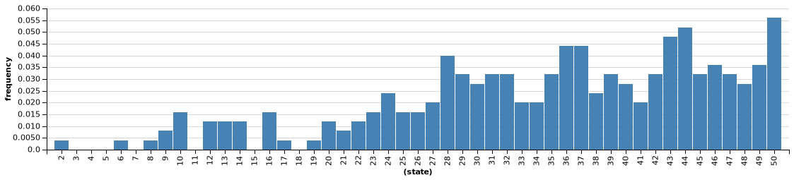
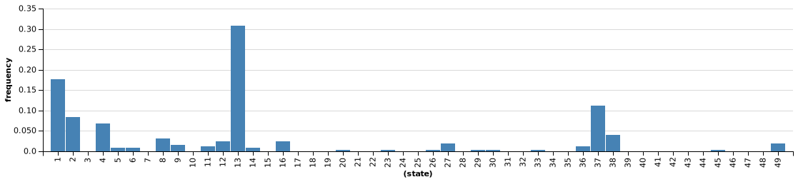

A major challenge to Bayesian models is that Bayesian inference is often computationally difficult. The most straightforward interpretation of Bayesian models at the algorithmic level is that explicit probabilities for different states are computed and represented. (This is very much like the 'enumerate' method of Infer.) Attempts have been made to model how neural systems might capture these representations, via ideas such as *probabilistic population codes*. (See [Bayesian inference with probabilistic population codes](https://www.nature.com/articles/nn1790), Ma, Beck, Latham, Pouget (2006).) While such methods work well for simple problems, it is difficult to see how they can scale up to real-world cognition.
<!--
Population codes and such. Difficulty of computation, scaling.
-->

<!--
As we noted in an earlier chapter, there is an interesting parallel between the `Infer` abstraction, which separates model specification from inference method, and the idea of levels of analysis in cognitive science @Marr1982.
For most of this book we are interested in the *computational* level of describing what people know about the world and what inferences that knowledge licenses.
That is, we treat the model argument to `infer` as the scientific hypothesis, and the options (including 'method') argument as an engineering detail needed to derive predictions.
We can make a great deal of progress with this abstraction.

The *algorithmic* level goes further, attempting to describe the process by which people draw these inferences -- taking the options to `Infer` as part of the hypotheses.
While `Infer` specifies an ideal, different methods for inference will approximate this ideal better or worse in different cases; they will also do so with different time, space, and energy trade-offs.
Is it reasonable to interpret the inference algorithms that we borrow from statistics as psychological hypotheses at the algorithmic level? *Which algorithm* does the brain use for inference? Could it be MCMC? Enumeration?

If we take the algorithms for inference as psychological hypotheses, then the approximation and resource-usage characteristics of the algorithms will be the signature phenomena of interest. 

# How is uncertainty represented?

A signature of probabilistic ("Bayesian") cognitive models is the central role of uncertainty. Generative models, our main notion of knowledge, capture uncertain causal processes. After making observations or assumptions, Infer captures uncertain answers. At the computational level we work with this uncertainty by manipulating distribution objects, without needing to explore (much) how they are created or represented. Yet cognitively there is a key algorithmic question: how is uncertainty represented in the human mind?

We have at least three very different possible answers to this question:

- Explicit representation of probabilities.
- Parametric representation of distribution families.
- Sampling-based representations.
-->

<!--TODO: describe some of the research in this direction.

 - one and done.
 - drift diffusion?
 - mcmc / anchoring.
 - amortized inference.
 - neural implementation.

  -->

## The sampling hypothesis

Finally, it is possible that there is *no explicit representation* of uncertainty in the human mind. Instead uncertainty is implicitly represented in the tendencies of a dynamical system. This is the *sampling hypothesis*: that the human mind has the ability to generate samples from conditional distributions when needed. Thus the mind implicitly represents an entire distribution, but can only work explicitly with a few samples from it.

We have seen a number of methods for creating dynamical systems that can sample from any desired distribution (rejection sampling, various Markov chain Monte Carlo methods, etc). This type of representation is thus possible in principle. What behavioral or neural signatures would we expect if it were correct? And *which* of the many sampling methods might be neurally plausible?

As a first analysis we can assume that the human mind is always capable of drawing perfect samples from the conditional distributions of interest (e.g. via rejection sampling) but doing so is costly in terms of time or energy. If we assume that only a few samples are going to be used by any individual in answering any question, a profound behavioral prediction arises: individuals' choice probability will match the posterior probability distribution. Note that this is a somewhat radical departure from a "fully Bayesian" agent. If we assume a choice is to be made, with 100$ reward for the correct answer and no reward for incorrect answers, a rational (that is utility-maximizing) agent that explicitly represents the answer distribution should *always* choose the most likely answer. Across a population of such agents we would see no variation in answers (assuming a priori identical beliefs). In contrast, an agent that has only a single sample from their answer distribution will choose this answer; across a population of such agents we would see answers distributed according to the answer distribution!

Let's see this in practice in a simple example, here each person sees a coin of unknown probability flipped five times, coming up heads four of them. Each person is asked to bet on the next outcome:

~~~~
var agentBelief = Infer({method:'rejection', samples: 1000},function(){
	var weight = uniform(0,1)
	observe(Binomial({p:weight, n:5}), 4)
	return flip(weight)
	})

var maxAgent = function(){return agentBelief.score(true)>agentBelief.score(false)}
var sampleAgent = function(){sample(agentBelief)}

print("max agents decision distribution:")
viz(repeat(100,maxAgent))
print("sample agents decision distribution:")
viz(repeat(100,sampleAgent))
~~~~

The maximizing agent chooses the most likely outcome by examining the conditional probability they assign to outcomes -- the result is all such agents choosing 'true'. In contrast, a population of agents that each represents their belief with a single sample will choose 'false' about 30% of the time. This behavioral signature -- *probability matching* -- is in fact a very old and well studied psychological phenomenon. (See for instance, Individual Choice Behavior: A Theoretical Analysis, Luce (1959).)

### How many samples should you take?

Vul, Goodman, Griffiths, Tenenbaum (2014) further ask how many samples a rational agent *should* use, if they are costly. This analysis explores the trade off between expected reward increase from more precise probability estimates (more samples) with resource savings from less work (fewer samples). The, somewhat surprising, result is that for a wide range of cost and reward assumptions it is optimal to decide based on only one, or a few, samples.

Let's use our favorite example: flipping a coin. Suppose this is a trick coin with known weight `w`. Our job is to correctly guess the outcome of the next flip of the coin.

If we want to maximize, we obviously should just round: if `w >= .5` we should guess `heads`; otherwise, `tails` (although, as we just discussed, humans often probability-match rather than maximize, here we're interested in what would be optimal, so we will maximize): 

~~~~
Infer({method: "forward", samples: 5000}, function(){
  var w = sample(Uniform({a: 0, b: 1})) //true weight
  return (flip(w) == (w >= .5))
})
~~~~

We can win this bet around 75% of the time.

However, let's assume for the moment that we can't easily calculate the optimal strategy. (For most non-trivial problems, we can't.) Instead, we sample the distribution of heads for our coin. If most of those samples come up `heads`, then we bet `heads`; otherwise, `tails':

~~~~
var takesamples = function(nsamples){
  var w = sample(Uniform({a: 0, b: 1})) //true weight
  var samples = Infer({method: "forward", samples:nsamples}, function(){
    return flip(w)
  })
  return(flip(w) == samples.MAP().val)
}

Infer({method: "forward", samples: 1000}, function(){takesamples(1000)})
~~~~

Here, we took 1,000 samples. Not surprisingly, we win our bet nearly 75\% of the time. But what happens if we only take 10 samples?

~~~~
var takesamples = function(nsamples){
  var w = sample(Uniform({a: 0, b: 1})) //true weight
  var samples = Infer({method: "forward", samples:nsamples}, function(){
    return flip(w)
  })
  return(flip(w) == samples.MAP().val)
}

Infer({method: "forward", samples: 5000}, function(){takesamples(10)})
~~~~

Impressively, we're still very close to 75%. What if we only took 1 sample?

~~~~
var takesamples = function(nsamples){
  var w = sample(Uniform({a: 0, b: 1})) //true weight
  var samples = Infer({method: "forward", samples:nsamples}, function(){
    return flip(w)
  })
  return(flip(w) == samples.MAP().val)
}

Infer({method: "forward", samples: 5000}, function(){takesamples(1)})
~~~~

We are still winning around 2/3 of the time. Obviously, if we have the computational power available and enough time to take the samples, we should take 1,000 samples and maximize our chances of winning. But if samples are costly, it may not be worth taking more than 1.

### Rational Anchoring

One well-known bias in human reasoning is the anchoring bias discovered by Kahnamen and Tversky. In the original study, subjects were first asked to judge whether the percentage of African countries in the United Nations was larger or smaller than a number that was randomly generated by spinning a wheel of fortune. Subjects were then asked to guess the correct percentage. What was striking was that subjects were systematically biased towards the random number: their guesses were larger when the random number was large and smaller when the random number was smaller. This same "anchoring" bias has appeared in many other contexts, and it is often given as a paradigmatic case of irrationality on the part of humans.

In "[The anchoring bias reflects rational use of cognitive resources](https://link.springer.com/article/10.3758/s13423-017-1286-8)", Lieder and colleagues suggest a resource-rational account, based on the dynamics of MCMC. Suppose that in the class study, subjects use the random number as their initial proposal for an MCMC-like process. (There are any number of reasons people might do this.) For instance, perhaps they consider whether it seems correct. If it doesn't, they propose a new number *based on the first number* and check again. And so on. The dynamics of this process look a lot like MCMC.

As we've seen previously, initial samples from MCMC are strongly biased by the starting point. If you run MCMC long enough, this bias disappears. However, an agent that is being resource-rational may not take a large number of samples, particularly in the context of being asked trivia questions by a random psychologist.

### Inferring human optimality from data

In "[Rational Use of Cognitive Resources: Levels of Analysis Between the Computational and the Algorithmic](https://onlinelibrary.wiley.com/doi/pdfdirect/10.1111/tops.12142)", Griffiths, Lieder, and Goodman note that Bayesian models provide a convenient way of analyzing behavior. That is, we can ask not just whether human cognition is perfectly optimal (it probably isn't), but *how* optimal is it. 

Let's return to our cross-situational learning model from the exercises for the "Algorithms for Inference" chapter. Below, it has been refactored so that the number of particles used by human cognition is a free variable. Now, we assume that 10 subjects have all participated in the study, and all of them concluded that the word for dog is "dax". If you run the following code (**warning: it will take a few minutes**), it'll infer the number of particles is probably fairly large. 

~~~~
var names = ["dax", "blicket", "gorper", "greeble", "freeble"]

var objName = mem(function(obj) {
  sample(Categorical({vs: names, ps: [.2, .2, .2, .2, .2]}))
})

var nameOne = function(obj1, obj2){
  return flip() ? objName(obj1) : objName(obj2)
}

var clmodel = function() {
  var dog = objName("dog")
  var cat = objName("cat")
  factor(2*(nameOne("dog","cat") == "dax"))
  var bird = objName("bird")
  factor(2*(nameOne("dog","bird") == "blicket"))
  var cow = objName("cow")
  factor(2*(nameOne("dog","cow") == "greeble"))
  var platypus = objName("platypus")
  factor(2*(nameOne("dog","platypus") == "freeble"))
  var ostrich = objName("platypus")
  factor(2*(nameOne("dog","ostrich") == "dax"))
  return objName("dog")
}

var experiment = Infer({method: "MCMC", samples:250, lag:10}, function(){
  var npart = sample(RandomInteger({n:50}))+1
  
  //5 subjects, all conclude dax=dog
  var sub1 = Infer({method: "SMC", particles: npart, rejuvSteps: 10}, clmodel).MAP().val
  var sub2 = Infer({method: "SMC", particles: npart, rejuvSteps: 10}, clmodel).MAP().val
  var sub3 = Infer({method: "SMC", particles: npart, rejuvSteps: 10}, clmodel).MAP().val
  var sub4 = Infer({method: "SMC", particles: npart, rejuvSteps: 10}, clmodel).MAP().val
  var sub5 = Infer({method: "SMC", particles: npart, rejuvSteps: 10}, clmodel).MAP().val
    
  factor(5*(sub1 == 'dax'));
  factor(5*(sub2 == 'dax'));
  factor(5*(sub3 == 'dax'));
  factor(5*(sub4 == 'dax'));
  factor(5*(sub5 == 'dax'));
  
  return npart
})

viz(experiment)
~~~~

Output from one run looked like this:

This seems reasonable. We know that if we are using particle filtering, accuracy goes up the more particles one has. Since all five subjects gave the right answer, that suggests a decent number of particles.

Suppose our subjects weren't so accuracy. We can rewrite the code above so that each subject comes to a different conclusion about the word for 'dog': one subject concludes 'dax', one concludes 'greeble', one concludes 'freeble', one concludes 'blicket', and one concludes 'gorper'. In this case, we'll infer the number of particles is probably a lot smaller:

Suppose we fit this model to a real dataset and found the best estimate for number of particles is 7. That would not necessarily mean that humans in fact use particle filtering with approximately 7 particles to learn vocabulary. Rather, it means that human level of accuracy can be captured by such a model. It further suggests that humans are fairly resource-limited in our ability to do cross-situational learning, since accuracy with only 7 particles is not going to be very high. (One could quantify just how limited it is by seeing how accuracy is affected by number of particles in a realistic learning scenario.)

## Approximate distribution representations

Another possible representation of uncertainty is via the parameters of a family of distributions. For instance, the mean and covariance of a Gaussian is a flexible and popular (in statistics) way to approximate a complex distirbution. (Indeed, we have seen that a mean-field product of Gaussians can give quick and useful inference result from variational inference.) It is thus possible that all uncertainty is represented in the human mind as parameters of some family. A version of this idea can be seen in the *free energy* hypothesis. (See [The free-energy principle: a unified brain theory?](https://www.nature.com/articles/nrn2787), Friston (2010).) This would of course come with its own set of tradeoffs between accuracy and cost. 

<!--

### Approximate samples

Gibbs sampling and jay's recurrent networks.

# Tools for connecting levels

## Resource-rational analysis

## Causal abstraction

-->

Test your knowledge: [Exercises]({{site.baseurl}}/exercises/process-models.html)

Reading & Discussion: [Readings]({{site.baseurl}}/readings/process-models.html)
