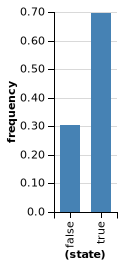

Please complete the exercises on this page and submit them in PDF form.
You can (and should!!) write your code here and click "Run" to test out your answers.
However, you will need to transfer your code to your own document in order to turn in your answers and get feedback.
THESE CODE BOXES WILL NOT SAVE YOUR WORK.
So copy your answers over to your own document frequently.

## Exercise 1

### a) 

Show that the marginal distribution on return values for these three programs is the same by directly computing the probability using the rules of probability *Hint:* write down each possible history of random choices for each program.

~~~~
flip() ? flip(.7) : flip(.1)
~~~~

~~~~
flip(flip() ? .7 : .1)
~~~~

~~~~
flip(.4)
~~~~

### b)

Check your answers by sampling from the programs, 1000 times each, and plotting the results.

~~~~
~~~~

~~~~
~~~~

~~~~
~~~~

### c)

Write another new program with the same marginal distribution on return values that looks different from all of the above programs.

~~~~
~~~~

## Exercise 2

### a)

Explain why (in terms of the evaluation process) these two programs give different answers (i.e. have different distributions on return values).

~~~~
var foo = flip();
display([foo, foo, foo]);
~~~~

~~~~
var foo = function() {return flip()};
display([foo(), foo(), foo()]);
~~~~

### b)

How could you use `mem` to make the second program have the same distribution as the first?

~~~~
~~~~

### c)

Change the program in Part B so that the first two elements in the list are always the same as each other but the third element can be different. *Optional challenge:* try to do this by adding only these 4 characters: `x`, `0`, `0`, and `1`.

~~~~
~~~~

## Exercise 3

### a)

Which of these programs would be more likely to generate the following proportions for 100 values of C? Justify your response.

~~~~
// Program "A"
var A = flip();
var B = flip(0.9);
var C = flip() ? A && B : A || B;
display([A, B, C])
~~~~

~~~~
// Program "B"
var A = flip(0.9);
var B = A && flip(0.9)
var C = B && flip(0.9)
display([A, B, C])
~~~~

### b)

Could the program you did *not* choose in Part A have *also* generated those return values? Explain.

## Exercise 4

In the simple medical diagnosis example, we imagined a generative process for diseases and symptoms of a single patient.
In this exercise, we'll write a version of that model that represents the diseases and symptoms of many patients.

### a)

Let's look at just two common conditions (a cold and allergies) and just two symptoms (sneeze and fever), and let's assume that symptoms are deterministic.

~~~~
var allergies = flip(0.3);
var cold = flip(0.2);

var sneeze = cold || allergies;
var fever = cold;

display([sneeze, fever])
~~~~

Under this model, what is the probability that the patient is sneezing? What is the probability that the patient is sneezing *and* has a fever?

### b)

Inspect the joint probability distributions of `sneeze` and `fever` using `Infer`.

~~~~
Infer({method: "forward", samples: 1000}, function() {
  ...
  return [ ... ];
})
~~~~

### c)

If we wanted to represent the diseases of many patients we might have tried to make each disease and symptom into a function from a person to whether they have that disease, like this:

~~~~
var allergies = function(person) {return flip(.3)};
var cold = function(person) {return flip(.2)}

var sneeze = function(person) {return cold(person) || allergies(person)}

display([sneeze('bob'), sneeze('alice')])
~~~~

Add `fever` to the program above, and use `Infer` to inspect the probability distribution over Bob's symptoms.

Is this the same probability distribution that you computed for the single patient in Part A? 
If not, what can you do to fix this program to capture our intuitions correctly?

## Exercise 5

Work through the evaluation process for the `bend` higher-order function in this example:

~~~~
var makeCoin = function(weight) {
  return function() {
    return flip(weight) ? 'h' : 't'
  }
}
var bend = function(coin) {
  return function() {
    return coin() == 'h' ? makeCoin(.7)() : makeCoin(.1)()
  }
}

var fairCoin = makeCoin(.5)
var bentCoin = bend(fairCoin)
~~~~

### a)

Directly compute the probability distribution of the bent coin in the example. 

### b)

Check your answer by using `Infer`.

~~~~
~~~~

<!-- ToW was moved to next chapter....
## Exercise 5

Here is a modified version of the tug of war game. Instead of drawing strength from the continuous Gaussian distribution, strength is either 5 or 10 with equal probability. Also the probability of laziness is changed from 1/4 to 1/3. Here are four expressions you could evaluate using this modified model:

~~~~
var strength = mem(function(person) {
  return flip() ? 5 : 10;
});

var lazy = function(person) {return flip(1/3)}
var totalPulling = function(team) {
  return sum(map(function(person) {
    return lazy(person) ? strength(person) / 2 : strength(person);
  }, team))
}

var winner = function(team1, team2) {
  return totalPulling(team1) < totalPulling(team2) : team2 : team1;
}

// expression 1
winner(['alice'], ['bob'])

// expression 2
_.isEqual(['alice'], winner(['alice'], ['bob']))

// expression 3
(_.isEqual(['alice'], winner(['alice'], ['bob'])) &&
 _.isEqual(['alice'], winner(['alice'], ['fred'])))

// expression 4
(_.isEqual(['alice'], winner(['alice'], ['bob'])) &&
 _.isEqual(['jane'], winner(['jane'], ['fred'])))
~~~~

a) Write down the sequence of expression evaluations and random choices that will be made in evaluating each expression.

b) Directly compute the probability for each possible return value from each expression.

c) Why are the probabilities different for the last two? Explain both in terms of the probability calculations you did and in terms of the "causal" process of evaluating and making random choices.

-->

## Exercise 6

### a)

Use the rules of probability to compute the probability that the geometric distribution defined by the following stochastic recursion returns the number 5. *Hint:* What is the default parameter for `flip()`?

~~~~
var geometric = function(p) {
  return flip(p) ? 0 : 1 + geometric(p)
};
~~~~

### b)

Check your answer by using `Infer`.

~~~~
~~~~

## Exercise 7

### a)

Convert the following probability table to a compact WebPPL program:

|A|    B|    P(A,B)|
|--- | --- | ---|
|F|      F|     0.14|
|F|      T|     0.06|
|T|      F|     0.4|
|T|      T|     0.4|

**Requirement:** fix the probability of A first and then define the probability of B to *depend* on whether A is true or not.

~~~~
var a = ...
var b = ...
display([a, b])
~~~~

### b)

Run your WebPPL program and use `Infer` to check that you get the correct distribution.

~~~~
~~~~

## Exercise 8

Below we've defined a higher-order function `flipSequence` that takes a coin flipping function (e.g. `trickCoin`, below) and flips that coin until it gets a *sequence* of two heads in a row (in which case it returns heads `'h'`) or two tails in a row (in which case it returns tails `'t'`.
Try out different weights for the `trickCoin`.

~~~~
var makeCoin = function(weight) {
  return function() {
    return flip(weight) ? 'h' : 't'
  }
}
var flipSequence = function(coin) {
  return function() {
    var flip1 = coin();
    var flip2 = coin();
    if (flip1 == flip2) {
      return flip1;
    } else {
      return flipSequence(coin)();
    }
  }
}

var trickCoin = makeCoin(.6)

var n_samples = 10000;
viz(Infer({method: "forward", samples: n_samples}, trickCoin))
viz(Infer({method: "forward", samples: n_samples}, flipSequence(trickCoin)))
~~~~

### a)

How does `flipSequence` change the distribution over return values (qualitatively)? Explain why requiring two flips in a row to be the same has this effect.

### b)

What would happen if a fair coin (with weight 0.5) were input to `flipSequence`? Explain.

<!-- ### c)

What weight would you need to give the trick coin in order for `flipSequence(trickCoin)` to return heads `'h`' X% of the time? -->

## Exercise 9

Box2D is a two dimensional simulation engine for simulating rigid bodies (those with constant shape). It allows for the construction of arbitray worlds and models important physical concepts including collisions, friction, gravity, momentum, and more.

We have provided a wrapper around Box2D that allows for the easy construction of worlds. A world consists of list of shapes.
Shapes are created by JavaScript objects with the following properties:

|`shape`    |"circle" or "rect"                               |
|`dims`     |[width, height] for rect or [radius] for circle  |
|`x`        |x_position_as_number (distance from left)        |
|`y`        |y_position_as_number (distance from top)         |
|`static`   |boolean (does the object move or stay still?)    |
|`velocity` |[x_velocity, y_velocity]                         |

The variables `worldWidth` and `worldHeight` are constants representing the visible size of the simulation window.

Here's an example with a ground and a single rectangle. Add another object to `bowlingWorld` and give it an initial velocity so that it knocks the original rectangle down.

~~~~
var ground = {shape: 'rect',
  static: true,
  dims: [worldWidth, 10],
  x: worldWidth/2,
  y: worldHeight}

var rect = {shape: 'rect',
  static: false,
  dims: [10, 100],
  x: worldWidth/2,
  y: 390}

var bowlingWorld = [ground, rect]
physics.animate(1000, bowlingWorld);
~~~~

## Exercise 10

In **Example: Intuitive physics** we modeled instability of a tower as the probability that the tower falls when perturbed, and we modeled "falling" as getting shorter. It would be reasonable to instead measure *how much shorter* the tower gets.

### a)

Below, modify the stability/instability model by writing a continuous measure, `towerFallDegree`. Let this measure take different values between 0 and 1.
That way, your continuous measure will be numerically comparable to the discrete measure, `doesTowerFall` (defined here as either 0 or 1).
Explain what your continuous measure represents and why it might be a good continuous measure of instability.

~~~~
///fold:
var listMin = function(xs) {
  if (xs.length == 1) {
    return xs[0]
  } else {
    return Math.min(xs[0], listMin(rest(xs)))
  }
}

var highestY = function (w) { listMin(map(function(obj) { return obj.y }, w)) }
var ground = {shape: 'rect', static: true, dims: [worldWidth, 10],
              x: worldWidth/2, y: worldHeight+6};

var almostUnstableWorld = [
  ground,
  {shape: 'rect', static: false, dims: [24, 22], x: 175, y: 473},
  {shape: 'rect', static: false, dims: [15, 38], x: 159.97995044874122, y: 413},
  {shape: 'rect', static: false, dims: [11, 35], x: 166.91912737427202, y: 340},
  {shape: 'rect', static: false, dims: [11, 29], x: 177.26195677111082, y: 276},
  {shape: 'rect', static: false, dims: [11, 17], x: 168.51354470809122, y: 230}
]

var noisify = function (world) {
  var perturbX = function (obj) {
    var noiseWidth = 10
    return obj.static ? obj : _.extend({}, obj, {x: uniform(obj.x - noiseWidth, obj.x + noiseWidth) })
  }
  map(perturbX, world)
}

///

// Returns height of tower
var getTowerHeight = function(world) {
  return worldHeight - highestY(world);
};

var doesTowerFall = function (initialW, finalW) {
  var approxEqual = function (a, b) { Math.abs(a - b) < 1.0 }
  return 1 - approxEqual(highestY(initialW), highestY(finalW));
}

var towerFallDegree = function(initialW, finalW) {
  // FILL THIS PART IN
  return -999;
};

var visualizeInstabilityMeasure = function(measureFunction) {
  var initialWorld = noisify(almostUnstableWorld);
  var finalWorld = physics.run(1000, initialWorld);
  var measureValue = measureFunction(initialWorld, finalWorld);
  print("Instability measure: " + measureValue);
  print("Initial height: " + getTowerHeight(initialWorld));
  print("Final height: " + getTowerHeight(finalWorld));
  physics.animate(1000, initialWorld);
};

// Test binary doesTowerFall measure
// visualizeInstabilityMeasure(doesTowerFall);

// Test custom towerFallDegree measure
visualizeInstabilityMeasure(towerFallDegree);
~~~~

### b)

Are there worlds where your new model makes very different predictions about instability from the original model? Which best captures the meaning of "unstable"? (it might be useful to actually code up your worlds and test them).
