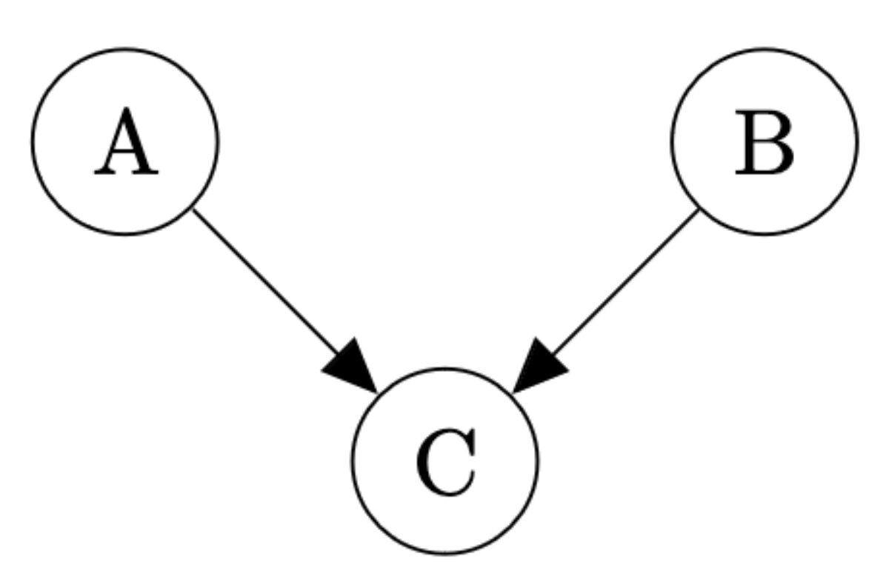
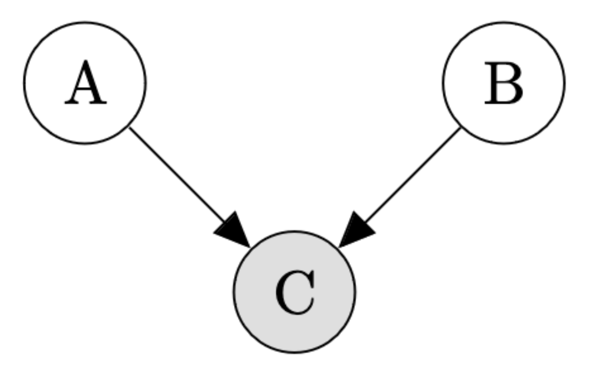
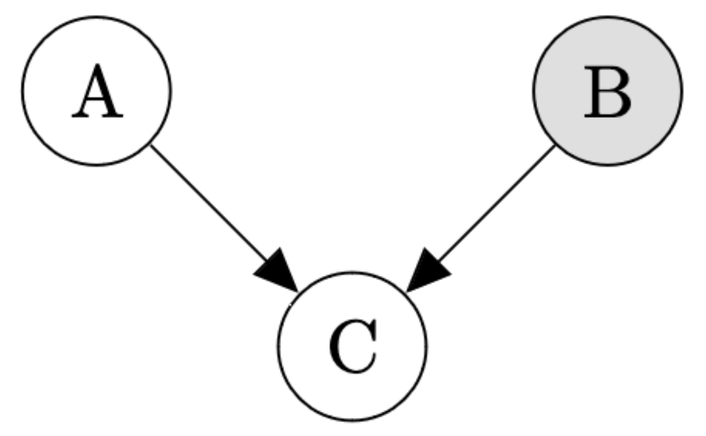
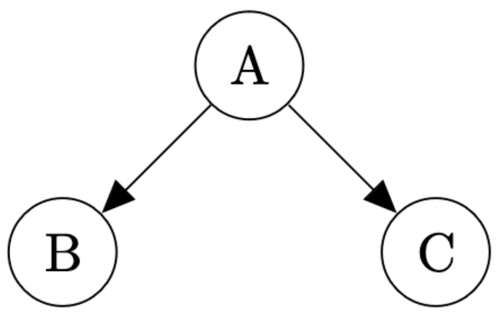
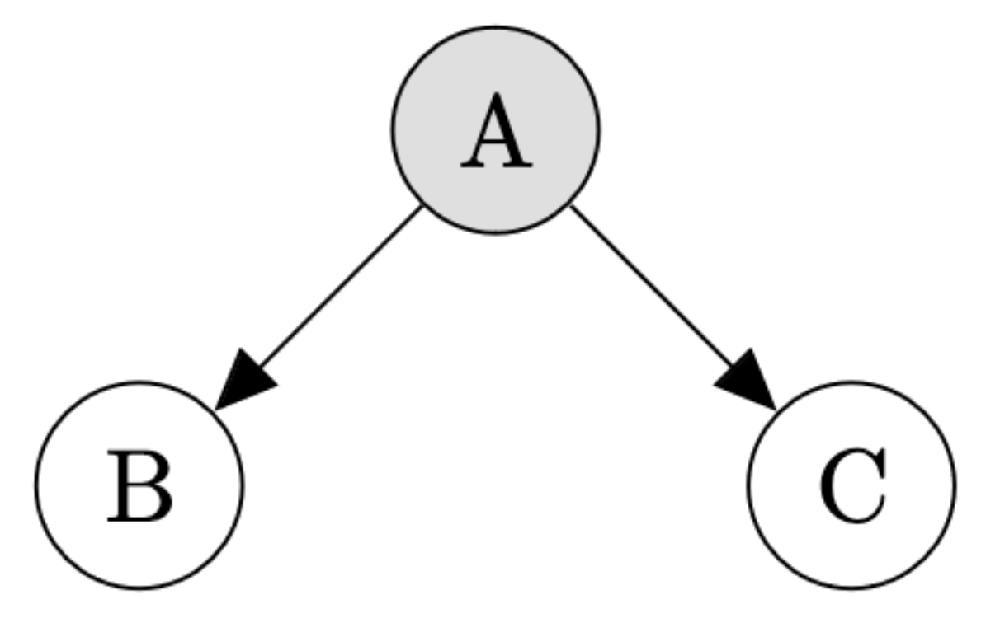
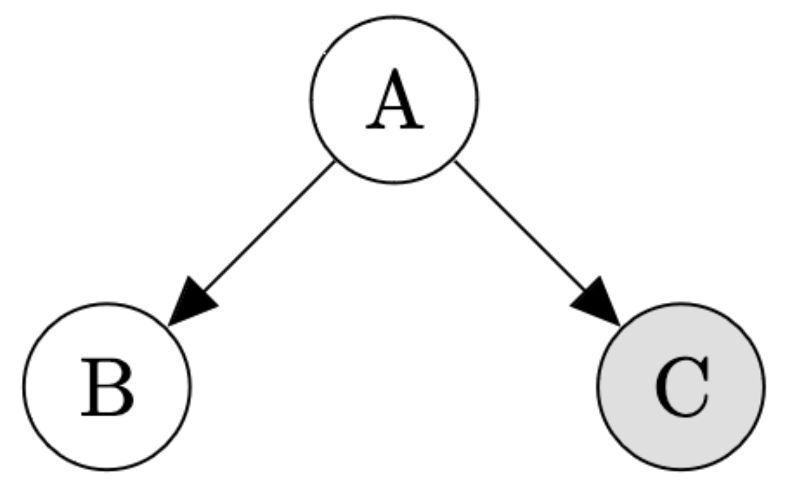

## Exercise 1: Epidemiology

Imagine that you are an epidemiologist and you are determining people's cause of death.
In this simplified world, there are two main diseases, cancer and the common cold.
People rarely have cancer, $$p( \text{cancer}) = 0.00001$$. People are much more likely to have a common cold, $$p( \text{cold} ) = 0.2$$.
When people do have cancer, it is often fatal, $$p( \text{death} \mid \text{cancer, no cold} ) = 0.9$$.
Having a cold is rarely fatal, $$p( \text{death} \mid \text{cold, no cancer} ) = 0.00006$$, but having cancer and a cold is slightly more deadly than having cancer alone, $$p(\text{death} \mid \text{cold, cancer}) = 0.91$$.
Very rarely, people also die of other causes, $$p(\text{death} \mid \text{no cold, no cancer}) = 0.000000001$$.

Write this model in WebPPL and use `Infer` to answer these questions (Be sure to include your code in your answer):

### a)

Compute $$p( \text{cancer} \mid \text{death} , \text{cold} )$$ and $$p( \text{cancer} \mid \text{death} , \text{no cold} )$$.
How do these probabilities compare to $$p( \text{cancer} \mid \text{death} )$$ and $$p( \text{cancer} )$$?
Using these probabilities, give an example of explaining away.

~~~~ 
display("prior")
viz.table(Infer({method: 'enumerate'}, function() {
  ...
}));
~~~~

~~~~
display("death")
viz.table(Infer({method: 'enumerate'}, function() {
  ...
}));
~~~~

~~~~
display("death and cold")
viz.table(Infer({method: 'enumerate'}, function() {
  ...
}));
~~~~

~~~~
display("death and no cold")
viz.table(Infer({method: 'enumerate'}, function() {
  ...
}));
~~~~

### b)

Compute $$p( \text{cold} \mid \text{death} , \text{cancer} )$$ and $$p( \text{cold} \mid \text{death} , \text{no cancer} )$$.
How do these probabilities compare to $$p( \text{cold} \mid \text{death} )$$ and $$p( \text{cold} )$$?
Using these probabilities, give an example of explaining away.

~~~~ 
display("prior")
viz.table(Infer({method: 'enumerate'}, function() {
  ...
}));
~~~~

~~~~
display("death")
viz.table(Infer({method: 'enumerate'}, function() {
  ...
}));
~~~~

~~~~
display("death and cancer")
viz.table(Infer({method: 'enumerate'}, function() {
  ...
}));
~~~~

~~~~
display("death and no cancer")
viz.table(Infer({method: 'enumerate'}, function() {
  ...
}));
~~~~

## Exercise 2: Are they independent?

For each question, determine whether the relevant variables are independent in the given Bayes net. Grey nodes represent observed variables while white nodes represent unobserved variables.

### a)

Are A and B independent?

### b)

Are A and B independent?

### c)

Are A and C independent?

### d)

Are B and C independent?

### e)

Are B and C independent?

### f)

Are A and B independent?

