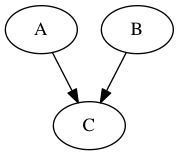
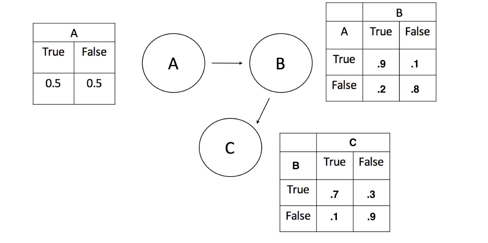
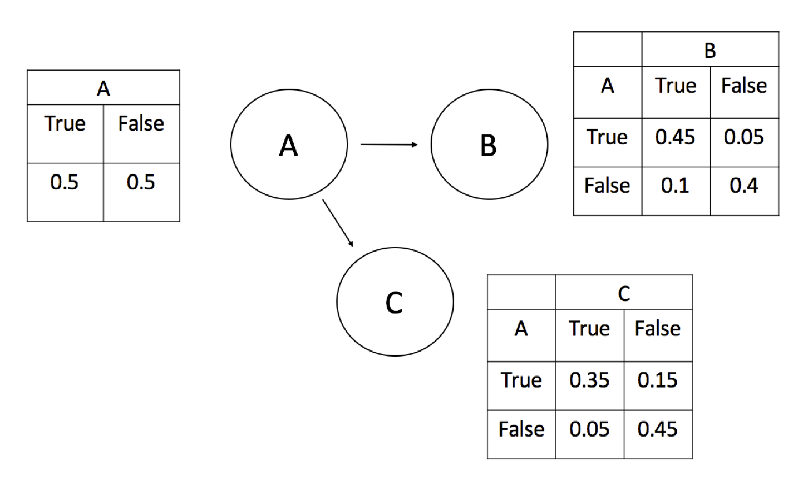
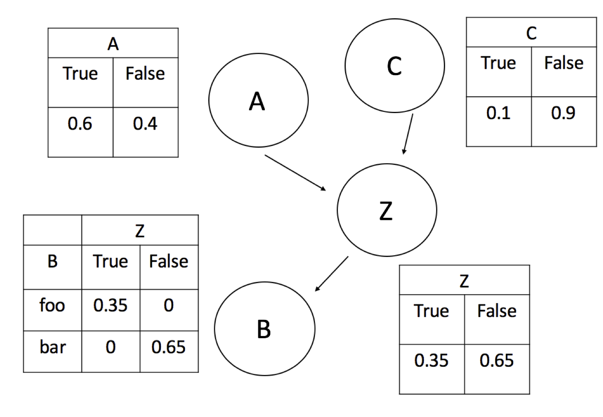
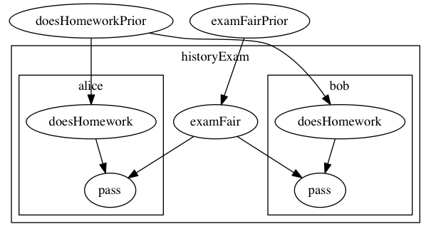

## Exercise 1: Causal and statistical dependency.

> For each of the following programs:
> 
> * Draw the dependency diagram (Bayes net). If you don't have software on your computer for doing this, Google Docs has a decent interface for creating drawings.
> 
> * Use informal evaluation order reasoning and the intervention method to determine causal dependency between A and B.
> 
> * Use conditioning to determine whether A and B are statistically dependent.

### a)

~~~~ 
var a = flip() 
var b = flip()
var c = flip(a && b ? .8 : .5)
~~~~

### b)

~~~~ 
var a = flip() 
var b = flip(a ? .9 : .2)
var c = flip(b ? .7 : .1)
~~~~

### c)

~~~~ 
var a = flip()
var b = flip(a ? .9 : .2)
var c = flip(a ? .7 : .1)
~~~~

d)

~~~~ 
var a = flip(.6)
var c = flip(.1)
var z = flip() ? a : c;
var b = z ? 'foo' : 'bar'
~~~~

e)

~~~~ 
var examFairPrior = Bernoulli({p: .8})
var doesHomeworkPrior = Bernoulli({p: .8})
var examFair = mem(function(exam) {return sample(examFairPrior)})
var doesHomework = mem(function(student) {return sample(doesHomeworkPrior)});

var pass = function(student, exam) {
  return flip(examFair(exam) ?
              (doesHomework(student) ? .9 : .5) :
              (doesHomework(student) ? .2 : .1));
}
var a = pass('alice', 'historyExam');
var b = pass('bob', 'historyExam');
~~~~

<!-- *Note:* Bayes nets often use plate notation for repeated structure across multiple entities (e.g. students and exams), but there is no standard notation for repeated structure when the repetitions are not nested. That is, `doesHomework` is memoized to `student` and `examFair` is memoized to `exam`. But for each `student`-`exam` pair we have a different value for `pass`. We can't represent that kind of shared structure in a Bayes net. -->

## Exercise 2: Epidemiology

> Imagine that you are an epidemiologist and you are determining people's cause of death. In this simplified world, there are two main diseases, cancer and the common cold. People rarely have cancer, $$p( \text{cancer}) = 0.00001$$, but when they do have cancer, it is often fatal, $$p( \text{death} \mid \text{cancer} ) = 0.9$$. People are much more likely to have a common cold, $$p( \text{cold} ) = 0.2$$, but it is rarely fatal, $$p( \text{death} \mid \text{cold} ) = 0.00006$$. Very rarely, people also die of other causes $$p(\text{death} \mid \text{other}) = 0.000000001$$.
> 
> Write this model in WebPPL and use `Infer` to answer these questions (Be sure to include your code in your answer):

~~~~ 
viz.table(Infer({method: 'enumerate'}, function() {
  var cancer = flip(0.00001);
  var cold = flip(0.2);
  var death_by_cancer = cancer ? flip(0.9) : false;
  var death_by_cold = cold ? flip(0.2) : false;
  var other_death = flip(0.000000001);
  var death = death_by_cancer || death_by_cold || other_death;
  return {cancer: cancer, cold: cold, death: death};
}));
~~~~

### a)

> Compute $$p( \text{cancer} \mid \text{death} , \text{cold} )$$ and $$p( \text{cancer} \mid \text{death} , \text{no cold} )$$. How do these probabilities compare to $$p( \text{cancer} \mid \text{death} )$$ and $$p( \text{cancer} )$$? Using these probabilities, give an example of explaining away.

Prior                   | 0.00001
Given death             | 0.42855
Given death and cold    | 0.13043
Given death and no cold | 0.99989

Having a cold explains away the death.
Given only the information that a person died, cancer is relatively likely.
When we learn the person also had a cold, this probability of cancer goes down, not down to prior levels, but pretty unlikely.
If we instead learn that the person died and did not have a cold, we become almost certain that the person died of cancer.

~~~~ 
display("(prior)")
viz.table(Infer({method: 'enumerate'}, function() {
  var cancer = flip(0.00001);
  var cold = flip(0.2);
  var death_by_cancer = cancer ? flip(0.9) : false;
  var death_by_cold = cold ? flip(0.00006) : false;
  var other_death = flip(0.000000001);
  var death = death_by_cancer || death_by_cold || other_death;
  return cancer;
}));

display("death")
viz.table(Infer({method: 'enumerate'}, function() {
  var cancer = flip(0.00001);
  var cold = flip(0.2);
  var death_by_cancer = cancer ? flip(0.9) : false;
  var death_by_cold = cold ? flip(0.00006) : false;
  var other_death = flip(0.000000001);
  var death = death_by_cancer || death_by_cold || other_death;
  condition(death);
  return cancer;
}));

display("death and cold")
viz.table(Infer({method: 'enumerate'}, function() {
  var cancer = flip(0.00001);
  var cold = flip(0.2);
  var death_by_cancer = cancer ? flip(0.9) : false;
  var death_by_cold = cold ? flip(0.00006) : false;
  var other_death = flip(0.000000001);
  var death = death_by_cancer || death_by_cold || other_death;
  condition(death && cold)
  return cancer;
}));

display("death and no cold")
viz.table(Infer({method: 'enumerate'}, function() {
  var cancer = flip(0.00001);
  var cold = flip(0.2);
  var death_by_cancer = cancer ? flip(0.9) : false;
  var death_by_cold = cold ? flip(0.00006) : false;
  var other_death = flip(0.000000001);
  var death = death_by_cancer || death_by_cold || other_death;
  condition(death && !cold)
  return cancer;
}));
~~~~

### b)

> Compute $$p( \text{cold} \mid \text{death} , \text{cancer} )$$ and $$p( \text{cold} \mid \text{death} , \text{no cancer} )$$. How do these probabilities compare to $$p( \text{cold} \mid \text{death} )$$ and $$p( \text{cold} )$$? Using these probabilities, give an example of explaining away.

Prior                     | 0.20
Given death               | 0.66
Given death and cancer    | 0.20
Given death and no cancer | 0.99

Having cancer *really* explains away the death.
Given only the information that a person died, a cold is very likely.
When we learn the person also had cancer, this probability goes back down to almost exactly the prior.
If we instead learn that the person *didn't* have cancer, we become almost certain they died of a cold.

~~~~ 
display("(prior)")
viz.table(Infer({method: 'enumerate'}, function() {
  var cancer = flip(0.00001);
  var cold = flip(0.2);
  var death_by_cancer = cancer ? flip(0.9) : false;
  var death_by_cold = cold ? flip(0.00006) : false;
  var other_death = flip(0.000000001);
  var death = death_by_cancer || death_by_cold || other_death;
  return cold;
}));

display("death")
viz.table(Infer({method: 'enumerate'}, function() {
  var cancer = flip(0.00001);
  var cold = flip(0.2);
  var death_by_cancer = cancer ? flip(0.9) : false;
  var death_by_cold = cold ? flip(0.00006) : false;
  var other_death = flip(0.000000001);
  var death = death_by_cancer || death_by_cold || other_death;
  condition(death);
  return cold;
}));

display("death and cancer")
viz.table(Infer({method: 'enumerate'}, function() {
  var cancer = flip(0.00001);
  var cold = flip(0.2);
  var death_by_cancer = cancer ? flip(0.9) : false;
  var death_by_cold = cold ? flip(0.00006) : false;
  var other_death = flip(0.000000001);
  var death = death_by_cancer || death_by_cold || other_death;
  condition(death && cancer)
  return cold;
}));

display("death and no cancer")
viz.table(Infer({method: 'enumerate'}, function() {
  var cancer = flip(0.00001);
  var cold = flip(0.2);
  var death_by_cancer = cancer ? flip(0.9) : false;
  var death_by_cold = cold ? flip(0.00006) : false;
  var other_death = flip(0.000000001);
  var death = death_by_cancer || death_by_cold || other_death;
  condition(death && !cancer)
  return cold;
}));
~~~~
