## Exercise 1: Factors

### a)

*Take our standard coin-flipping model. Use `factor` to create a "soft" condition on the outcome being heads, such that there is an approx. 95% chance of heads.*

```js
var dist = Infer({method: 'enumerate'},
  function () {
    var A = flip()
    factor(A*3) //edit this line
    return A
});
viz(dist)
```

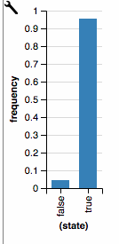

This is actually quite close to 95%:

`{"probs":[0.04742587317756678,0.9525741268224333],"support":[false,true]}`


### b)

In this model, we flip 3 coins. Use `factor` to favor an outcome of 2 heads and 1 tails:

```js
var softHeads = Infer({}, function() {
    var a = flip(0.5);
    var b = flip(0.5);
    var c = flip(0.5);
    factor(1*((a+b+c)==2));
    return a;
  }
});

viz(softHeads);
```

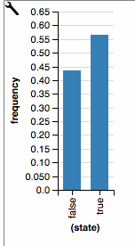

## Exercise 2: The Ultimatum Game

### a)

*The ultimatum game requires two players: A proposer and a responder. The proposer has to decide how to allocate \$10 between the two players in \$1 increments. Once this proposal is made, the responder decides whether to accept the proposal. If the responder accepts, both players are awarded the money according to the proposal. If the responder rejects, neither player gets anything.*

*If the responder was a strict utilitarian, s/he would accept any offer of \$1 or more. Assume the proposer is a soft maximizer who wants to keep as much of the \$10 as possible. Complete the code below to find out how much the proposer will offer:*

~~~~
var responder = function(offer) {    
    
    return (offer>0 ? true : false);
    
}

var proposer = Infer({method: "enumerate"}, function(){
	
	var offer = uniformDraw([0,1,2,3,4,5,6,7,8,9,10]);
	var reward = responder(offer) ? (10 - offer) : 0;
	
	factor(reward)
	return(offer)	
	})

viz(proposer);
~~~~

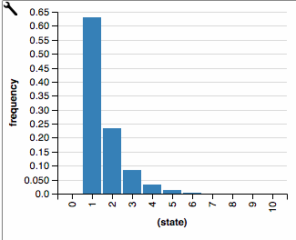

### b)

*People, it turns out, act very differently than the model above suggests. Responders will often reject low offers as "unfair", even though this means they get nothing. Assume that the responder decides whether to accept in proportion to the percentage of the \$10 allocated to her, raised to some power `alpha` (you can think of `alpha` as "spitefulness"). Complete the code below to determine how much the proposer should offer:*

```js
var alpha = 2

var responder = function(offer, alpha) {    
    var p = Math.pow(offer/10,alpha)
	return(flip(p));
}

var proposer = Infer({method: "enumerate"}, function(){
	var offer = uniformDraw([0,1,2,3,4,5,6,7,8,9,10]);
	var reward = responder(offer,alpha) ? (10 - offer) : 0;
	factor(reward)
	return(offer)	
	})

viz(proposer);
```

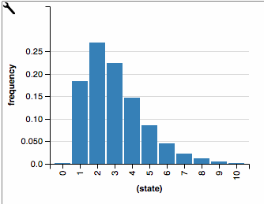

### c) 

*You can think of the variable `alpha` in the code above as encoding spitefulness: the degree to which the responder is willing to forego a reward in order to prevent the proposer from having a reward. See how setting `alpha` to 4, 6, 10, 25, and 50 affects what the proposer does. Explain the results.* 

~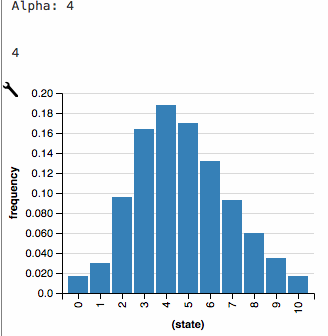
~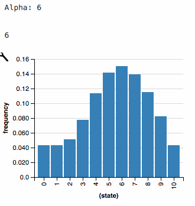
~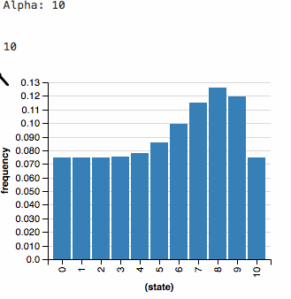
~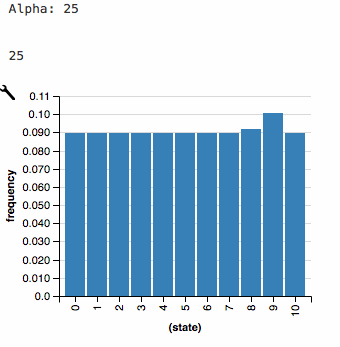
~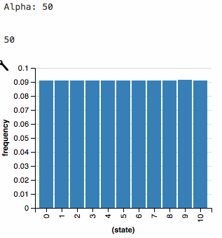

As alpha increases, the responder becomes increasingly unlikely to accept any offer less than \$10. Thus, no matter what the proposer offers, she'll probably end up with \$0. This makes her indifferent to the choice.

### d)

*The models above assume the proposer knows the responder's decision function. Let's soften that assumption: the proposer knows that the responder's value of `alpha` is somewhere on the range [0.5, 5]. Suppose the proposer offered \$2 and the responder rejects it. What is the most likely level of `alpha`?*

(Hint: you may find it helpful to find a different place for `alpha` than within the definition of `responder`.)

```js
var responder = function(offer, alpha) {    
    var p = Math.pow(offer/10,alpha)
    return(flip(p));
}

var proposer = Infer({method: "MCMC", samples:50000}, function(){
    var alpha = uniform(0.5,5)
    var offer = 2;
    var reward = responder(offer, alpha) ? (10 - offer) : 0;
    condition(reward==0)
    return(alpha)   
})

viz(proposer)
```

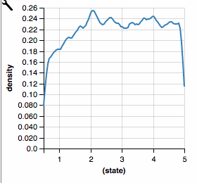


### e)

*Again, suppose the proposer offered \$2 and the responder rejected it. Suppose they are going to play a second round. How much should the proposer offer? How does this change if the first (rejected) offer was \$8?*

Here is a straight-forward if not especially computationally-efficient model:

```js
var responder = function(offer, alpha) {    
    var p = Math.pow(offer/10,alpha)
    return(flip(p));
}

var proposer1 = Infer({method: "MCMC", samples:50000}, function(){
    var alpha = uniform(0.5,5)
    var offer1 = 2
    var reward1 = responder(offer1, alpha) ? (10 - offer1): 0;
    condition(reward1==0)
    return(alpha)   
})

var makeoffer = Infer({method: "forward", samples:1000}, function(){
                      
     var alpha2 = sample(proposer1)

     var proposer2 = Infer({method: "MCMC", samples:5000}, function(){
       var offer2 = uniformDraw([0,1,2,3,4,5,6,7,8,9,10]);
       var reward2 = responder(offer2, alpha2) ? (10 - offer2) : 0
       factor(reward2) 
       return(offer2)
      })
                      
      return sample(proposer2)                
});

viz(makeoffer)
```

With offer1 = 2:

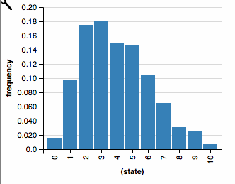

With offer1 = 8:

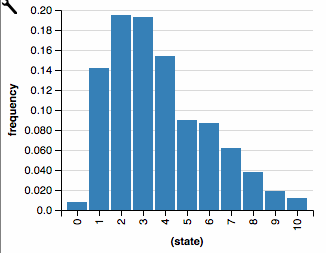

The differences are underwhelming. The reason is `factor(reward2)` actually puts a lot of pressure on the proposer getting a large payout. If we change `factor(reward2)` to `factor(Math.pow(reward2,1))`, we get more impressive differences.

With offer1 = 2:

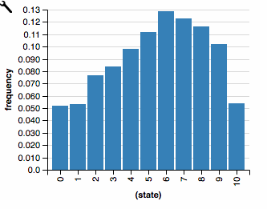

With offer1 = 8:

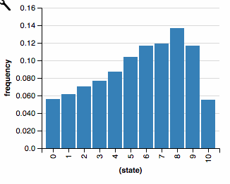

## Exercise 3: The Prisoner's Dilemma

*In the prisoner's dilemma, two thieves work together on a bank heist. Afterwards, they are apprehended by the police. The police interrogate the thieves separately. They tell each thief that if she confesses, she will get a lenient sentence. If not, she will get 10 years. However, the thieves know that the police need at least one of them to confess; if neither of them confesses, the police don't have enough evidence to charge them, and they will both go free.* 

*What's the longest the lenient sentence can be (in round years) such that it makes sense for the thief to confess (that is, where she has a greater than 50% chance of confessing)? Use `factor(percentYearsFreedom)` where `percentYearsFreedom` is the percentage of the next 10 years the thief will not be in jail. (Assume that this incident has scared her straight and she will not commit any other crimes.)*

```js
var thiefRats = function(){
  return (flip()? true: false)
}

var lenient = 6

var thief = Infer({}, function(){
  var otherThiefRats = thiefRats();
  var IRat = thiefRats();
  var years = (otherThiefRats? 
              (IRat? lenient : 10) : 
              (IRat? lenient : 0));
  var percentYearsFreedom = (10-years)/10
  factor(percentYearsFreedom)
  return(IRat)
})

viz(thief)
```

From trial-and-error, if the lenient sentence is 6 years, the thief should be indifferent.

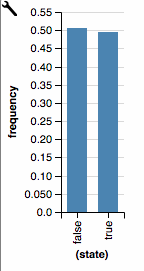

Alternatively, you can infer the correct answer as follows:

```js
var sentences = RandomInteger({n:10})

var thiefRats = function(){
  return (flip()? true: false)
}

var thief = Infer({}, function(){
  var LenientSentence = sample(sentences);
  var iRat = thiefRats()
  var uRat = thiefRats()
  var percentYearsFreedom = 1 - (iRat ? LenientSentence/10 : (uRat ? LenientSentence/10 : 0))
  factor (1*(percentYearsFreedom > .5))
  return LenientSentence
})

viz(thief)
```

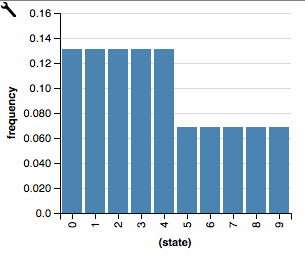

As you can see, we end up prefering lenient sentences no longer than 4 years.

## Exercise 4: Exploring RSA

For this exercise, modify the RSA model introduced in the main text as necessary.

### a) 

*How does increasing the optimality of the speaker affect the pragmatic listener's inferences? Try a couple values and report the results.*

For convenience, we turn `alpha` into a parameter:

```js
// Here is the code from the Frank and Goodman RSA model

// possible objects of reference
var meaningPrior = function() {
  uniformDraw([
    {shape: "square", color: "blue"},
    {shape: "circle", color: "blue"},
    {shape: "square", color: "green"}
  ])
}

// possible one-word utterances
var utterances = ["blue","green","square","circle"]

// meaning function to interpret the utterances
var meaning = function(utterance, obj){
  (utterance === "blue" || utterance === "green") ? utterance === obj.color :
  (utterance === "circle" || utterance === "square") ? utterance === obj.shape :
  true
}

// literal listener
var literalListener = function(utterance){
  Infer({model: function(){
    var obj = meaningPrior();
    condition(meaning(utterance, obj))
    return obj
  }})
}

// pragmatic speaker
var speaker = function(obj,alpha){
  Infer({model: function(){
    var utterance = uniformDraw(utterances)
    factor(alpha * literalListener(utterance).score(obj))
    return utterance
  }})
}

// pragmatic listener
var pragmaticListener = function(utterance,alpha){
  Infer({model: function(){
    var obj = meaningPrior()
    observe(speaker(obj,alpha),utterance)
    return obj
  }})
}


print("pragmatic listener's interpretation of 'blue', given alpha = 0.01:")
viz.table(pragmaticListener("blue", 0.01))

print("pragmatic listener's interpretation of 'blue', given alpha = 1:")
viz.table(pragmaticListener("blue", 1))

print("pragmatic listener's interpretation of 'blue', given alpha = 4:")
viz.table(pragmaticListener("blue", 4))

print("pragmatic listener's interpretation of 'blue', given alpha = 10:")
viz.table(pragmaticListener("blue", 10))
```

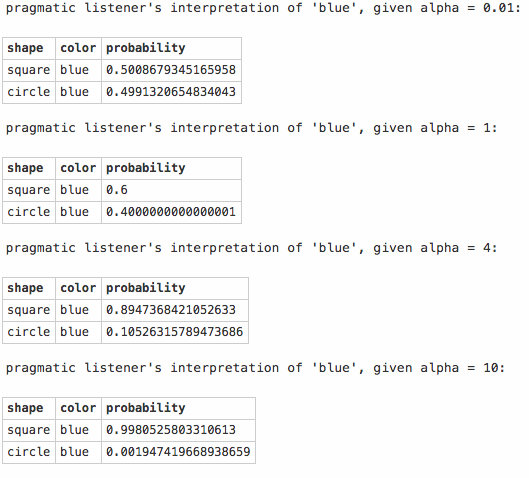

As `alpha` increases, the pragmatic listener is increasingly likely to interpret `blue` as referring to the blue square.

### b) 

*How do the inferences of $$L_{2}$$ compare to those of $$L_{1}$$?*

```js
// Here is the code from the Frank and Goodman RSA model

// possible objects of reference
var meaningPrior = function() {
  uniformDraw([
    {shape: "square", color: "blue"},
    {shape: "circle", color: "blue"},
    {shape: "square", color: "green"}
  ])
}

// possible one-word utterances
var utterances = ["blue","green","square","circle"]

// meaning function to interpret the utterances
var meaning = function(utterance, obj){
  (utterance === "blue" || utterance === "green") ? utterance === obj.color :
  (utterance === "circle" || utterance === "square") ? utterance === obj.shape :
  true
}

var alpha = 1

// literal listener
var literalListener = function(utterance){
  Infer({model: function(){
    var obj = meaningPrior();
    condition(meaning(utterance, obj))
    return obj
  }})
}

// pragmatic speaker
var speaker = function(obj){
  Infer({model: function(){
    var utterance = uniformDraw(utterances)
    factor(alpha * literalListener(utterance).score(obj))
    return utterance
  }})
}

// pragmatic listener
var pragmaticListener = function(utterance){
  Infer({model: function(){
    var obj = meaningPrior()
    observe(speaker(obj),utterance)
    return obj
  }})
}

// pragmatic speaker2
var speaker2 = function(obj){
  Infer({model: function(){
    var utterance = uniformDraw(utterances)
    factor(alpha * pragmaticListener(utterance).score(obj))
    return utterance
  }})
}

// pragmatic listener #2
var listener3 = function(utterance){
  Infer({model: function(){
    var obj = meaningPrior()
    observe(speaker2(obj),utterance)
    return obj
  }})
}

print("L1's interpretation of 'blue'")
viz.table(pragmaticListener("blue"))

print("L2's interpretation of 'blue'")
viz.table(listener3("blue"))
```

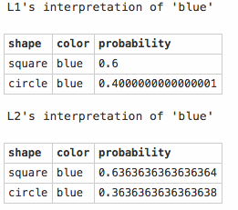

There is little additional effect.

### c)

*Add a blue circle to the scenario. What happens to the interpretion of "blue"? Why?*

It becomes 50/50 between 'blue circle' and 'blue square'. This is because 'blue' is now useful for distinguishing between the two circles as well.

### d) 

*Is there any way to get “blue” to refer to something green? Why or why not?*

In this model, the literal listener expects the speaker to tell the literal truth, albeit with some noise. So there is no way to prefer an interpretation that is literally false to one that is literally true. So we'd need to relax the assumption that the literal listener expects the speaker to always tell the truth.