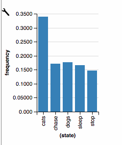
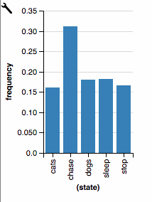
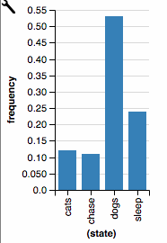
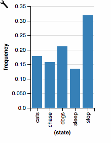
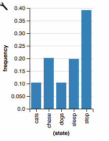

## Exercise 1: What word comes next?

a) *In human languages, certain words are more likely to follow others. "The" is more likely to be followed by "dog" than "rhino", and even less likely to be followed by "sings". *

*Let's consider a fragment of English consisting of only the words "dogs", "cats", "chase", and "sleep". This fragment does not contain punctuation or capital letters. Now, suppose that somebody says, "dogs chase cats". Determine how likely "chase" is to be followed by each word in the vocabulary.*

```js
//Helper function to compare arrays
var comparray = function(arr1,arr2){
  return (JSON.stringify(arr1) === JSON.stringify(arr2))
} 

var mm = Infer({method:'MCMC', burn:10000, samples: 50000, onlyMAP:false}, function() {
  
  let vocab = ['dogs', 'cats', 'chase', 'sleep', 'stop'];

  var wordToDistribution = mem(function(word) {
    return dirichletDrift({alpha:ones([vocab.length,1]), concentration:10})
  })

  var transition = function(word) {
    return categorical({ps: wordToDistribution(word), vs: vocab})
  }

 
  let obs = ['dogs', 'chase', 'cats'];

  let generateSentence = function(lastState, sentence) {
    let word = transition(lastState);
    if (word == 'stop') return [];
    return [word].concat(generateSentence(word, sentence));
  }

  condition(comparray(obs, generateSentence('start')))

  return transition('chase');
                
})

viz(mm)
```



b) *Assume now that in addition to saying "dogs chase cats", your interlocutor said a second sentence. However, you only heard the first word, which again was "dogs". What is the distribution across likely second words in this sentence? NOTE: If you are not careful, you will end up assigning some probability to "undefined". Be careful.*

```js
//Helper function to compare arrays
var comparray = function(arr1,arr2){
  return (JSON.stringify(arr1) === JSON.stringify(arr2))
}

var mm = Infer({method:'MCMC', burn:10000, samples: 50000, onlyMAP: false}, function() {

  let vocab = ['dogs', 'cats', 'chase', 'sleep', 'stop'];

  var wordToDistribution = mem(function(word) {
    return dirichletDrift({alpha:ones([vocab.length,1]), concentration:10})
  })

  var transition = function(word) {
    return categorical({ps: wordToDistribution(word), vs: vocab})
  }

  let generateSentence = function(lastState, sentence) {
    let word = transition(lastState);
    if (word == 'stop') return ['stop']; //to avoid probabilities on 'undefined'
    return [word].concat(generateSentence(word, sentence));
  }

  let obs = ['dogs', 'chase', 'cats', 'stop'];
  condition(comparray(obs, generateSentence('start')))

  let newSentence = generateSentence('start');
  condition(newSentence[0] == 'dogs');
  return newSentence[1];
})

viz(mm)
```



c) *Suppose again that somebody said "dogs chase cats". Now suppose they spoke another sentence, where again the second word was "chase". Show that the most likely first word was "dogs". *

```js
var comparray = function(arr1,arr2){
  return (JSON.stringify(arr1) === JSON.stringify(arr2))
}

var mm = Infer({method:'MCMC', burn:10000, samples: 50000, onlyMAP: false}, function() {

  let vocab = ['dogs', 'cats', 'chase', 'sleep', 'stop'];

  var wordToDistribution = mem(function(word) {
    return dirichletDrift({alpha:ones([vocab.length,1]), concentration:10})
  })

  var transition = function(word) {
    return categorical({ps: wordToDistribution(word), vs: vocab})
  }

  let generateSentence = function(lastState, sentence) {
    let word = transition(lastState);
    if (word == 'stop') return ['stop']; //to avoid probabilities on 'undefined'
    return [word].concat(generateSentence(word, sentence));
  }

  let obs = ['dogs', 'chase', 'cats', 'stop'];
  condition(comparray(obs, generateSentence('start')))

  let newSentence = generateSentence('start');
  condition(newSentence[1] == 'chase');
  return newSentence[0];
})

viz(mm)
```



## Exercise 2: Hidden Markov Model

a) *Return to the model from Exercise 1b. Suppose that the second sentence, instead of beginning with "dogs", began with "cats". Provide the marginal distribution on the second word of that sentence.*

```js
//Helper function to compare arrays
var comparray = function(arr1,arr2){
  return (JSON.stringify(arr1) === JSON.stringify(arr2))
}

var mm = Infer({method:'MCMC', burn:10000, samples: 50000, onlyMAP: false}, function() {

  let vocab = ['dogs', 'cats', 'chase', 'sleep', 'stop'];

  var wordToDistribution = mem(function(word) {
    return dirichletDrift({alpha:ones([vocab.length,1]), concentration:10})
  })

  var transition = function(word) {
    return categorical({ps: wordToDistribution(word), vs: vocab})
  }

  let generateSentence = function(lastState, sentence) {
    let word = transition(lastState);
    if (word == 'stop') return ['stop']; //to avoid probabilities on 'undefined'
    return [word].concat(generateSentence(word, sentence));
  }

  let obs = ['dogs', 'chase', 'cats', 'stop'];
  condition(comparray(obs, generateSentence('start')))

  let newSentence = generateSentence('start');
  condition(newSentence[0] == 'cats');
  return newSentence[1];
})

viz(mm)
```



b) *In Exercise 2a, you should have found that an ungrammatical sequence like "cats cats" is as likely as a grammatical sequence like "cats sleep". Why is this?*

The model hasn't observed anything other than 'stop' as following the word 'cats'. This implies that 'stop' is the most likely option, but also that the algorithm is totally indifferent towards all the other words -- since this is a language without grammar, all words are treated the same (they literally coexist as entries in a single list).

c) *Let's try a hidden Markov model instead. Note that two of the words in our fragment of English are nouns ("dogs", "cats") and two are verbs ("chase", "sleep").*

*Model sentence generation as involving Markov transitions between parts of speech, rather than between the words themselves. *

```js
//Helper function to compare arrays
var comparray = function(arr1,arr2){
  return (JSON.stringify(arr1) === JSON.stringify(arr2))
}

var drawWord = function(pos){
  return (pos=="N") ? uniformDraw(['dogs','cats']) :
         (pos=="V") ? uniformDraw(['chase','sleep']) : 
         'stop'
}
var POS = ["N", "V", "stop"]

var posToDistribution = mem(function(pos) {
    return dirichletDrift({alpha:ones([POS.length,1]), concentration:10})
  })

var transition = function(pos) {
  return categorical({ps: posToDistribution(pos), vs: POS})
 }

let generateSentence = function(lastPOS) {
  let nextPOS = transition(lastPOS);
  let word = drawWord(nextPOS);
  return (word == 'stop') ? [word] : [word].concat(generateSentence(nextPOS));
}

var sentence = generateSentence("start");
print(sentence)
```

d) *Try Exercise 2a, but using our new hidden Markov model. Show that we are now more likely to get the grammatical phrases "cats chase" or "cats sleep" than "cats cats" or "cats dogs".* 

```js
//Helper function to compare arrays
var comparray = function(arr1,arr2){
  return (JSON.stringify(arr1) === JSON.stringify(arr2))
}

var drawWord = function(pos){
  return (pos=="N") ? uniformDraw(['dogs','cats']) :
         (pos=="V") ? uniformDraw(['chase','sleep']) : 
         'stop'
}
var POS = ["N", "V", "stop"]

var hmm = Infer({method:'MCMC', burn:10000, samples: 1000, lag:10, onlyMAP: false}, function() {
  var posToDistribution = mem(function(pos) {
    return dirichletDrift({alpha:ones([POS.length,1]), concentration:10})
  })

  var transition = function(pos) {
    return categorical({ps: posToDistribution(pos), vs: POS})
  }

  let generateSentence = function(lastPOS) {
    let nextPOS = transition(lastPOS);
    let word = drawWord(nextPOS);
    return (word == 'stop') ? [word] : [word].concat(generateSentence(nextPOS));
  }
  let obs = ['dogs', 'chase', 'cats', 'stop'];
  condition(comparray(obs, generateSentence('start')))

  let newSentence = generateSentence('start');
  condition(newSentence[0] == 'cats');
  return newSentence[1];
})

viz(hmm)
```



## Exercise 3: Phrase structure grammars

a) *Extend your hidden Markov model from Exercise 2 so that our fragment of English additionally includes the determiners "the" and "a" as well as the adverb "diligently". Make "dogs", "cats", "chase", and "sleep" singular ("dog", "cat", "chases", "sleeps"). Condition on "The dog chases a cat" being a sentence in the language and generate some additional sentences.*

*Note that for the solution used here, it's convenient (but not necessary) to set* `onlyMAP: true`.


```js
//Helper function to compare arrays
var comparray = function(arr1,arr2){
  return (JSON.stringify(arr1) === JSON.stringify(arr2))
}

var drawWord = function(pos){
  return (pos=="N") ? uniformDraw(['dog','cat']) :
         (pos=="V") ? uniformDraw(['chases','sleeps']) : 
         (pos=="D") ? uniformDraw(['the','a']) :
         (pos=="A") ? 'dilligently' : 
         'stop'
}
var POS = ["N", "V", "D", "A", "stop"]

var hmm = Infer({method:'MCMC', burn:10000, samples: 1000, lag:10, onlyMAP: true}, function() {
  var posToDistribution = mem(function(pos) {
    return dirichletDrift({alpha:ones([POS.length,1]), concentration:10})
  })

  var transition = function(pos) {
    return categorical({ps: posToDistribution(pos), vs: POS})
  }

  let generateSentence = function(lastPOS) {
    let nextPOS = transition(lastPOS);
    let word = drawWord(nextPOS);
    return (word == 'stop') ? [word] : [word].concat(generateSentence(nextPOS));
  }
  let obs = ['the', 'dog', 'chases', 'a', 'cat', 'stop'];

  factor(comparray(obs, generateSentence('start'))*5)

  var sent1 = generateSentence('start');
  var sent2 = generateSentence('start');
  var sent3 = generateSentence('start');
  var sent4 = generateSentence('start');
  var sent5 = generateSentence('start');
  
  return {sent1: sent1, sent2: sent2, sent3: sent3, sent4: sent4, sent5: sent5}
})

print(hmm)
```

NOTE: This may take several tries to get it to run. Using `factor` instead of `condition` will work much better. We return to this in [Algorithms for Inference](07-inference-process.md).

b) *Let us consider a phrase structure grammar for our English fragment instead, modeled on the one in Chapter 5. Again, condition on "The dog chases a cat" being a sentence in the language and generate some additional sentences.* 

*Note that for the solution used here, it's convenient (but not necessary) to set* `onlyMAP: true`.

```js
//Helper function to compare arrays
var comparray = function(arr1,arr2){
  return (JSON.stringify(arr1) === JSON.stringify(arr2))
}

var uniformDraw = function (xs) {return xs[randomInteger(xs.length)]};

var D  = function() {return uniformDraw(['the', 'a'])};
var N  = function() {return uniformDraw(['cat', 'dog'])};
var V  = function() {return uniformDraw(['chases', 'sleeps'])}
var A  = function() {return uniformDraw(['diligently'])}
var AP = function() {return uniformDraw([A()])}
var NP = function() {return [D(), N()]}
var VP = function() {return uniformDraw([[V(), AP()],
                                         [V(), NP()]])}
var S  = function() {return [NP(), VP()]}

var psg = Infer({method:'MCMC', burn:10000, samples: 1000, onlyMAP: true}, function() {
  let obs = [['the', 'dog'], ['chases', ['a', 'cat']]]
  condition(comparray(obs, S()))


  var sent1 = S();
  var sent2 = S();
  var sent3 = S();
  var sent4 = S();
  var sent5 = S();
  
  return {sent1: sent1, sent2: sent2, sent3: sent3, sent4: sent4, sent5: sent5}
})

print(psg)
```

c) *Which model produced better English sentences, the hidden Markov model in Exercise 3a or the phrase structure grammar model in Exercise 3b? Why do you suppose that is?*

The phrase structure grammar produces much more sensible sentences, because it has a lot of prior knowlege about sentence structure. For instance, it is not capable of producing sentences with two articles in a row.

