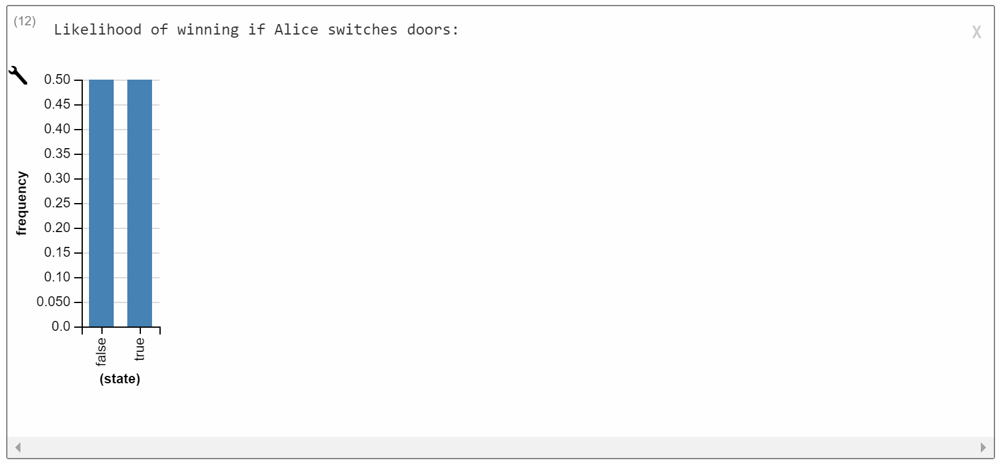
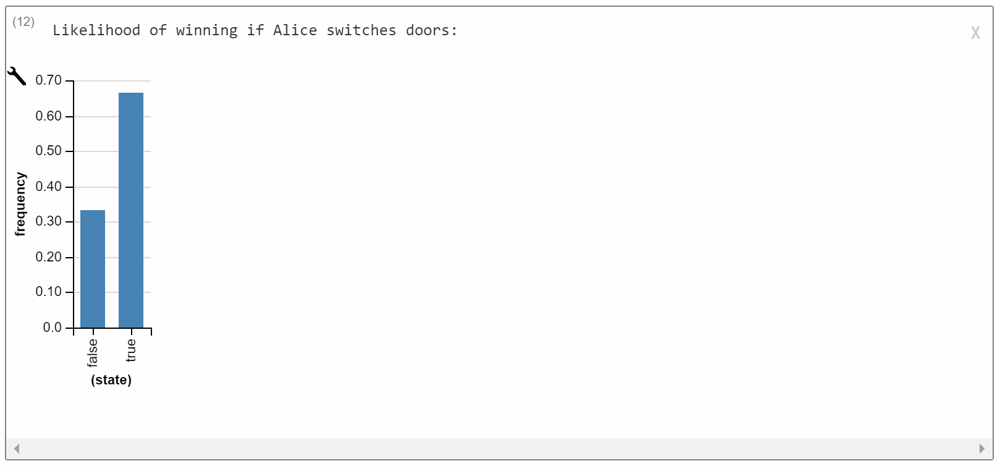
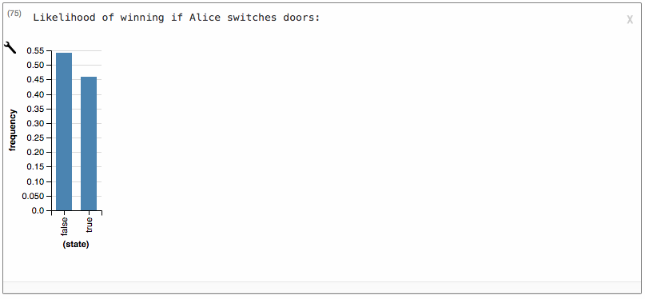

## Exercise 1: Tricky Agents

What would happen if Sally knew you were watching her and wanted to deceive you? 

a) *Complete the code below so that `chooseAction` chooses a misdirection if Sally is deceptive. Then describe and show what happens if you knew Sally was deceptive and chose action "b".*

~~~~
var actionPrior = Categorical({vs: ['a', 'b', 'c'], ps: [1/3, 1/3, 1/3]});
var foodPrior = Categorical({vs: ['bagel', 'cookie', 'doughnut'], ps: [1/3, 1/3, 1/3]});

var vendingMachine = function(state action) {
  return (action == 'a' ? categorical({vs: ['bagel', 'cookie', 'doughnut'], ps: [.8, .1, .1]}) :
          action == 'b' ? categorical({vs: ['bagel', 'cookie', 'doughnut'], ps: [.1, .8, .1]}) :
	  action == 'c' ? categorical({vs: ['bagel', 'cookie', 'doughnut'], ps: [.1, .1, .8]}) :
	  'nothing');

var chooseAction = function(goal, transition, state, deceive) {
  return Infer({method: 'enumerate'}, function() {
    var action = sample(actionPrior);
    condition((!deceive && goal(transition(state,action))) || (deceive && !goal(transition(state, action))))
    return action;
  })
};

var goalPosterior = Infer({method: 'enumerate'}, function() {
  var deceive = flip();
  var goalFood = sample(foodPrior);
  var goal = function(outcome) {return outcome == goalFood};
  var sallyActionDist = chooseAction(goal, vendingMachine, 'state', deceive);
  condition(deceive && sample(sallyActionDist) == 'b')
  return goalFood;
});

viz.auto(goalPosterior);
~~~~

Results: Given the conditions, the probabilities that Alice wants a bagel or doughnut (p=0.45 for both) are much larger than the probability she wants a cooke (p=0.1):


b) *What happens if you don't know Sally is deceptive and she chooses "b" and then "b". What if she chooses "a" and then "b." Show the models and describe the difference in behavior. Is she deceptive in each case?*

For the first possibility, we condition on:

~~~~
condition(sample(sallyActionDist) == 'b' && sample(sallyActionDist)=='b');
~~~~

We suspect that Sally wants a cookie and was not deceptive, since she chose the option most likely to give her a cookie both times:


(Note that we can confirm that the model does not believe Sally is being deceptive by returning the value of `deceive`.)

For the second possibility, we condition on:

~~~~
condition(sample(sallyActionDist) == 'a' && sample(sallyActionDist)=='b');
~~~~

It is most likely that Alice wants a doughnut, i.e. that the button  most likely to result in her goal is 'c'. The model predicts from her inconsistency (swiching from 'a' to 'b) that it is most likely that she is deceptive. If she was not being deceptive, she would have chosen the same thing both times. So her true goal is the result of the only button she didn't press: 'c':


(Note that we can confirm that the model believes Sally is being deceptive by returning the value of `deceive`.)

## Exercise 2: Monty Hall.

*Here, we will use the tools of Bayesian inference to explore a classic statistical puzzle -- the Monty Hall problem. Here is one statement of the problem:*

> Alice is on a game show and she's given the choice of three doors. Behind one door is a car; behind the others, goats. She picks door 1. The host, Monty, knows what's behind the doors and opens another door, say No. 3, revealing a goat. He then asks Alice if she wants to switch doors. Should she switch?

*Intuitively, it may seem like switching doesn't matter. However, the canonical solution is that you should switch doors. We'll explore (a) the intuition that switching doesn't matter, (b) the canonical solution, and more.*

a) *Whether you should switch depends crucially on how you believe Monty chooses doors to pick. First, write the model such that the host randomly picks doors (for this, fill in `montyRandom`). In this setting, should Alice switch? Or does it not matter? Hint: it is useful to condition on the exact doors that we discussed in the problem description.*

~~~~
// Here's a function that might be handy: it removes some set of badItems from a list l
// e.g. removeBadItems(['nut', 'cake', 'nut', 'bagel'], ['cake', 'bagel']) => ['nut', 'nut']
var removeBadItems = function(l, badItems) {
  return reduce(function(badItem, remainingL) {
    return remove(badItem, remainingL)
  }, l, badItems);
}

var doors = [1,2,3]
var chooseDoor = Categorical({vs: doors, ps: [1/3, 1/3, 1/3]});

var montyRandom = function(aliceDoor, prizeDoor) {
  return Infer({method: 'enumerate'}, function() {
    return sample(chooseDoor);
  });
};

Infer({method: 'enumerate'}, function() {
  var aliceDoor = sample(chooseDoor);
  var prizeDoor = sample(chooseDoor);
  var montyFunction = montyAvoidBoth;

  var montyDoorDist = montyFunction(aliceDoor, prizeDoor);

  let montyDoor = sample(montyDoorDist);
  condition(montyDoor != prizeDoor && montyDoor != aliceDoor);

  let switchDoor = removeBadItems(doors, [aliceDoor, montyDoor])[0]

  display("Likelihood of winning if Alice switches doors:")
  return switchDoor==prizeDoor;
});
~~~~

In this case, it doesn't matter whether Alice switches. *A priori* all doors are equally likely to be the prize door. Monte has eliminated one, but there's no reason to favor either of the other two:



b) *Now, fill in* `montyAvoidBoth` *(make sure you switch your* `var montyFunction = ...` *alias to use* `montyAvoidBoth`). *Here, Monty randomly picks a door that is neither the prize door nor Alice's door. For both-avoiding Monty, you'll find that Alice should switch. 

```javascript
// Here's a function that might be handy: it removes some set of badItems from a list l
// e.g. removeBadItems(['nut', 'cake', 'nut', 'bagel'], ['cake', 'bagel']) => ['nut', 'nut']
// Here's a function that might be handy: it removes some set of badItems from a list l
// e.g. removeBadItems(['nut', 'cake', 'nut', 'bagel'], ['cake', 'bagel']) => ['nut', 'nut']
var removeBadItems = function(l, badItems) {
  return reduce(function(badItem, remainingL) {
    return remove(badItem, remainingL)
  }, l, badItems);
}

var doors = [1,2,3]
var chooseDoor = Categorical({vs: doors, ps: [1/3, 1/3, 1/3]});

var montyAvoidBoth = function(aliceDoor, prizeDoor) {
  return Infer({method: 'enumerate'}, function() {
    let montyDoor = sample(chooseDoor);
    condition(montyDoor != prizeDoor && montyDoor != aliceDoor);
    return montyDoor;
  });
};

Infer({method: 'enumerate'}, function() {
  var aliceDoor = sample(chooseDoor);
  var prizeDoor = sample(chooseDoor);
  var montyFunction = montyAvoidBoth;

  var montyDoorDist = montyFunction(aliceDoor, prizeDoor);

  let montyDoor = sample(montyDoorDist);
  condition(montyDoor != prizeDoor && montyDoor != aliceDoor);

  let switchDoor = removeBadItems(doors, [aliceDoor, montyDoor])[0]

  display("Likelihood of winning if Alice switches doors:")
  return switchDoor==prizeDoor;
});
```

By running the model, we see that switching doors allows Alice to find the car 2/3 of the time:


*This is unintuitive  -- we know that Monty picked door 3, so why should the process he used to arrive at this choice matter? By hand, compute the probability table for* $$P(\text{Prize } \mid \text{Alice picks door 1}, \text{Monty picks door 3}, \text{Door 3 is not the prize})$$ under both `montyRandom` and `montyAvoidBoth`. *Using these tables, explain why Alice should switch for both-avoiding Monty but why switching doesn't matter for random Monty. Hint: you will want to compare particular rows of these tables.*

Under `montyRandom`, here are the probabilities prior to conditioning:

| Alice's Door | Prize Door | Monty's Door | P(Alice, Prize, Monty) |
|--------------|------------|--------------|------------------------|
| 1            | 1          | 1            | 0.037                  |
| 1            | 1          | 2            | 0.037                  |
| 1            | 1          | 3            | 0.037                  |
| 1            | 2          | 1            | 0.037                  |
| 1            | 2          | 2            | 0.037                  |
| 1            | 2          | 3            | 0.037                  |
| 1            | 3          | 1            | 0.037                  |
| 1            | 3          | 2            | 0.037                  |
| 1            | 3          | 3            | 0.037                  |
| 2            | 1          | 1            | 0.037                  |
| 2            | 1          | 2            | 0.037                  |
| 2            | 1          | 3            | 0.037                  |
| 2            | 2          | 1            | 0.037                  |
| 2            | 2          | 2            | 0.037                  |
| 2            | 2          | 3            | 0.037                  |
| 2            | 3          | 1            | 0.037                  |
| 2            | 3          | 2            | 0.037                  |
| 2            | 3          | 3            | 0.037                  |
| 3            | 1          | 1            | 0.037                  |
| 3            | 1          | 2            | 0.037                  |
| 3            | 1          | 3            | 0.037                  |
| 3            | 2          | 1            | 0.037                  |
| 3            | 2          | 2            | 0.037                  |
| 3            | 2          | 3            | 0.037                  |
| 3            | 3          | 1            | 0.037                  |
| 3            | 3          | 2            | 0.037                  |
| 3            | 3          | 3            | 0.037                  |

After we condition on Alice choosing Door 1, Monte choosing Door 3, and Door 3 not being the prize, there are only two remaining possibilities:  

| Alice's Door | Prize Door | Monty's Door | P(Alice, Prize, Monty) |
|--------------|------------|--------------|------------------------|
| 1            | 1          | 3            | 0.037                  |
| 1            | 2          | 3            | 0.037                  |

These are equally likely in the prior and thus equally likely in the posterior.

Under `montyAvoidBoth`:

| Alice's Door | Prize Door | Monty's Door | P(Alice, Prize, Monty) |
|--------------|------------|--------------|------------------------|
| 1            | 1          | 1            | 0                      |
| 1            | 1          | 2            | 0.06                   |
| 1            | 1          | 3            | 0.06                   |
| 1            | 2          | 1            | 0                      |
| 1            | 2          | 2            | 0                      |
| 1            | 2          | 3            | 0.11                   |
| 1            | 3          | 1            | 0                      |
| 1            | 3          | 2            | 0.11                   |
| 1            | 3          | 3            | 0                      |
| 2            | 1          | 1            | 0                      |
| 2            | 1          | 2            | 0                      |
| 2            | 1          | 3            | 0.11                   |
| 2            | 2          | 1            | 0.06                   |
| 2            | 2          | 2            | 0                      |
| 2            | 2          | 3            | 0.06                   |
| 2            | 3          | 1            | 0.11                   |
| 2            | 3          | 2            | 0                      |
| 2            | 3          | 3            | 0                      |
| 3            | 1          | 1            | 0                      |
| 3            | 1          | 2            | 0.11                   |
| 3            | 1          | 3            | 0                      |
| 3            | 2          | 1            | 0.11                   |
| 3            | 2          | 2            | 0                      |
| 3            | 2          | 3            | 0                      |
| 3            | 3          | 1            | 0.06                   |
| 3            | 3          | 2            | 0.06                   |
| 3            | 3          | 3            | 0                      |

Again, conditioning leaves only the two possibilities:

| Alice's Door | Prize Door | Monty's Door | P(Alice, Prize, Monty) |
|--------------|------------|--------------|------------------------|
| 1            | 1          | 3            | 0.06                   |
| 1            | 2          | 3            | 0.11                   |

Thus, in the posterior, the possibility where Door 2 is the prize door is twice as likely as the possibility where Door 1 is the prize door. Alice should switch.

c) *Fill in* `montyAvoidAlice`. *Here, Monty randomly picks a door that is simply not Alice's door. Should Alice switch here?*

```javascript
// Here's a function that might be handy: it removes some set of badItems from a list l
// e.g. removeBadItems(['nut', 'cake', 'nut', 'bagel'], ['cake', 'bagel']) => ['nut', 'nut']
// Here's a function that might be handy: it removes some set of badItems from a list l
// e.g. removeBadItems(['nut', 'cake', 'nut', 'bagel'], ['cake', 'bagel']) => ['nut', 'nut']
var removeBadItems = function(l, badItems) {
  return reduce(function(badItem, remainingL) {
    return remove(badItem, remainingL)
  }, l, badItems);
}

var doors = [1,2,3]
var chooseDoor = Categorical({vs: doors, ps: [1/3, 1/3, 1/3]});

var montyAvoidAlice = function(aliceDoor, prizeDoor) {
  return Infer({method: 'enumerate'}, function() {
    let montyDoor = sample(chooseDoor);
    condition(montyDoor != aliceDoor);
    return montyDoor;
  });
};

Infer({method: 'enumerate'}, function() {
  var aliceDoor = sample(chooseDoor);
  var prizeDoor = sample(chooseDoor);
  var montyFunction = montyAvoidAlice;

  var montyDoorDist = montyFunction(aliceDoor, prizeDoor);

  let montyDoor = sample(montyDoorDist);
  condition(montyDoor != prizeDoor && montyDoor != aliceDoor);

  let switchDoor = removeBadItems(doors, [aliceDoor, montyDoor])[0]

  display("Likelihood of winning if Alice switches doors:")
  return switchDoor==prizeDoor;
});
```

In this case, Alice should be indifferent to switching. 

    
d) Fill in `montyAvoidPrize`. Here, Monty randomly picks a door that is simply not the prize door. Should Alice switch here?

```javascript
// Here's a function that might be handy: it removes some set of badItems from a list l
// e.g. removeBadItems(['nut', 'cake', 'nut', 'bagel'], ['cake', 'bagel']) => ['nut', 'nut']
// Here's a function that might be handy: it removes some set of badItems from a list l
// e.g. removeBadItems(['nut', 'cake', 'nut', 'bagel'], ['cake', 'bagel']) => ['nut', 'nut']
var removeBadItems = function(l, badItems) {
  return reduce(function(badItem, remainingL) {
    return remove(badItem, remainingL)
  }, l, badItems);
}

var doors = [1,2,3]
var chooseDoor = Categorical({vs: doors, ps: [1/3, 1/3, 1/3]});

var montyAvoidPrize = function(aliceDoor, prizeDoor) {
  return Infer({method: 'enumerate'}, function() {
    let montyDoor = sample(chooseDoor);
    condition(montyDoor != prizeDoor);
    return montyDoor;
  });
};

Infer({method: 'enumerate'}, function() {
  var aliceDoor = sample(chooseDoor);
  var prizeDoor = sample(chooseDoor);
  var montyFunction = montyAvoidPrize;

  var montyDoorDist = montyFunction(aliceDoor, prizeDoor);

  let montyDoor = sample(montyDoorDist);
  condition(montyDoor != prizeDoor && montyDoor != aliceDoor);

  let switchDoor = removeBadItems(doors, [aliceDoor, montyDoor])[0]

  display("Likelihood of winning if Alice switches doors:")
  return switchDoor==prizeDoor;
});
```

Here, Alice should be indifferent towards staying or switching, since she has a 50/50 chance on expectation:


e) *An interesting cognitive question is: why do we have the initial intuition that switching shouldn't matter? Given your explorations, propose an answer.*

[Note: There's no right answer to this. Here are two reasonable answers.]

*Answer 1*: Either we believe that Monte is trying to avoid the prize door or we believe he is acting randomly. Either possibility would lead to the (correct) prediction that we think Alice should be indifferent to switching.

*Answer 2*: We are uncertain as to what Monte's strategy is, and so we average over the four possibilities:

```javascript
// Here's a function that might be handy: it removes some set of badItems from a list l
// e.g. removeBadItems(['nut', 'cake', 'nut', 'bagel'], ['cake', 'bagel']) => ['nut', 'nut']
var removeBadItems = function(l, badItems) {
  return reduce(function(badItem, remainingL) {
    return remove(badItem, remainingL)
  }, l, badItems);
}

var doors = [1,2,3]
var chooseDoor = Categorical({vs: doors, ps: [1/3, 1/3, 1/3]});

var montyRandom = function(aliceDoor, prizeDoor) {
  return Infer({method: 'enumerate'}, function() {
    return sample(chooseDoor);
  });
};

var montyAvoidBoth = function(aliceDoor, prizeDoor) {
  return Infer({method: 'enumerate'}, function() {
    let montyDoor = sample(chooseDoor);
    condition(montyDoor != prizeDoor && montyDoor != aliceDoor);
    return montyDoor;
  });
};

var montyAvoidAlice = function(aliceDoor, prizeDoor) {
  return Infer({method: 'enumerate'}, function() {
    let montyDoor = sample(chooseDoor);
    condition(montyDoor != aliceDoor);
    return montyDoor;
  });
};

var montyAvoidPrize = function(aliceDoor, prizeDoor) {
  return Infer({method: 'enumerate'}, function() {
    let montyDoor = sample(chooseDoor);
    condition(montyDoor != prizeDoor);
    return montyDoor;
  });
};

var chooseMontyFunction = function(){
  var f = randomInteger(4);
  return f==0? montyRandom :
         f==1? montyAvoidBoth :
         f==2? montyAvoidAlice :
         montyAvoidPrize
}

Infer({method: 'enumerate'}, function() {
  var aliceDoor = sample(chooseDoor);
  var prizeDoor = sample(chooseDoor);
  var montyFunction = chooseMontyFunction()
  
  var montyDoorDist = montyFunction(aliceDoor, prizeDoor);

  let montyDoor = sample(montyDoorDist);
  //condition(montyDoor != prizeDoor && montyDoor != aliceDoor); //Part A

  let switchDoor = removeBadItems(doors, [aliceDoor, montyDoor])[0]

  display("Likelihood of winning if Alice switches doors:")
  return switchDoor==prizeDoor;
});
```
This results in a slight bias towards not switching, but it's close enough to 50/50 that we may not sense of a distinction between switching and not switching.

