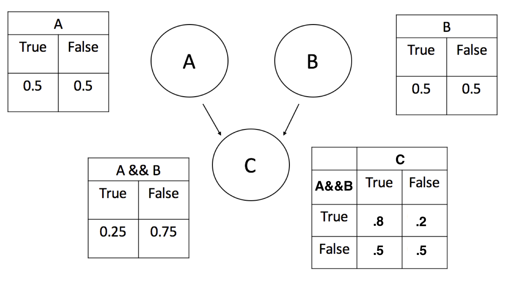
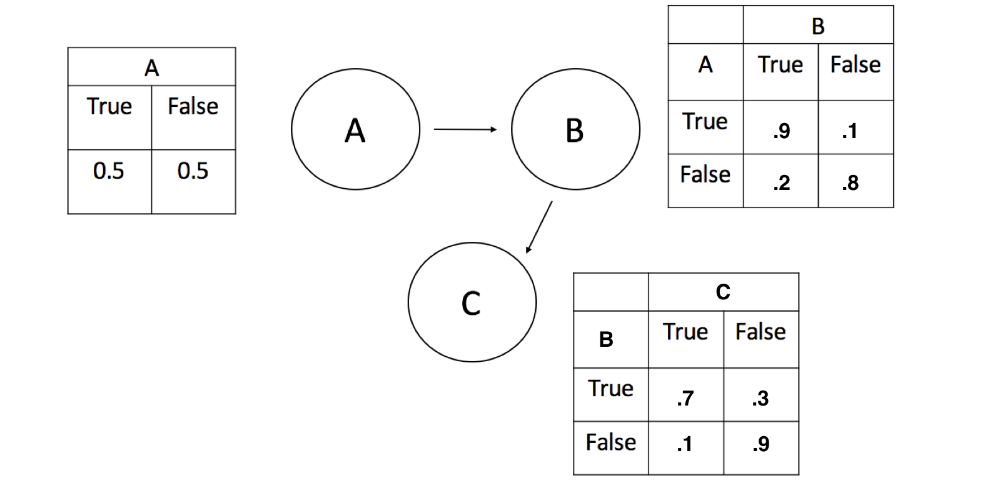
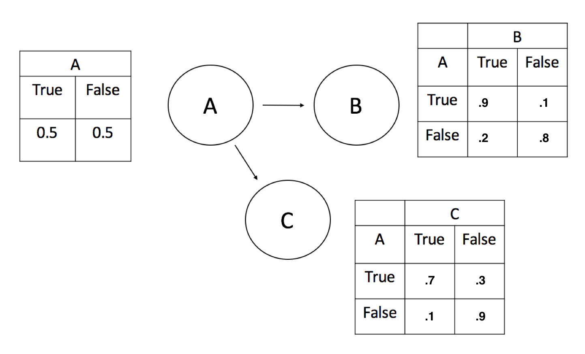
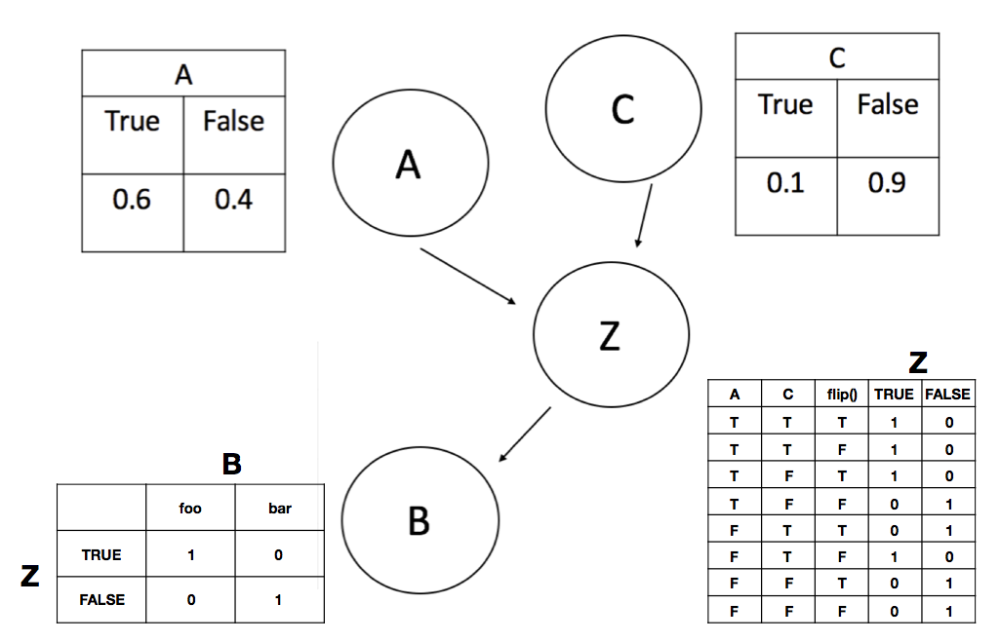

## Exercise 1: Causal and statistical dependency.

> For each of the following programs:
> 
> * Draw the dependency diagram (Bayes net). If you don't have software on your computer for doing this, Google Docs has a decent interface for creating drawings.
> 
> * Use informal evaluation order reasoning and the intervention method to determine causal dependency between A and B.
> 
> * Use conditioning to determine whether A and B are statistically dependent.

### a)

~~~~ 
var a = flip();
var b = flip();
var c = flip(a && b ? .8 : .5);
~~~~

neither causally dependent nor statistically dependent

### b)

~~~~ 
var a = flip();
var b = flip(a ? .9 : .2);
var c = flip(b ? .7 : .1);
~~~~

both causally dependent *and* statistically dependent

### c)

~~~~ 
var a = flip();
var b = flip(a ? .9 : .2);
var c = flip(a ? .7 : .1);
~~~~

both causally dependent *and* statistically dependent

### d)

~~~~ 
var a = flip(.6);
var c = flip(.1);
var z = flip() ? a : c;
var b = z ? 'foo' : 'bar';
~~~~

both causally dependent *and* statistically dependent

### e)

statistically dependent but *not* causally dependent

~~~~ 
var examFairPrior = Bernoulli({p: .8});
var doesHomeworkPrior = Bernoulli({p: .8});
var examFair = mem(function(exam) { return sample(examFairPrior) });
var doesHomework = mem(function(student) { return sample(doesHomeworkPrior) });

var pass = function(student, exam) {
  return flip(examFair(exam) ?
              (doesHomework(student) ? .9 : .5) :
              (doesHomework(student) ? .2 : .1));
}
var a = pass('alice', 'historyExam');
var b = pass('bob', 'historyExam');
~~~~

<!-- *Note:* Bayes nets often use plate notation for repeated structure across multiple entities (e.g. students and exams), but there is no standard notation for repeated structure when the repetitions are not nested. That is, `doesHomework` is memoized to `student` and `examFair` is memoized to `exam`. But for each `student`-`exam` pair we have a different value for `pass`. We can't represent that kind of shared structure in a Bayes net. -->
