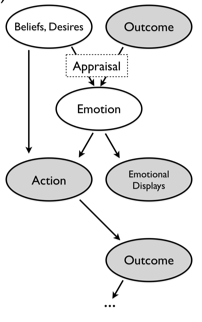

When humans think about other people, we consider their feelings as well as their beliefs, desires, and other cognitive states.
How can we integrate emotions into a theory of mind?
We will need to say what kind of values "emotion" should take, as well as how these states are causally related to other (observable and unobservable) states.
Here is a figure from [Ong, Soh, Zaki, Goodman (2019)](https://arxiv.org/abs/1903.06445), illustrating the potential causal relations:

# Appraisal

In the above diagram we see that emotion is the result of an *appraisal* process. 
We want to explore various `appraisal` functions to see what they will imply about judgments an observer makes about what someone is likely to feel in different situations.
First we have to decide what this function should return -- what is a (representation of another person's) emotion?
Intuitively, an emotional state is positive or negative, and can vary in degree -- that is it can be captured with a single real number.
Affective scientists have argued that emotion is experienced in a two dimensional space of valence and arousal. However these two dimensions are tightly related (in a roughly quadratic shape), so we will simplify to one dimension for now. 

Let's return to our friend Sally and her vending machine. We have adjusted the model of action choice slightly to depend on a real-valued utility function, instead of a Boolean goal.

~~~~
var actionPrior = Categorical({vs: ['a', 'b'], ps: [.5, .5]})

var chooseAction = function(utilityFn, transition, state, alpha) {
  var state = (state==undefined)?'start':state
  var alpha = (alpha==undefined)?1:alpha
  return Infer(function() {
    var action = sample(actionPrior)
    factor(alpha * utilityFn(transition(state, action)))
    return action
  })
}

var vendingMachine = function(state, action) {
  return (action == 'a' ? categorical({vs: ['bagel', 'cookie'], ps: [.9, .1]}) :
          action == 'b' ? categorical({vs: ['bagel', 'cookie'], ps: [.1, .9]}) :
          'nothing')
}

var sallyDesire = function(state){ return state=='cookie' ? 10 : 1}

~~~~

One possibility is thus that appraisal simply returns how good or bad the outcome was for Sally.
Code a version of this simple appraisal model:

~~~~
var actionPrior = Categorical({vs: ['a', 'b'], ps: [.5, .5]})

var chooseAction = function(utilityFn, transition, state, alpha) {
  var state = (state==undefined)?'start':state
  var alpha = (alpha==undefined)?1:alpha
  return Infer(function() {
    var action = sample(actionPrior)
    factor(alpha * utilityFn(transition(state, action)))
    return action
  })
}

var vendingMachine = function(state, action) {
  return (action == 'a' ? categorical({vs: ['bagel', 'cookie'], ps: [.9, .1]}) :
          action == 'b' ? categorical({vs: ['bagel', 'cookie'], ps: [.1, .9]}) :
          'nothing')
}

var sallyDesire = function(state){ return state=='cookie' ? 10 : 1}

var appraisal = function(...) {...}

~~~~

<!-- put in something on appraisal as expected future reward, instead of current reward? this means that inferences about the current state, which affect expectations about future rewards, can affect emotion. in turn this means reevaluating current evidence can change emotion -- this is re-appraisal as in CBT -->

However you may have the intuition (as participants in experiments do) that how happy or sad Sally will be depends on not only what happened, but what she *expected* to happen. This is often captured by comparing the true reward (or utility) to the reward expected ahead of the outcome.
Code a version of this appraisal model (Hint: WebPPL's `expectation` operator may be useful):

~~~~
var actionPrior = Categorical({vs: ['a', 'b'], ps: [.5, .5]})

var chooseAction = function(utilityFn, transition, state, alpha) {
  var state = (state==undefined)?'start':state
  var alpha = (alpha==undefined)?1:alpha
  return Infer(function() {
    var action = sample(actionPrior)
    factor(alpha * utilityFn(transition(state, action)))
    return action
  })
}

var vendingMachine = function(state, action) {
  return (action == 'a' ? categorical({vs: ['bagel', 'cookie'], ps: [.9, .1]}) :
          action == 'b' ? categorical({vs: ['bagel', 'cookie'], ps: [.1, .9]}) :
          'nothing')
}

var sallyDesire = function(state){ return state=='cookie' ? 10 : 1}

var expectedReward = function(...) {...}

var appraisal = function(...) {...}

~~~~

There are in fact several elements of outcome expectations that we can separate out. Some outcomes are unexpected but don't yield unexpected reward, other outcomes are only a bit unexpected but lead to very different reward. Appraisal could depend on these pieces (surprise, etc) to different extents. 
Code a version of the appraisal model where you can change the reliance of emotion on actual reward, expected reward, surprise (and any other factors you'd like).

~~~~
var actionPrior = Categorical({vs: ['a', 'b'], ps: [.5, .5]})

var chooseAction = function(utilityFn, transition, state, alpha) {
  var state = (state==undefined)?'start':state
  var alpha = (alpha==undefined)?1:alpha
  return Infer(function() {
    var action = sample(actionPrior)
    factor(alpha * utilityFn(transition(state, action)))
    return action
  })
}

var vendingMachine = function(state, action) {
  return (action == 'a' ? categorical({vs: ['bagel', 'cookie'], ps: [.9, .1]}) :
          action == 'b' ? categorical({vs: ['bagel', 'cookie'], ps: [.1, .9]}) :
          'nothing')
}

var sallyDesire = function(state){ return state=='cookie' ? 10 : 1}

var expectedReward = function(...) {...}

var surprise = function(...) {...}

var appraisal = function(...) {...}

~~~~

Now play with different scenarios (e.g. change the outcomes from the vending machine, the probabilities, or Sally's utilities). Can you find cases where your intuitions of what Sally will feel constrain the `appraisal` model? That is what experiment would you run in order to distinguish among your hypotheses about how people predict other people's emotions from the situation they are in?

## Other things to consider

- Emotions at one moment of time are influenced by emotions at past moments. How would you incorporate this temporal dynamics into the theory of emotion?
- Appraisal in the moment likely depends not on reward, or reward prediction error, for the current moment, but on expected future reward. This means that inferences about the current state, which affect expectations about future rewards, can affect emotion. So, for instance if Sally gets a package with a picture of a bagel on the front, she may think she will have to eat a bagel and be sad; if she then reads the fine print "Delicious cookie by San Fran Bagel Co" she may change her belief about what's in the bag and become happy. This is an example of *reappraisal*, where new information or interpretations can change emotional experience. Reappraisal in an important part of cognitive behavioral therapy... is it also a part of your intuitive theory of emotions?

# Emotion displays

Some things that people do are a (somewhat) direct result of their emotional experience. This includes facial expressions, body language, and perhaps some verbal ejaculations (e.g. grunts, cursing). This type of action is called an *emotion display*. Because emotion displays depend only on the emotion, they require a simple causal model, `emoDisplay(emotion)`, but they can be perceptually quite complex.

Let's think about facial expressions. For simplicity, let's imagine a facial expression is determined by five numbers: mouth width (`mw`), mouth angle (`ma`), mouth openness (`mo`), eyebrow height (`eh`), eyebrow angle (`ea`).

~~~~
var showSally = function(faceParams) {
	var canvas = Draw(400, 400, true);
	canvas.circle(200,200,100)
	canvas.squiggle()
}

var emoDisplay = function(emotion) {
	...
	return {mw: ..., ma: ..., mo: ..., eh: ..., ea: ...}}
~~~~
(Sometimes extreme positive and negative emotions lead to similar facial expressions. Does your model capture this?)

Some people express emotions more, or to different degrees. (Everyone has that one really stoic friend who barely moves his mouth when he laughs, right?) How can you incorporate these individual differences into your model?

~~~~
~~~~

Notice that it now takes more observations from a person to make a confident attribution of their emotion from their facial expression! Why?

Finally, combine your model of facial expressions with your model above of appraisal. 

~~~~
~~~~

Now explore the emotion attributions this model predicts. How do the outcome and the observed facial display trade off? 

# Other actions

Some actions, unlike emotion displays, might be influenced by emotions, but not fully determined by them. In these cases the observer may have a difficult inference problem: should an action be explained by emotion, by desires or beliefs, or by some interaction of them?

Come up with a class of actions that you think is comes about by some combination of emotion and rational deliberation. Make a model that describes this causal process and explore the inferences an observer would make when seeing these actions.
